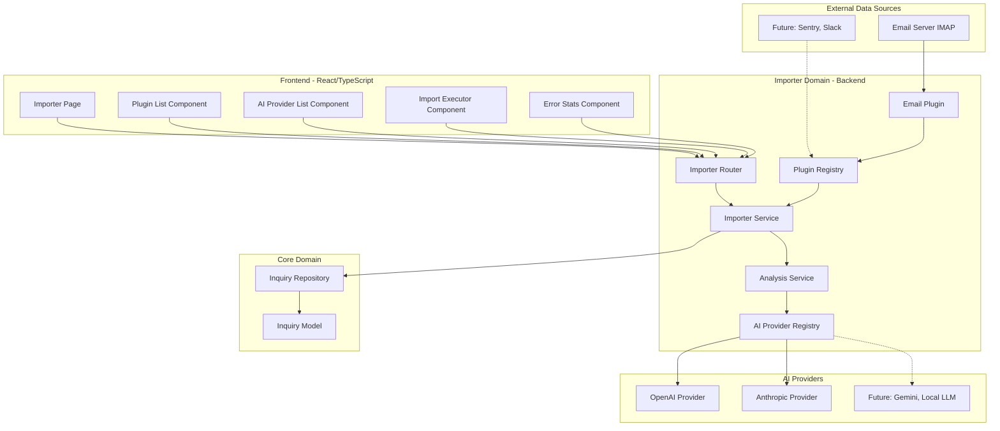
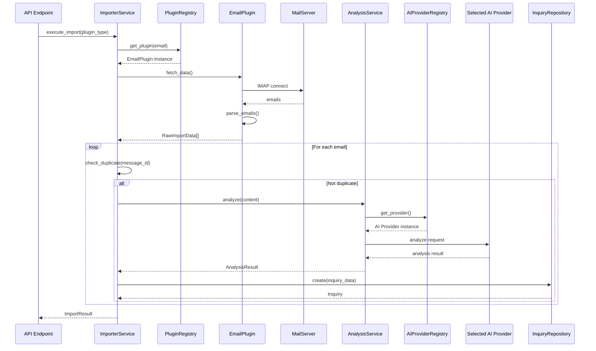
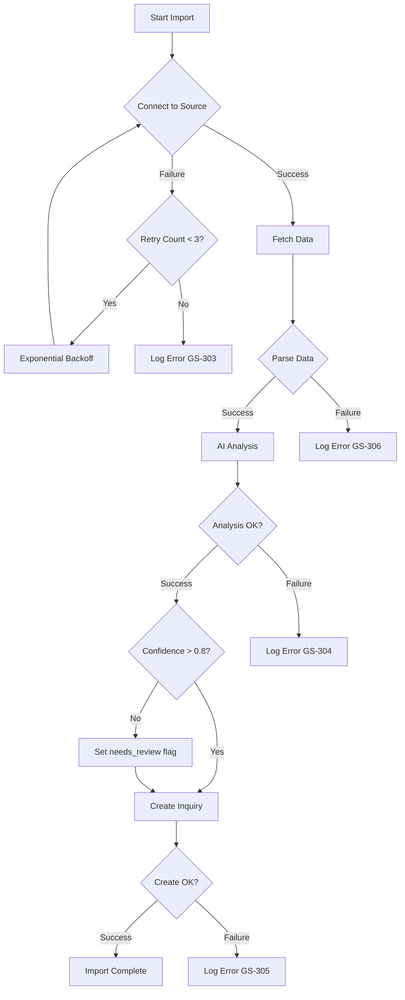
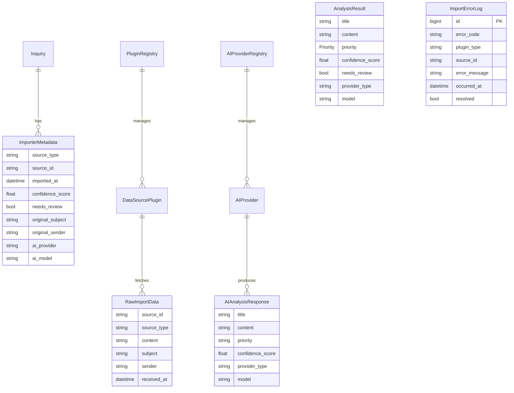

# Design Document: Importer機能

## Overview

**Purpose**: Importer機能は、外部データソース（メール、チャット、Sentry等）から問い合わせを自動取り込みし、AIで解析して構造化された問い合わせデータを生成する。

**Users**: システム管理者がプラグインを管理し、プロダクトマネージャーが自動生成された問い合わせをレビュー・承認する。

**Impact**: 手動での問い合わせ登録作業を削減し、外部システムからの情報を自動的にGhost Squadの問い合わせ管理システムに統合する。

### Goals
- プラグインアーキテクチャによる拡張可能なデータソース対応
- MVPとしてメールからの問い合わせ自動取り込み
- AIによる問い合わせ内容の自動解析・構造化（プロバイダー選択可能）
- 既存Inquiry APIとのシームレスな統合

### Non-Goals
- リアルタイムのプッシュ通知（Webhook受信）
- 複数言語対応（日本語のみ対象）
- スケジューリング機能（現時点では手動実行のみ）
- 高度な管理機能UI（プラグイン設定編集、詳細統計ダッシュボード等）

### MVP Frontend Scope
- インポート実行・結果確認の基本UI
- プラグイン一覧・有効/無効切り替えUI
- AIプロバイダー一覧・デフォルト設定UI
- エラー統計の簡易表示UI

## Architecture

### Existing Architecture Analysis
- **InquiryRepository**: 問い合わせCRUD操作を提供（完全実装済み）
- **StoryGenerationService**: OpenAI API統合パターン（リトライ、サニタイズ）
- **エラーコード体系**: GS-001〜GS-204（Inquiry/Story用）
- **Service層パターン**: Repository、Validator、Workflow、Queryの分離

### Architecture Pattern & Boundary Map



**Architecture Integration**:
- **Selected pattern**: レイヤードアーキテクチャ + ダブルプラグインパターン（データソース + AIプロバイダー）
- **Domain boundaries**: Importer Domain（プラグイン、解析）とCore Domain（Inquiry）を分離
- **Existing patterns preserved**: Service層パターン、Repository パターン、エラーコード体系
- **New components rationale**: データソースとAIプロバイダーの両方を拡張可能にするため
- **Steering compliance**: 既存の3層アーキテクチャ（Router/Service/Model）に準拠

### Technology Stack

| Layer | Choice / Version | Role in Feature | Notes |
|-------|------------------|-----------------|-------|
| Backend | Python 3.11+ / FastAPI 0.104.1 | APIエンドポイント、サービス層 | 既存スタック |
| Email | imaplib / email（標準ライブラリ） | IMAP接続、メールパース | 追加依存なし |
| AI (Default) | OpenAI API 1.3.7 / GPT-4 | 問い合わせ解析・分類 | 既存統合パターン再利用 |
| AI (Optional) | Anthropic API / Claude 3 | 問い合わせ解析・分類 | 将来対応 |
| Data | PostgreSQL 15 / SQLAlchemy 2.0.23 | 問い合わせ永続化 | 既存Inquiryモデル使用 |
| Logging | structlog 23.2.0 | ログ出力 | 既存基盤 |

## System Flows

### メールインポートフロー



### エラーハンドリングフロー



## Requirements Traceability

| Requirement | Summary | Components | Interfaces | Flows |
|-------------|---------|------------|------------|-------|
| 1.1 | プラグイン登録・解除 | PluginRegistry | PluginRegistryService | - |
| 1.2 | 有効/無効切り替え | PluginRegistry | PluginRegistryService | - |
| 1.3 | 設定情報検証 | PluginRegistry | PluginBase | - |
| 1.4 | 共通インターフェース | PluginBase | DataSourcePlugin ABC | - |
| 1.5 | 初期化失敗処理 | PluginRegistry | PluginRegistryService | - |
| 2.1 | IMAP/POP3接続 | EmailPlugin | EmailPluginConfig | メールインポートフロー |
| 2.2 | メール情報取得 | EmailPlugin | DataSourcePlugin.fetch | メールインポートフロー |
| 2.3 | フォルダフィルタリング | EmailPlugin | EmailPluginConfig | - |
| 2.4 | 進捗状況記録 | ImporterService | ImportProgress | - |
| 2.5 | リトライ処理 | EmailPlugin | RetryStrategy | エラーハンドリングフロー |
| 2.6 | 重複取り込み防止 | ImporterService | DuplicateChecker | メールインポートフロー |
| 3.1 | カテゴリ判定 | AnalysisService, AIProvider | AnalysisResult | メールインポートフロー |
| 3.2 | 優先度推定 | AnalysisService, AIProvider | AnalysisResult | - |
| 3.3 | タイトル生成 | AnalysisService, AIProvider | AnalysisResult | - |
| 3.4 | 本文構造化 | AnalysisService, AIProvider | AnalysisResult | - |
| 3.5 | 信頼度フラグ | AnalysisService | AnalysisResult | - |
| 3.6 | 日本語解析 | AnalysisService, AIProvider | AIProvider interface | - |
| 4.1 | Inquiry API使用 | ImporterService | InquiryRepository | メールインポートフロー |
| 4.2 | メタデータ付与 | ImporterService | ImporterMetadata | - |
| 4.3 | ステータス登録 | ImporterService | InquiryStatus | - |
| 4.4 | 生成失敗処理 | ImporterService | ErrorHandler | エラーハンドリングフロー |
| 4.5 | 重複防止 | ImporterService | DuplicateChecker | - |
| 5.1 | エラーログ出力 | All Components | structlog | エラーハンドリングフロー |
| 5.2 | 手動リトライ | ImporterRouter | RetryAPI | - |
| 5.3 | 連続エラーアラート | ImporterService | AlertService | - |
| 5.4 | エラー統計 | ImporterService | ErrorStats | - |
| 5.5 | 指数バックオフ | All Plugins, AIProviders | RetryStrategy | エラーハンドリングフロー |

## Components and Interfaces

| Component | Domain/Layer | Intent | Req Coverage | Key Dependencies | Contracts |
|-----------|--------------|--------|--------------|------------------|-----------|
| ImporterPage | Frontend/Page | インポーター管理画面 | MVP UI | React Router (P0) | UI |
| PluginListComponent | Frontend/Component | プラグイン一覧・操作 | 1.1, 1.2 | ImporterAPI (P0) | UI |
| AIProviderListComponent | Frontend/Component | AIプロバイダー一覧・操作 | 3.1-3.6 | ImporterAPI (P0) | UI |
| ImportExecutorComponent | Frontend/Component | インポート実行・結果表示 | 2.1-2.6, 4.1-4.5 | ImporterAPI (P0) | UI |
| ErrorStatsComponent | Frontend/Component | エラー統計表示 | 5.4 | ImporterAPI (P0) | UI |
| ImporterAPI | Frontend/Service | APIクライアント | All | axios/fetch (P0) | Service |
| PluginBase | Importer/Plugin | データソースプラグイン共通インターフェース | 1.4 | - | Service |
| PluginRegistry | Importer/Plugin | データソースプラグイン登録・管理 | 1.1, 1.2, 1.3, 1.5 | PluginBase (P0) | Service |
| EmailPlugin | Importer/Plugin | メール取り込み | 2.1-2.6 | imaplib (P0), PluginBase (P0) | Service |
| AIProviderBase | Importer/AI | AIプロバイダー共通インターフェース | 3.1-3.6 | - | Service |
| AIProviderRegistry | Importer/AI | AIプロバイダー登録・管理 | 3.1-3.6 | AIProviderBase (P0) | Service |
| OpenAIProvider | Importer/AI | OpenAI GPT-4統合 | 3.1-3.6 | OpenAI API (P0) | Service |
| AnthropicProvider | Importer/AI | Anthropic Claude統合 | 3.1-3.6 | Anthropic API (P0) | Service |
| AnalysisService | Importer/Service | AI解析統括 | 3.1-3.6 | AIProviderRegistry (P0) | Service |
| ImporterService | Importer/Service | インポート統括 | 4.1-4.5, 5.1-5.5 | PluginRegistry (P0), AnalysisService (P0), InquiryRepository (P0) | Service, API |
| ImportErrorLogRepository | Importer/Repository | エラーログ永続化 | 5.1, 5.4 | SQLAlchemy (P0) | Repository |
| ImporterRouter | Importer/Router | APIエンドポイント | 5.2 | ImporterService (P0) | API |

### Frontend Layer

#### ImporterPage

| Field | Detail |
|-------|--------|
| Intent | インポーター機能の管理画面を提供 |
| Requirements | MVP UI |

**Responsibilities & Constraints**
- プラグイン、AIプロバイダー、インポート実行、エラー統計の各コンポーネントを統合
- タブまたはセクションベースのレイアウト
- レスポンシブデザイン対応

**Dependencies**
- Inbound: React Router — ルーティング (P0)
- Outbound: 各子コンポーネント (P0)

**Contracts**: UI [x]

##### Component Structure
```typescript
// web/src/pages/ImporterPage.tsx
import React from 'react';

interface ImporterPageProps {}

const ImporterPage: React.FC<ImporterPageProps> = () => {
  return (
    <div className="importer-page">
      <h1>インポーター管理</h1>
      <section className="importer-section">
        <ImportExecutorComponent />
      </section>
      <section className="plugin-section">
        <PluginListComponent />
      </section>
      <section className="ai-provider-section">
        <AIProviderListComponent />
      </section>
      <section className="stats-section">
        <ErrorStatsComponent />
      </section>
    </div>
  );
};
```

#### PluginListComponent

| Field | Detail |
|-------|--------|
| Intent | データソースプラグインの一覧表示と有効/無効切り替え |
| Requirements | 1.1, 1.2 |

**Responsibilities & Constraints**
- 登録済みプラグインの一覧表示
- 各プラグインの有効/無効トグル
- プラグインステータス（初期化状態、エラー）の表示

**Dependencies**
- Inbound: ImporterPage — 親コンポーネント (P0)
- Outbound: ImporterAPI — API呼び出し (P0)

**Contracts**: UI [x]

##### Component Structure
```typescript
// web/src/components/importer/PluginListComponent.tsx
interface PluginStatus {
  plugin_type: string;
  enabled: boolean;
  initialized: boolean;
  error_message?: string;
}

interface PluginListComponentProps {}

const PluginListComponent: React.FC<PluginListComponentProps> = () => {
  const [plugins, setPlugins] = useState<PluginStatus[]>([]);
  const [loading, setLoading] = useState(false);

  const handleToggle = async (pluginType: string, enabled: boolean) => {
    // POST /api/plugins/{type}/enable or /disable
  };

  return (
    <div className="plugin-list">
      <h2>データソースプラグイン</h2>
      <table>
        <thead>
          <tr>
            <th>プラグイン</th>
            <th>状態</th>
            <th>有効/無効</th>
          </tr>
        </thead>
        <tbody>
          {plugins.map(plugin => (
            <tr key={plugin.plugin_type}>
              <td>{plugin.plugin_type}</td>
              <td>{plugin.initialized ? '初期化済み' : 'エラー'}</td>
              <td>
                <Switch
                  checked={plugin.enabled}
                  onChange={(e) => handleToggle(plugin.plugin_type, e.target.checked)}
                />
              </td>
            </tr>
          ))}
        </tbody>
      </table>
    </div>
  );
};
```

#### AIProviderListComponent

| Field | Detail |
|-------|--------|
| Intent | AIプロバイダーの一覧表示とデフォルト設定 |
| Requirements | 3.1-3.6 |

**Responsibilities & Constraints**
- 登録済みAIプロバイダーの一覧表示
- デフォルトプロバイダーの選択・設定
- プロバイダーステータス（モデル、接続状態）の表示

**Dependencies**
- Inbound: ImporterPage — 親コンポーネント (P0)
- Outbound: ImporterAPI — API呼び出し (P0)

**Contracts**: UI [x]

##### Component Structure
```typescript
// web/src/components/importer/AIProviderListComponent.tsx
interface AIProviderStatus {
  provider_type: string;
  enabled: boolean;
  initialized: boolean;
  is_default: boolean;
  model: string;
  error_message?: string;
}

interface AIProviderListComponentProps {}

const AIProviderListComponent: React.FC<AIProviderListComponentProps> = () => {
  const [providers, setProviders] = useState<AIProviderStatus[]>([]);

  const handleSetDefault = async (providerType: string) => {
    // POST /api/ai-providers/{type}/set-default
  };

  return (
    <div className="ai-provider-list">
      <h2>AIプロバイダー</h2>
      <table>
        <thead>
          <tr>
            <th>プロバイダー</th>
            <th>モデル</th>
            <th>状態</th>
            <th>デフォルト</th>
          </tr>
        </thead>
        <tbody>
          {providers.map(provider => (
            <tr key={provider.provider_type}>
              <td>{provider.provider_type}</td>
              <td>{provider.model}</td>
              <td>{provider.initialized ? '接続済み' : 'エラー'}</td>
              <td>
                <Radio
                  checked={provider.is_default}
                  onChange={() => handleSetDefault(provider.provider_type)}
                />
              </td>
            </tr>
          ))}
        </tbody>
      </table>
    </div>
  );
};
```

#### ImportExecutorComponent

| Field | Detail |
|-------|--------|
| Intent | インポート実行と結果表示 |
| Requirements | 2.1-2.6, 4.1-4.5 |

**Responsibilities & Constraints**
- プラグイン選択とインポート実行ボタン
- AIプロバイダー選択（オプション）
- インポート結果（成功/スキップ/失敗件数）の表示
- エラー発生時の詳細表示

**Dependencies**
- Inbound: ImporterPage — 親コンポーネント (P0)
- Outbound: ImporterAPI — API呼び出し (P0)

**Contracts**: UI [x]

##### Component Structure
```typescript
// web/src/components/importer/ImportExecutorComponent.tsx
interface ImportResult {
  total_fetched: number;
  total_imported: number;
  total_skipped: number;
  total_failed: number;
  imported_inquiry_ids: number[];
  errors: ImportError[];
}

interface ImportExecutorComponentProps {}

const ImportExecutorComponent: React.FC<ImportExecutorComponentProps> = () => {
  const [selectedPlugin, setSelectedPlugin] = useState<string>('');
  const [selectedProvider, setSelectedProvider] = useState<string>('');
  const [result, setResult] = useState<ImportResult | null>(null);
  const [loading, setLoading] = useState(false);

  const handleExecute = async () => {
    setLoading(true);
    // POST /api/importers/execute
    const response = await importerAPI.execute({
      plugin_type: selectedPlugin,
      ai_provider_type: selectedProvider || undefined
    });
    setResult(response);
    setLoading(false);
  };

  return (
    <div className="import-executor">
      <h2>インポート実行</h2>
      <div className="executor-form">
        <Select
          label="データソース"
          value={selectedPlugin}
          onChange={setSelectedPlugin}
          options={plugins}
        />
        <Select
          label="AIプロバイダー（オプション）"
          value={selectedProvider}
          onChange={setSelectedProvider}
          options={providers}
          placeholder="デフォルトを使用"
        />
        <Button
          onClick={handleExecute}
          loading={loading}
          disabled={!selectedPlugin}
        >
          インポート実行
        </Button>
      </div>
      {result && (
        <div className="import-result">
          <h3>実行結果</h3>
          <dl>
            <dt>取得件数</dt><dd>{result.total_fetched}</dd>
            <dt>インポート成功</dt><dd>{result.total_imported}</dd>
            <dt>スキップ（重複）</dt><dd>{result.total_skipped}</dd>
            <dt>失敗</dt><dd>{result.total_failed}</dd>
          </dl>
          {result.errors.length > 0 && (
            <div className="error-list">
              <h4>エラー詳細</h4>
              {result.errors.map((err, i) => (
                <div key={i} className="error-item">{err.message}</div>
              ))}
            </div>
          )}
        </div>
      )}
    </div>
  );
};
```

#### ErrorStatsComponent

| Field | Detail |
|-------|--------|
| Intent | エラー統計の表示 |
| Requirements | 5.4 |

**Responsibilities & Constraints**
- エラー種別ごとの発生件数表示
- 最終発生日時の表示
- 手動リトライへのナビゲーション

**Dependencies**
- Inbound: ImporterPage — 親コンポーネント (P0)
- Outbound: ImporterAPI — API呼び出し (P0)

**Contracts**: UI [x]

##### Component Structure
```typescript
// web/src/components/importer/ErrorStatsComponent.tsx
interface ErrorStats {
  error_code: string;
  count: number;
  last_occurred: string;
}

interface ErrorStatsComponentProps {}

const ErrorStatsComponent: React.FC<ErrorStatsComponentProps> = () => {
  const [stats, setStats] = useState<ErrorStats[]>([]);

  useEffect(() => {
    // GET /api/importers/stats
    loadStats();
  }, []);

  return (
    <div className="error-stats">
      <h2>エラー統計</h2>
      {stats.length === 0 ? (
        <p>エラーはありません</p>
      ) : (
        <table>
          <thead>
            <tr>
              <th>エラーコード</th>
              <th>発生回数</th>
              <th>最終発生</th>
            </tr>
          </thead>
          <tbody>
            {stats.map(stat => (
              <tr key={stat.error_code}>
                <td>{stat.error_code}</td>
                <td>{stat.count}</td>
                <td>{new Date(stat.last_occurred).toLocaleString('ja-JP')}</td>
              </tr>
            ))}
          </tbody>
        </table>
      )}
    </div>
  );
};
```

#### ImporterAPI (Frontend Service)

| Field | Detail |
|-------|--------|
| Intent | バックエンドAPIとの通信を担当 |
| Requirements | All |

**Responsibilities & Constraints**
- REST API呼び出しの抽象化
- エラーハンドリングの共通化
- TypeScript型定義の提供

**Dependencies**
- External: axios or fetch API (P0)

**Contracts**: Service [x]

##### Service Interface
```typescript
// web/src/services/importerAPI.ts
import axios from 'axios';

const API_BASE = '/api';

export interface ExecuteImportRequest {
  plugin_type: string;
  ai_provider_type?: string;
}

export interface RetryImportRequest {
  plugin_type: string;
  source_ids: string[];
  ai_provider_type?: string;
}

export const importerAPI = {
  // プラグイン関連
  listPlugins: () =>
    axios.get<PluginStatus[]>(`${API_BASE}/plugins`),

  enablePlugin: (pluginType: string) =>
    axios.post<PluginStatus>(`${API_BASE}/plugins/${pluginType}/enable`),

  disablePlugin: (pluginType: string) =>
    axios.post<PluginStatus>(`${API_BASE}/plugins/${pluginType}/disable`),

  // AIプロバイダー関連
  listAIProviders: () =>
    axios.get<AIProviderStatus[]>(`${API_BASE}/ai-providers`),

  setDefaultAIProvider: (providerType: string) =>
    axios.post<AIProviderStatus>(`${API_BASE}/ai-providers/${providerType}/set-default`),

  // インポート関連
  executeImport: (request: ExecuteImportRequest) =>
    axios.post<ImportResult>(`${API_BASE}/importers/execute`, request),

  retryImport: (request: RetryImportRequest) =>
    axios.post<ImportResult>(`${API_BASE}/importers/retry`, request),

  getErrorStats: () =>
    axios.get<ErrorStats[]>(`${API_BASE}/importers/stats`),
};
```

### Importer/Plugin Layer

#### PluginBase

| Field | Detail |
|-------|--------|
| Intent | データソースプラグインの共通インターフェースを定義 |
| Requirements | 1.4 |

**Responsibilities & Constraints**
- すべてのデータソースプラグインが実装する抽象基底クラス
- fetch(), parse(), validate()メソッドの規約を定義
- プラグイン設定の型安全性を保証

**Dependencies**
- Inbound: PluginRegistry — プラグイン管理 (P0)
- External: なし

**Contracts**: Service [x]

##### Service Interface
```python
from abc import ABC, abstractmethod
from typing import Generic, TypeVar, List
from dataclasses import dataclass
from datetime import datetime

TConfig = TypeVar('TConfig')

@dataclass
class RawImportData:
    """プラグインから取得した生データ"""
    source_id: str           # 外部システムのID（Message-ID等）
    source_type: str         # データソース種別
    content: str             # 本文
    subject: str             # 件名/タイトル
    sender: str              # 送信者
    received_at: datetime    # 受信日時
    raw_metadata: dict       # 追加メタデータ

class DataSourcePlugin(ABC, Generic[TConfig]):
    """データソースプラグインの抽象基底クラス"""

    @property
    @abstractmethod
    def plugin_type(self) -> str:
        """プラグイン種別を返す（例: 'email', 'sentry'）"""
        ...

    @abstractmethod
    def validate_config(self, config: TConfig) -> ValidationResult:
        """設定情報を検証する"""
        ...

    @abstractmethod
    def connect(self) -> None:
        """データソースに接続する"""
        ...

    @abstractmethod
    def disconnect(self) -> None:
        """データソースから切断する"""
        ...

    @abstractmethod
    def fetch(self) -> List[RawImportData]:
        """データを取得する"""
        ...

    @abstractmethod
    def mark_as_processed(self, source_id: str) -> None:
        """処理済みとしてマークする"""
        ...
```
- Preconditions: validate_config()が成功していること
- Postconditions: fetch()は重複しないRawImportDataのリストを返す
- Invariants: source_idは外部システム内で一意

#### PluginRegistry

| Field | Detail |
|-------|--------|
| Intent | プラグインの登録・解除・有効/無効管理 |
| Requirements | 1.1, 1.2, 1.3, 1.5 |

**Responsibilities & Constraints**
- プラグインインスタンスのライフサイクル管理
- 設定検証の実行
- 初期化失敗時のエラーログ記録と無効化

**Dependencies**
- Inbound: ImporterService — プラグイン取得 (P0)
- Outbound: PluginBase — プラグイン操作 (P0)
- External: structlog — ログ出力 (P1)

**Contracts**: Service [x]

##### Service Interface
```python
from typing import Dict, Optional, Type
from dataclasses import dataclass

@dataclass
class PluginStatus:
    plugin_type: str
    enabled: bool
    initialized: bool
    error_message: Optional[str] = None

class PluginRegistryService:
    """プラグイン管理サービス"""

    def register(
        self,
        plugin_class: Type[DataSourcePlugin],
        config: dict
    ) -> Result[PluginStatus, PluginError]:
        """プラグインを登録する"""
        ...

    def unregister(self, plugin_type: str) -> Result[None, PluginError]:
        """プラグインを解除する"""
        ...

    def enable(self, plugin_type: str) -> Result[PluginStatus, PluginError]:
        """プラグインを有効化する"""
        ...

    def disable(self, plugin_type: str) -> Result[PluginStatus, PluginError]:
        """プラグインを無効化する"""
        ...

    def get_plugin(self, plugin_type: str) -> Optional[DataSourcePlugin]:
        """プラグインインスタンスを取得する"""
        ...

    def list_plugins(self) -> List[PluginStatus]:
        """登録済みプラグイン一覧を取得する"""
        ...
```
- Preconditions: plugin_classはDataSourcePluginを継承していること
- Postconditions: 登録成功時、get_plugin()でインスタンス取得可能
- Invariants: 同一plugin_typeは1つのみ登録可能

#### EmailPlugin

| Field | Detail |
|-------|--------|
| Intent | IMAPプロトコルによるメール取り込み |
| Requirements | 2.1, 2.2, 2.3, 2.4, 2.5, 2.6 |

**Responsibilities & Constraints**
- IMAP4_SSL接続によるメールサーバー接続
- 指定フォルダからの未読メール取得
- Message-IDによる重複検出
- リトライ戦略（指数バックオフ、最大3回）

**Dependencies**
- Inbound: PluginRegistry — プラグイン管理 (P0)
- External: imaplib — IMAP接続 (P0)
- External: email — メールパース (P0)

**Contracts**: Service [x]

##### Service Interface
```python
from dataclasses import dataclass
from typing import List, Optional

@dataclass
class EmailPluginConfig:
    """メールプラグイン設定"""
    imap_server: str
    imap_port: int = 993
    username: str = ""
    password: str = ""
    folder: str = "INBOX"
    use_ssl: bool = True
    fetch_limit: int = 50
    retry_max: int = 3
    retry_backoff_base: float = 2.0

class EmailPlugin(DataSourcePlugin[EmailPluginConfig]):
    """メールデータソースプラグイン"""

    @property
    def plugin_type(self) -> str:
        return "email"

    def validate_config(self, config: EmailPluginConfig) -> ValidationResult:
        """IMAP接続設定を検証"""
        ...

    def connect(self) -> None:
        """IMAPサーバーに接続（SSL/TLS）"""
        ...

    def disconnect(self) -> None:
        """IMAP接続を切断"""
        ...

    def fetch(self) -> List[RawImportData]:
        """未読メールを取得"""
        ...

    def mark_as_processed(self, source_id: str) -> None:
        """メールを既読にマーク"""
        ...
```
- Preconditions: 有効なIMAP接続設定
- Postconditions: fetch()は最大fetch_limit件のメールを返す
- Invariants: Message-IDはsource_idとして使用

**Implementation Notes**
- Integration: imaplib.IMAP4_SSL使用、タイムアウト30秒
- Validation: 接続テスト、フォルダ存在確認
- Risks: メールサーバー接続不安定時のリトライ処理

### Importer/AI Layer

#### AIProviderBase

| Field | Detail |
|-------|--------|
| Intent | AIプロバイダーの共通インターフェースを定義 |
| Requirements | 3.1, 3.2, 3.3, 3.4, 3.5, 3.6 |

**Responsibilities & Constraints**
- すべてのAIプロバイダーが実装する抽象基底クラス
- analyze()メソッドの規約を定義
- プロバイダー設定の型安全性を保証

**Dependencies**
- Inbound: AIProviderRegistry — プロバイダー管理 (P0)
- External: なし

**Contracts**: Service [x]

##### Service Interface
```python
from abc import ABC, abstractmethod
from typing import Generic, TypeVar, Optional
from dataclasses import dataclass
from enum import Enum

TConfig = TypeVar('TConfig')

class AIProviderType(Enum):
    """AIプロバイダー種別"""
    OPENAI = "openai"
    ANTHROPIC = "anthropic"
    # 将来: GEMINI = "gemini"
    # 将来: LOCAL = "local"

@dataclass
class AIProviderConfig:
    """AIプロバイダー共通設定"""
    api_key: str
    model: str
    temperature: float = 0.7
    max_tokens: int = 1000
    timeout: int = 30
    retry_max: int = 3
    retry_backoff_base: float = 2.0

@dataclass
class AIAnalysisRequest:
    """AI解析リクエスト"""
    content: str              # 解析対象コンテンツ
    subject: str              # 件名/タイトル
    sender: str               # 送信者情報
    source_type: str          # データソース種別
    additional_context: dict  # 追加コンテキスト

@dataclass
class AIAnalysisResponse:
    """AI解析レスポンス"""
    title: str                # 生成されたタイトル
    content: str              # 構造化された本文
    priority: str             # 推定優先度（low/medium/high/urgent）
    category: Optional[str]   # カテゴリ
    confidence_score: float   # 信頼度スコア（0.0-1.0）
    raw_response: dict        # プロバイダーからの生レスポンス
    provider_type: str        # 使用したプロバイダー
    model: str                # 使用したモデル

class AIProvider(ABC, Generic[TConfig]):
    """AIプロバイダーの抽象基底クラス"""

    @property
    @abstractmethod
    def provider_type(self) -> AIProviderType:
        """プロバイダー種別を返す"""
        ...

    @property
    @abstractmethod
    def supported_models(self) -> List[str]:
        """サポートするモデル一覧を返す"""
        ...

    @abstractmethod
    def validate_config(self, config: TConfig) -> ValidationResult:
        """設定情報を検証する"""
        ...

    @abstractmethod
    def initialize(self) -> None:
        """プロバイダーを初期化する"""
        ...

    @abstractmethod
    def analyze(
        self,
        request: AIAnalysisRequest
    ) -> Result[AIAnalysisResponse, AIProviderError]:
        """コンテンツを解析する"""
        ...

    @abstractmethod
    def health_check(self) -> bool:
        """接続状態を確認する"""
        ...
```
- Preconditions: validate_config()が成功していること
- Postconditions: analyze()はAIAnalysisResponseを返す
- Invariants: confidence_scoreは0.0〜1.0の範囲

#### AIProviderRegistry

| Field | Detail |
|-------|--------|
| Intent | AIプロバイダーの登録・管理・選択 |
| Requirements | 3.1-3.6 |

**Responsibilities & Constraints**
- AIプロバイダーインスタンスのライフサイクル管理
- デフォルトプロバイダーの設定
- フォールバック戦略の管理

**Dependencies**
- Inbound: AnalysisService — プロバイダー取得 (P0)
- Outbound: AIProviderBase — プロバイダー操作 (P0)
- External: structlog — ログ出力 (P1)

**Contracts**: Service [x]

##### Service Interface
```python
from typing import Dict, Optional, Type, List
from dataclasses import dataclass

@dataclass
class AIProviderStatus:
    provider_type: AIProviderType
    enabled: bool
    initialized: bool
    is_default: bool
    model: str
    error_message: Optional[str] = None

class AIProviderRegistryService:
    """AIプロバイダー管理サービス"""

    def register(
        self,
        provider_class: Type[AIProvider],
        config: AIProviderConfig
    ) -> Result[AIProviderStatus, AIProviderError]:
        """プロバイダーを登録する"""
        ...

    def unregister(
        self,
        provider_type: AIProviderType
    ) -> Result[None, AIProviderError]:
        """プロバイダーを解除する"""
        ...

    def set_default(
        self,
        provider_type: AIProviderType
    ) -> Result[AIProviderStatus, AIProviderError]:
        """デフォルトプロバイダーを設定する"""
        ...

    def get_provider(
        self,
        provider_type: Optional[AIProviderType] = None
    ) -> Optional[AIProvider]:
        """プロバイダーインスタンスを取得する（未指定時はデフォルト）"""
        ...

    def list_providers(self) -> List[AIProviderStatus]:
        """登録済みプロバイダー一覧を取得する"""
        ...
```
- Preconditions: provider_classはAIProviderを継承していること
- Postconditions: 登録成功時、get_provider()でインスタンス取得可能
- Invariants: デフォルトプロバイダーは1つのみ

#### OpenAIProvider

| Field | Detail |
|-------|--------|
| Intent | OpenAI GPT-4によるコンテンツ解析 |
| Requirements | 3.1, 3.2, 3.3, 3.4, 3.5, 3.6 |

**Responsibilities & Constraints**
- OpenAI API統合
- GPT-4/GPT-4o/GPT-3.5-turboモデルサポート
- リトライ戦略（指数バックオフ、最大3回）

**Dependencies**
- Inbound: AIProviderRegistry — プロバイダー管理 (P0)
- External: OpenAI API — API呼び出し (P0)

**Contracts**: Service [x]

##### Service Interface
```python
from dataclasses import dataclass

@dataclass
class OpenAIProviderConfig(AIProviderConfig):
    """OpenAIプロバイダー設定"""
    model: str = "gpt-4"
    organization: Optional[str] = None

class OpenAIProvider(AIProvider[OpenAIProviderConfig]):
    """OpenAI AIプロバイダー"""

    SUPPORTED_MODELS = [
        "gpt-4",
        "gpt-4-turbo",
        "gpt-4o",
        "gpt-3.5-turbo"
    ]

    @property
    def provider_type(self) -> AIProviderType:
        return AIProviderType.OPENAI

    @property
    def supported_models(self) -> List[str]:
        return self.SUPPORTED_MODELS

    def validate_config(self, config: OpenAIProviderConfig) -> ValidationResult:
        """API Key形式、モデル名を検証"""
        ...

    def initialize(self) -> None:
        """OpenAI clientを初期化"""
        ...

    def analyze(
        self,
        request: AIAnalysisRequest
    ) -> Result[AIAnalysisResponse, AIProviderError]:
        """GPT-4でコンテンツを解析"""
        ...

    def health_check(self) -> bool:
        """API接続を確認"""
        ...
```
- Preconditions: 有効なOpenAI API Key
- Postconditions: JSON形式のレスポンスを解析してAIAnalysisResponseを返す
- Invariants: SUPPORTED_MODELSに含まれるモデルのみ使用可能

**Implementation Notes**
- Integration: StoryGenerationServiceのパターンを踏襲
- Validation: API Key形式チェック、モデル名検証
- Risks: API呼び出し失敗時のリトライ（3回、指数バックオフ）

#### AnthropicProvider

| Field | Detail |
|-------|--------|
| Intent | Anthropic Claudeによるコンテンツ解析 |
| Requirements | 3.1, 3.2, 3.3, 3.4, 3.5, 3.6 |

**Responsibilities & Constraints**
- Anthropic API統合
- Claude 3シリーズモデルサポート
- リトライ戦略（指数バックオフ、最大3回）

**Dependencies**
- Inbound: AIProviderRegistry — プロバイダー管理 (P0)
- External: Anthropic API — API呼び出し (P0)

**Contracts**: Service [x]

##### Service Interface
```python
from dataclasses import dataclass

@dataclass
class AnthropicProviderConfig(AIProviderConfig):
    """Anthropicプロバイダー設定"""
    model: str = "claude-3-sonnet-20240229"

class AnthropicProvider(AIProvider[AnthropicProviderConfig]):
    """Anthropic AIプロバイダー"""

    SUPPORTED_MODELS = [
        "claude-3-opus-20240229",
        "claude-3-sonnet-20240229",
        "claude-3-haiku-20240307",
        "claude-3-5-sonnet-20241022"
    ]

    @property
    def provider_type(self) -> AIProviderType:
        return AIProviderType.ANTHROPIC

    @property
    def supported_models(self) -> List[str]:
        return self.SUPPORTED_MODELS

    def validate_config(self, config: AnthropicProviderConfig) -> ValidationResult:
        """API Key形式、モデル名を検証"""
        ...

    def initialize(self) -> None:
        """Anthropic clientを初期化"""
        ...

    def analyze(
        self,
        request: AIAnalysisRequest
    ) -> Result[AIAnalysisResponse, AIProviderError]:
        """Claudeでコンテンツを解析"""
        ...

    def health_check(self) -> bool:
        """API接続を確認"""
        ...
```
- Preconditions: 有効なAnthropic API Key
- Postconditions: JSON形式のレスポンスを解析してAIAnalysisResponseを返す
- Invariants: SUPPORTED_MODELSに含まれるモデルのみ使用可能

**Implementation Notes**
- Integration: OpenAIProviderと同様のパターン
- Validation: API Key形式チェック、モデル名検証
- Risks: API呼び出し失敗時のリトライ（3回、指数バックオフ）

### Importer/Service Layer

#### AnalysisService

| Field | Detail |
|-------|--------|
| Intent | AIプロバイダーを使用した問い合わせ解析統括 |
| Requirements | 3.1, 3.2, 3.3, 3.4, 3.5, 3.6 |

**Responsibilities & Constraints**
- AIProviderRegistryを通じたプロバイダー取得
- プロンプト構築と共通化
- 解析結果の信頼度判定
- プロバイダー切り替えのサポート

**Dependencies**
- Inbound: ImporterService — 解析リクエスト (P0)
- Outbound: AIProviderRegistry — プロバイダー取得 (P0)

**Contracts**: Service [x]

##### Service Interface
```python
from dataclasses import dataclass
from typing import Optional
from models.enums.priority import Priority

@dataclass
class AnalysisResult:
    """AI解析結果"""
    title: str                    # 生成されたタイトル
    content: str                  # 構造化された本文
    priority: Priority            # 推定優先度
    category: Optional[str]       # カテゴリ（将来用）
    confidence_score: float       # 信頼度スコア（0.0-1.0）
    needs_review: bool            # レビュー必要フラグ
    provider_type: str            # 使用したプロバイダー
    model: str                    # 使用したモデル
    analysis_metadata: dict       # 解析メタデータ

class ImporterAnalysisService:
    """問い合わせ解析サービス"""

    def __init__(
        self,
        provider_registry: AIProviderRegistryService
    ):
        self._provider_registry = provider_registry

    def analyze(
        self,
        raw_data: RawImportData,
        provider_type: Optional[AIProviderType] = None
    ) -> Result[AnalysisResult, AnalysisError]:
        """生データを解析し、構造化された問い合わせ情報を生成"""
        ...

    def _build_prompt(self, raw_data: RawImportData) -> str:
        """解析用プロンプトを構築（全プロバイダー共通）"""
        ...

    def _convert_response(
        self,
        ai_response: AIAnalysisResponse
    ) -> AnalysisResult:
        """AIレスポンスをAnalysisResultに変換"""
        ...

    def _determine_needs_review(self, confidence: float) -> bool:
        """レビュー必要フラグを判定（閾値: 0.8）"""
        ...
```
- Preconditions: raw_data.contentが空でないこと
- Postconditions: confidence_score < 0.8の場合、needs_review = True
- Invariants: 日本語コンテンツの解析をサポート

**Implementation Notes**
- Integration: AIProviderRegistryを通じてプロバイダーを取得
- Validation: レスポンス構造検証
- Risks: プロバイダー未登録時のエラーハンドリング

#### ImporterService

| Field | Detail |
|-------|--------|
| Intent | インポート処理の統括、問い合わせ生成 |
| Requirements | 4.1, 4.2, 4.3, 4.4, 4.5, 5.1, 5.3, 5.4, 5.5 |

**Responsibilities & Constraints**
- プラグインからのデータ取得調整
- 重複チェック
- 問い合わせ生成（InquiryRepository使用）
- エラー統計・アラート管理

**Dependencies**
- Inbound: ImporterRouter — APIリクエスト (P0)
- Outbound: PluginRegistry — プラグイン取得 (P0)
- Outbound: AnalysisService — AI解析 (P0)
- Outbound: InquiryRepository — 問い合わせ作成 (P0)
- External: structlog — ログ出力 (P1)

**Contracts**: Service [x]

##### Service Interface
```python
from dataclasses import dataclass
from typing import List, Optional
from datetime import datetime

@dataclass
class ImporterMetadata:
    """インポート元メタデータ（inquiry_metadataに格納）"""
    source_type: str              # データソース種別
    source_id: str                # 外部システムID
    imported_at: datetime         # インポート日時
    confidence_score: float       # AI解析信頼度
    needs_review: bool            # レビュー必要フラグ
    original_subject: str         # 元の件名
    original_sender: str          # 元の送信者
    ai_provider: str              # 使用したAIプロバイダー
    ai_model: str                 # 使用したAIモデル

@dataclass
class ImportResult:
    """インポート結果"""
    total_fetched: int            # 取得件数
    total_imported: int           # インポート成功件数
    total_skipped: int            # スキップ件数（重複等）
    total_failed: int             # 失敗件数
    imported_inquiry_ids: List[int]
    errors: List[ImportError]

@dataclass
class ErrorStats:
    """エラー統計"""
    error_code: str
    count: int
    last_occurred: datetime

class ImporterService:
    """インポート統括サービス"""

    def execute_import(
        self,
        plugin_type: str,
        ai_provider_type: Optional[AIProviderType] = None
    ) -> Result[ImportResult, ImporterError]:
        """指定プラグインでインポートを実行（AIプロバイダー指定可能）"""
        ...

    def check_duplicate(self, source_type: str, source_id: str) -> bool:
        """重複チェック（inquiry_metadataを検索）"""
        ...

    def get_error_stats(self) -> List[ErrorStats]:
        """エラー統計を取得"""
        ...

    def retry_failed(
        self,
        plugin_type: str,
        source_ids: List[str],
        ai_provider_type: Optional[AIProviderType] = None
    ) -> Result[ImportResult, ImporterError]:
        """失敗したインポートをリトライ"""
        ...
```
- Preconditions: plugin_typeが登録済みであること
- Postconditions: 成功時、問い合わせがステータス「received」で作成される
- Invariants: source_type + source_idの組み合わせは一意

### Importer/Router Layer

#### ImporterRouter

| Field | Detail |
|-------|--------|
| Intent | インポートAPIエンドポイント |
| Requirements | 5.2 |

**Responsibilities & Constraints**
- REST APIエンドポイントの提供
- リクエスト/レスポンスのシリアライズ

**Dependencies**
- Inbound: External Client — APIリクエスト (P0)
- Outbound: ImporterService — ビジネスロジック (P0)

**Contracts**: API [x]

##### API Contract

| Method | Endpoint | Request | Response | Errors |
|--------|----------|---------|----------|--------|
| POST | /api/importers/execute | ExecuteImportRequest | ImportResult | 400, 404, 500 |
| POST | /api/importers/retry | RetryImportRequest | ImportResult | 400, 404, 500 |
| GET | /api/importers/stats | - | ErrorStatsResponse | 500 |
| GET | /api/plugins | - | PluginListResponse | 500 |
| POST | /api/plugins/{type}/enable | - | PluginStatus | 404, 500 |
| POST | /api/plugins/{type}/disable | - | PluginStatus | 404, 500 |
| GET | /api/ai-providers | - | AIProviderListResponse | 500 |
| POST | /api/ai-providers/{type}/set-default | - | AIProviderStatus | 404, 500 |

**ExecuteImportRequest Schema**:
```python
@dataclass
class ExecuteImportRequest:
    plugin_type: str                      # データソースプラグイン種別
    ai_provider_type: Optional[str] = None  # AIプロバイダー種別（未指定時はデフォルト）
```

## Data Models

### Domain Model



### Logical Data Model

**Structure Definition**:
- ImporterMetadataはInquiryの`inquiry_metadata` JSONフィールド内に格納
- 既存のInquiryテーブル構造を変更しない
- source_type + source_idの組み合わせで重複検出

**Consistency & Integrity**:
- トランザクション境界: 1つのインポート処理 = 1つのInquiry作成
- 失敗時は即座にロールバック

### Configuration Persistence

**プラグイン・AIプロバイダー設定の永続化**:

設定の永続化は環境変数と設定ファイルベースで管理し、アプリケーション起動時にレジストリを初期化する。

```python
# config/importer_config.yaml（設定ファイル例）
plugins:
  email:
    enabled: true
    config:
      imap_server: ${IMAP_SERVER}
      imap_port: 993
      username: ${IMAP_USERNAME}
      password: ${IMAP_PASSWORD}
      folder: "INBOX"

ai_providers:
  default: openai
  providers:
    openai:
      enabled: true
      api_key: ${OPENAI_API_KEY}
      model: "gpt-4"
    anthropic:
      enabled: false
      api_key: ${ANTHROPIC_API_KEY}
      model: "claude-3-sonnet-20240229"
```

**永続化方針**:
- **静的設定**: 環境変数 + YAML設定ファイルで管理
- **動的状態**: 有効/無効の切り替えはインメモリ（サーバー再起動で設定ファイルの状態に戻る）
- **将来拡張**: 必要に応じて`importer_config`テーブルを追加し、UI からの設定変更を永続化

### Duplicate Detection Performance

**重複チェックのパフォーマンス最適化**:

大量データ時のパフォーマンスを確保するため、`inquiry_metadata`のJSONフィールドにGINインデックスを追加する。

```sql
-- マイグレーションで追加するインデックス
CREATE INDEX ix_inquiries_importer_source
ON inquiries USING GIN ((inquiry_metadata->'importer'));

-- 重複チェッククエリ例
SELECT id FROM inquiries
WHERE inquiry_metadata->'importer'->>'source_type' = 'email'
  AND inquiry_metadata->'importer'->>'source_id' = 'message-id-xxx';
```

**パフォーマンス考慮事項**:
- GINインデックスにより、JSONフィールド内の検索を高速化
- 10万件規模のデータでも数ミリ秒での重複チェックを実現
- インデックス追加はAlembicマイグレーションで管理

### Data Contracts & Integration

**ImporterMetadata Schema（inquiry_metadata内）**:
```python
{
    "importer": {
        "source_type": str,       # "email", "sentry", etc.
        "source_id": str,         # Message-ID等
        "imported_at": str,       # ISO 8601形式
        "confidence_score": float,# 0.0-1.0
        "needs_review": bool,
        "original_subject": str,
        "original_sender": str,
        "ai_provider": str,       # "openai", "anthropic", etc.
        "ai_model": str           # "gpt-4", "claude-3-sonnet", etc.
    }
}
```

## Error Handling

### Error Strategy
- **エラーコード範囲**: GS-301〜GS-399
- **ログ出力**: structlogによる構造化ログ
- **リトライ戦略**: 指数バックオフ（2^n秒、最大3回）

### Error Categories and Responses

| Code | Category | Description | Recovery |
|------|----------|-------------|----------|
| GS-301 | Plugin | データソースプラグイン未検出 | プラグイン登録を確認 |
| GS-302 | Plugin | プラグイン初期化失敗 | 設定を確認、再登録 |
| GS-303 | Connection | データソース接続失敗 | 自動リトライ後、手動対応 |
| GS-304 | Analysis | AI解析失敗 | 自動リトライ後、手動対応 |
| GS-305 | Duplicate | 重複インポート検出 | スキップ（正常動作） |
| GS-306 | Fetch | データ取得失敗 | 自動リトライ後、手動対応 |
| GS-307 | Retry | リトライ上限超過 | 手動リトライAPI使用 |
| GS-308 | AIProvider | AIプロバイダー未検出 | プロバイダー登録を確認 |
| GS-309 | AIProvider | AIプロバイダー初期化失敗 | API Key、設定を確認 |

### Monitoring
- エラー発生時のstructlogログ出力
- エラー統計API（/api/importers/stats）
- 連続エラー検出時のアラートログ

### Error Statistics Storage

**エラー統計の保存方法**:

エラー統計は新規テーブル`import_error_logs`に永続化し、集計クエリで統計情報を提供する。

```python
# models/database/import_error_log.py
from sqlalchemy import Column, BigInteger, String, DateTime, Index
from models.database.base import BaseModel

class ImportErrorLog(BaseModel):
    """インポートエラーログモデル"""
    __tablename__ = "import_error_logs"

    id = Column(BigInteger, primary_key=True, autoincrement=True)
    error_code = Column(String(10), nullable=False)       # GS-301等
    plugin_type = Column(String(50), nullable=False)      # "email"等
    source_id = Column(String(255), nullable=True)        # Message-ID等
    error_message = Column(String(1000), nullable=False)
    occurred_at = Column(DateTime(timezone=True), nullable=False)
    resolved = Column(Boolean, default=False)             # リトライ成功時にTrue

    __table_args__ = (
        Index('ix_import_error_logs_code_occurred', 'error_code', 'occurred_at'),
        Index('ix_import_error_logs_plugin', 'plugin_type'),
    )
```

**統計クエリ例**:
```sql
-- エラー種別ごとの統計
SELECT
    error_code,
    COUNT(*) as count,
    MAX(occurred_at) as last_occurred
FROM import_error_logs
WHERE resolved = false
GROUP BY error_code
ORDER BY count DESC;
```

**保存方針**:
- すべてのエラー発生を`import_error_logs`に記録
- リトライ成功時は`resolved = true`に更新
- 統計APIは集計クエリで算出（キャッシュ考慮）
- ログ保持期間: 90日（定期クリーンアップジョブで削除）

## Testing Strategy

### Backend Unit Tests
- PluginBase: インターフェース契約の検証
- EmailPlugin: メールパース、Message-ID抽出
- AIProviderBase: インターフェース契約の検証
- OpenAIProvider: プロンプト構築、レスポンスパース
- AnthropicProvider: プロンプト構築、レスポンスパース
- AnalysisService: プロバイダー選択、結果変換
- ImporterService: 重複チェック、メタデータ生成

### Frontend Unit Tests
- ImporterPage: コンポーネントレンダリング、子コンポーネント統合
- PluginListComponent: プラグイン一覧表示、トグル操作
- AIProviderListComponent: プロバイダー一覧表示、デフォルト設定
- ImportExecutorComponent: フォーム入力、実行ボタン、結果表示
- ErrorStatsComponent: 統計データ表示、空状態表示
- ImporterAPI: API呼び出しモック、エラーハンドリング

### Backend Integration Tests
- EmailPlugin + IMAPサーバーモック
- OpenAIProvider + OpenAI APIモック
- AnthropicProvider + Anthropic APIモック
- AnalysisService + AIProviderモック
- ImporterService + InquiryRepository

### Frontend Integration Tests
- ImporterPage + MSW (Mock Service Worker) によるAPI統合テスト
- フォーム送信 → API呼び出し → 結果表示の一連のフロー
- エラー発生時のUI状態遷移

### E2E Tests
- 完全なインポートフロー（メール取得→解析→問い合わせ作成）
- AIプロバイダー切り替えフロー（OpenAI→Anthropic）
- エラーハンドリングフロー（接続失敗→リトライ→成功）
- 重複検出フロー（同一メールの2回目インポート）
- フロントエンドからのインポート実行フロー（UI操作→API→結果確認）

## Security Considerations

- **認証情報管理**: メールサーバー、AI API Keyは環境変数で管理
- **入力サニタイズ**: メール本文は制御文字除去、最大文字数制限
- **アクセス制御**: インポートAPIは認証必須（将来実装）
- **API Key保護**: ログにAPI Keyを出力しない
