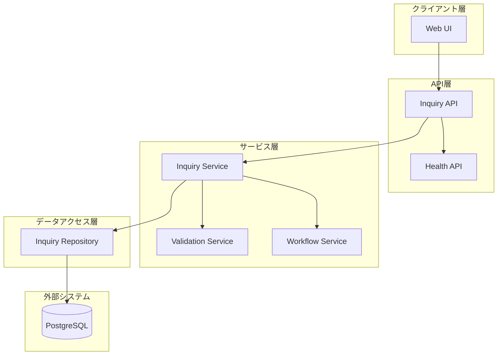
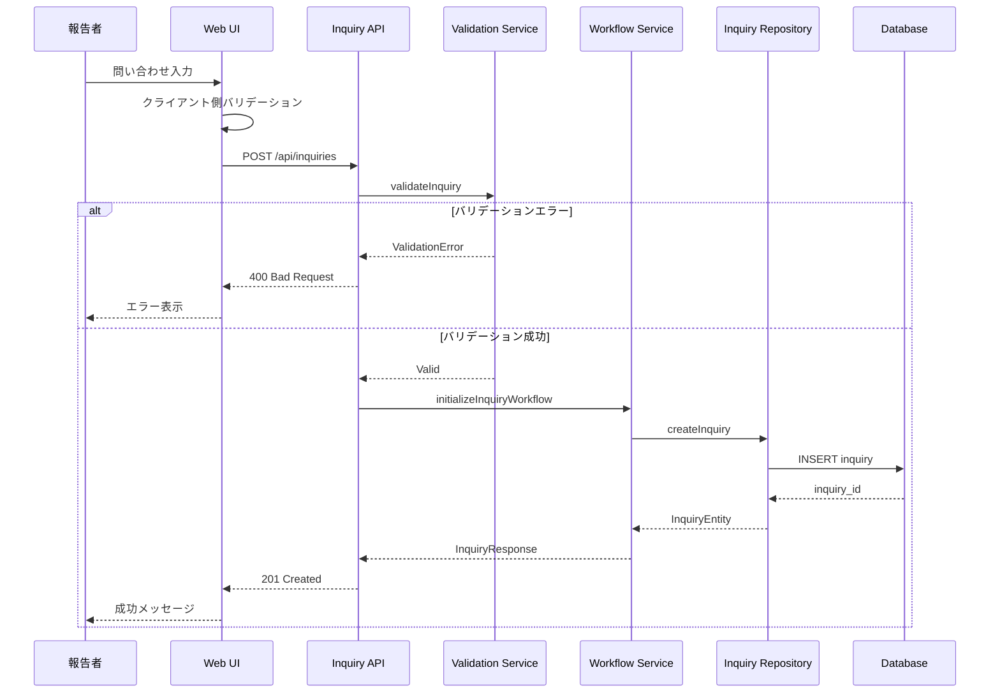
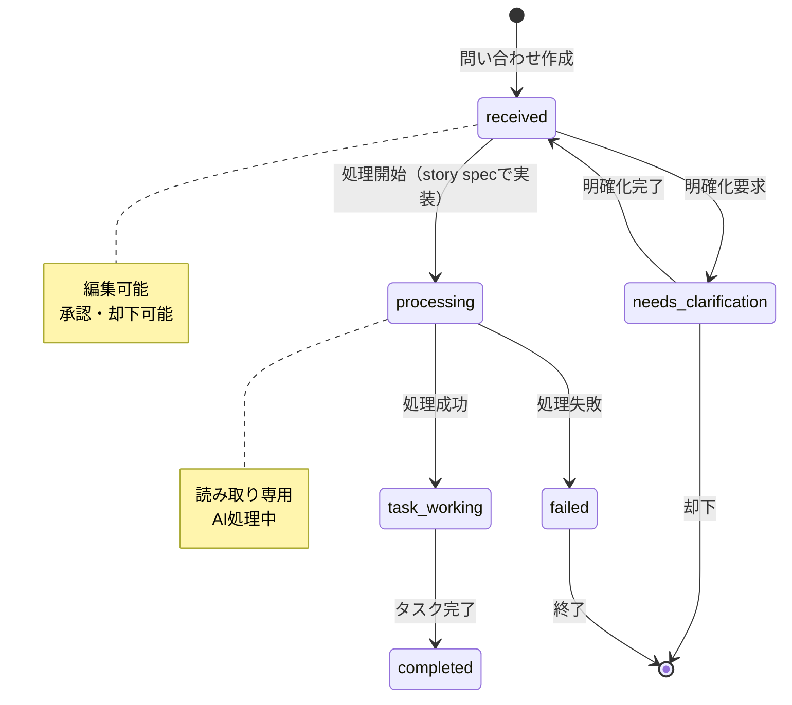
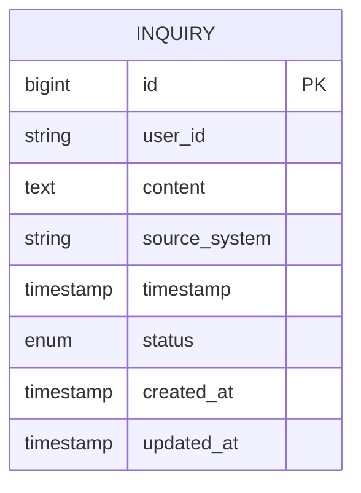

# 問い合わせ管理機能 技術設計書

## 概要

問い合わせ管理機能は、報告者からの自然言語問い合わせを受け付け、それを管理するシステムの基盤機能である。本機能は問い合わせの作成・管理、ワークフロー制御という2つの主要フローを提供する。

### 設計目標

- **型安全性**: すべてのインターフェースで明示的な型定義を使用し、`any`型を排除する
- **疎結合**: コンポーネント間の依存関係を最小化し、明確な境界を設定する
- **拡張性**: 将来的な外部システム連携に対応できる設計
- **可観測性**: すべての重要な操作でログ記録とエラー追跡を実装する
- **言語対応**: 日本語を主言語として設計し、国際化を考慮する

### 非目標

- AI統合機能（story specで実装）
- ストーリー管理機能（story specで実装）
- モバイルアプリケーション（WebUIのみ）

## 要件トレーサビリティ

| 要件ID | 要件概要 | 主要コンポーネント | 主要インターフェース | フロー |
|--------|----------|-------------------|---------------------|--------|
| 1.1-1.6 | 問い合わせの作成 | InquiryRepository, InquiryValidator | createInquiry, validateInquiry | 問い合わせ作成フロー |
| 2.1-2.9 | 問い合わせの一覧・検索・編集 | InquiryRepository, InquiryQueryService | listInquiries, getInquiry, updateInquiry | 問い合わせ管理フロー |
| 3.1-3.5 | 問い合わせの承認・却下 | InquiryWorkflowService | approveInquiry, rejectInquiry | ステータス変更フロー |
| 4.1-4.5 | ユーザーインターフェース | InquiryForm, InquiryList, InquiryDetail | すべてのUI関連インターフェース | 全UIフロー |

## アーキテクチャ概要

### システムアーキテクチャ図



### レイヤー責務

- **クライアント層**: ユーザー入力の受付、データ表示、バリデーションフィードバック
- **API層**: HTTPリクエスト処理、認証・認可、リクエスト/レスポンスのシリアライゼーション
- **サービス層**: ビジネスロジック実装、ワークフロー制御
- **データアクセス層**: データベースCRUD操作、クエリ最適化、トランザクション管理
- **外部システム**: データ永続化

## 技術スタック

### バックエンド

| レイヤー | 技術 | バージョン | 役割 |
|---------|------|-----------|------|
| APIフレームワーク | FastAPI | 0.104.1 | RESTful API提供、OpenAPI自動生成 |
| ASGIサーバー | Uvicorn | 0.24.0 | 非同期リクエスト処理 |
| ORM | SQLAlchemy | 2.0.23 | データベース抽象化レイヤー |
| マイグレーション | Alembic | 1.12.1 | スキーマバージョン管理 |
| バリデーション | Pydantic | 2.5.0 | データ検証・シリアライゼーション |
| テスト | pytest | 7.4.3 | ユニット・統合テスト |

### フロントエンド

| レイヤー | 技術 | バージョン | 役割 |
|---------|------|-----------|------|
| UIフレームワーク | React | 18.2.0 | コンポーネントベースUI構築 |
| 型システム | TypeScript | 4.9.5 | 静的型チェック |
| 状態管理 | TanStack Query | 5.8.4 | サーバー状態管理・キャッシング |
| フォーム | React Hook Form | 7.43.0 | フォーム状態管理 |
| バリデーション | Zod | 3.22.4 | スキーマバリデーション |
| HTTP | Axios | 1.6.2 | API通信 |
| スタイリング | Tailwind CSS | 3.3.5 | ユーティリティファーストCSS |

### データ層

| レイヤー | 技術 | バージョン | 役割 |
|---------|------|-----------|------|
| データベース | PostgreSQL | 15 | リレーショナルデータ永続化 |
| コンテナ | Docker | latest | 開発環境統一 |

## システムフロー

### 問い合わせ作成フロー



### ワークフローステート図



## コンポーネント設計

### コンポーネント概要

| コンポーネント | ドメイン | 責務 | 要件カバレッジ | 依存関係 |
|--------------|---------|------|--------------|---------|
| InquiryRepository | データアクセス | 問い合わせCRUD | 1.1-1.6, 2.1-2.9 | Database |
| InquiryValidator | サービス | 入力検証 | 1.4, 2.8 | - |
| InquiryQueryService | サービス | 検索・ページネーション | 2.1-2.4 | InquiryRepo |
| InquiryWorkflowService | サービス | ワークフロー制御 | 3.1-3.5 | InquiryRepo |
| InquiryAPI | API | 問い合わせエンドポイント | 1.1-3.5 | InquiryService |
| InquiryForm | UI | 問い合わせ入力 | 4.1-4.3 | InquiryAPI |
| InquiryList | UI | 問い合わせ一覧 | 4.4 | InquiryAPI |
| InquiryDetail | UI | 問い合わせ詳細 | 4.5 | InquiryAPI |

## データモデル

### ドメインモデル



#### エンティティ定義

**Inquiry（問い合わせ）**

- **責務**: 報告者からの自然言語問い合わせを表現する
- **集約ルート**: Inquiry自身
- **不変条件**:
  - `content`は空文字列を許可しない
  - `status`はInquiryStatusの有効な値のみ
  - `source_system`は送信元システムを識別する文字列（例: "manual", "email", "chat"）

#### 列挙型定義

**InquiryStatus**

```typescript
type InquiryStatus =
  | 'received'              // 受付済み
  | 'processing'            // AI処理中（story specで使用）
  | 'needs_clarification'   // 明確化要求
  | 'task_working'          // タスク作業中（story specで設定）
  | 'completed'             // 完了
  | 'failed';               // 失敗（story specで設定）
```

### 論理データモデル

#### インデックス戦略

```sql
-- 問い合わせテーブル
CREATE INDEX ix_inquiries_status ON inquiries(status);
CREATE INDEX ix_inquiries_user_id ON inquiries(user_id);
CREATE INDEX ix_inquiries_created_at ON inquiries(created_at DESC);
CREATE INDEX ix_inquiries_composite ON inquiries(status, created_at DESC);

-- 全文検索用（将来）
CREATE INDEX ix_inquiries_content_gin ON inquiries USING gin(to_tsvector('japanese', content));
```

#### データ整合性制約

```sql
-- チェック制約
ALTER TABLE inquiries
  ADD CONSTRAINT chk_inquiries_content_not_empty
  CHECK (length(trim(content)) > 0);
```

### データ契約・統合

#### API レスポンス型

**InquiryResponse**

```typescript
interface InquiryResponse {
  id: number;
  user_id: string;
  content: string;
  source_system: string;
  timestamp: string;  // ISO 8601形式
  status: InquiryStatus;
  created_at: string;  // ISO 8601形式
  updated_at: string;  // ISO 8601形式
}
```

**PaginatedResponse**

```typescript
interface PaginatedResponse<T> {
  data: T[];
  meta: {
    page: number;
    limit: number;
    total: number;
    has_next: boolean;
  };
  timestamp: string;  // ISO 8601形式
}
```

#### API リクエスト型

**CreateInquiryRequest**

```typescript
interface CreateInquiryRequest {
  user_id: string;
  content: string;
  source_system: string;  // 送信元システム (例: "manual", "email", "chat")
}
```

**UpdateInquiryRequest**

```typescript
interface UpdateInquiryRequest {
  content?: string;
  source_system?: string;
}
```

## コンポーネント・インターフェース詳細

### データアクセス層

#### InquiryRepository

**責務**: 問い合わせのCRUD操作とクエリ実行

**契約種別**: Service

**サービスインターフェース**

```typescript
interface InquiryRepository {
  // 作成操作（要件1.1）
  create(data: CreateInquiryData): Promise<InquiryEntity>;

  // 読み取り操作（要件2.3, 2.5）
  findById(id: number): Promise<InquiryEntity | null>;
  findMany(options: FindManyOptions): Promise<InquiryEntity[]>;
  count(filter: InquiryFilter): Promise<number>;

  // 更新操作（要件2.8, 3.1-3.2）
  update(id: number, data: UpdateInquiryData): Promise<InquiryEntity>;
  updateStatus(id: number, status: InquiryStatus): Promise<InquiryEntity>;

  // 削除操作（将来）
  delete(id: number): Promise<void>;
}

interface CreateInquiryData {
  user_id: string;
  content: string;
  source_system: string;
  timestamp: Date;
  status: InquiryStatus;
}

interface UpdateInquiryData {
  content?: string;
  source_system?: string;
}

interface FindManyOptions {
  filter?: InquiryFilter;
  sort?: SortOption[];
  pagination?: PaginationOption;
}

interface InquiryFilter {
  status?: InquiryStatus | InquiryStatus[];
  user_id?: string;
  created_after?: Date;
  created_before?: Date;
}

interface SortOption {
  field: 'created_at' | 'updated_at' | 'status';
  direction: 'asc' | 'desc';
}

interface PaginationOption {
  page: number;      // 1-indexed
  limit: number;     // 1-100
}

interface InquiryEntity {
  id: number;
  user_id: string;
  content: string;
  source_system: string;
  timestamp: Date;
  status: InquiryStatus;
  created_at: Date;
  updated_at: Date;
}
```

**実装ノート**

- SQLAlchemyセッション管理は依存性注入で提供される
- すべての書き込み操作でタイムスタンプを自動更新する
- `findMany`はデフォルトで`created_at DESC`でソートする
- ページネーションの`limit`は1-100の範囲に制限する
- トランザクション境界はサービス層で管理する

**エラーハンドリング**

- `EntityNotFoundError`: 指定されたIDのエンティティが存在しない
- `DatabaseError`: データベース操作失敗
- `ValidationError`: データ検証失敗

### サービス層

#### InquiryValidator

**責務**: 問い合わせデータのバリデーション

**契約種別**: Service

**サービスインターフェース**

```typescript
interface InquiryValidator {
  // 作成時検証（要件1.4）
  validateCreate(data: CreateInquiryRequest): ValidationResult;

  // 更新時検証（要件2.8）
  validateUpdate(data: UpdateInquiryRequest): ValidationResult;

  // コンテンツ検証
  validateContent(content: string): ValidationResult;
}

interface ValidationResult {
  valid: boolean;
  errors: ValidationError[];
}

interface ValidationError {
  field: string;
  message: string;
  code: string;  // GS-xxx形式
}
```

**バリデーションルール**

- `content`: 空文字列禁止、最大長10,000文字
- `user_id`: 必須、英数字とアンダースコアのみ、最大50文字
- `source_system`: 必須、送信元システムを識別する文字列（例: "manual", "email", "chat"）、最大50文字

**実装ノート**

- すべてのエラーメッセージは日本語で提供する
- エラーコードは`GS-001`から開始する一意のコード体系
- クライアント側とサーバー側で同じルールを共有する

#### InquiryQueryService

**責務**: 問い合わせの検索とページネーション

**契約種別**: Service

**サービスインターフェース**

```typescript
interface InquiryQueryService {
  // 一覧取得（要件2.1-2.3）
  listInquiries(request: ListInquiriesRequest): Promise<PaginatedInquiries>;

  // 詳細取得（要件2.5）
  getInquiry(id: number): Promise<InquiryEntity>;
}

interface ListInquiriesRequest {
  page?: number;          // デフォルト: 1
  limit?: number;         // デフォルト: 20、範囲: 1-100（要件2.2）
  status?: InquiryStatus | InquiryStatus[];
  user_id?: string;
  sort_by?: 'created_at' | 'updated_at';
  sort_order?: 'asc' | 'desc';  // デフォルト: 'desc'（要件2.3）
}

interface PaginatedInquiries {
  data: InquiryEntity[];
  meta: {
    page: number;
    limit: number;
    total: number;
    has_next: boolean;
  };
}
```

**実装ノート**

- デフォルトソートは`created_at DESC`（要件2.3）
- ページネーションは1-indexed
- `limit`の範囲検証を実施し、範囲外の値は最大値にクランプする
- `getInquiry`で存在しないIDは404エラー（要件2.6）

**エラーハンドリング**

- `InquiryNotFoundError`: 指定されたIDの問い合わせが存在しない（要件2.6）
- `InvalidPaginationError`: ページネーションパラメータが不正

#### InquiryWorkflowService

**責務**: 問い合わせのワークフロー制御

**契約種別**: Service

**サービスインターフェース**

```typescript
interface InquiryWorkflowService {
  // 問い合わせワークフロー（要件3.1-3.5）
  approveInquiry(inquiryId: number): Promise<InquiryEntity>;
  rejectInquiry(inquiryId: number): Promise<InquiryEntity>;
}
```

**ワークフロールール**

問い合わせステータス遷移:
- `received` → `processing`: ストーリー生成開始時（story specで実装）
- `processing` → `task_working`: ストーリー生成成功時（story specで実装）
- `processing` → `failed`: ストーリー生成失敗時（story specで実装）
- `task_working` → `completed`: すべてのストーリーが完了時（story specで実装）

**実装ノート**

- すべてのステータス変更で`updated_at`タイムスタンプを更新する（要件3.3）
- 無効なステータス遷移は`InvalidStateTransitionError`を発生させる
- ワークフロー実行はトランザクション内で行う

**エラーハンドリング**

- `InvalidStateTransitionError`: 無効なステータス遷移
- `InquiryNotFoundError`: 問い合わせが存在しない

### API層

#### InquiryAPI

**責務**: 問い合わせ関連のHTTPエンドポイント

**契約種別**: API

**APIエンドポイント**

```typescript
// 問い合わせ作成（要件1.1-1.6）
POST /api/inquiries
Request: CreateInquiryRequest
Response: 201 Created, InquiryResponse
Errors: 400 Bad Request, 500 Internal Server Error

// 問い合わせ一覧（要件2.1-2.4）
GET /api/inquiries?page=1&limit=20&status=received&sort_by=created_at&sort_order=desc
Response: 200 OK, PaginatedResponse<InquiryResponse>
Errors: 400 Bad Request, 500 Internal Server Error

// 問い合わせ詳細（要件2.5-2.6）
GET /api/inquiries/{id}
Response: 200 OK, InquiryResponse
Errors: 404 Not Found, 500 Internal Server Error

// 問い合わせ更新（要件2.8-2.9）
PUT /api/inquiries/{id}
Request: UpdateInquiryRequest
Response: 200 OK, InquiryResponse
Errors: 400 Bad Request, 404 Not Found, 500 Internal Server Error

// 問い合わせ承認（要件3.1）
POST /api/inquiries/{id}/approve
Response: 200 OK, InquiryResponse
Errors: 404 Not Found, 409 Conflict, 500 Internal Server Error

// 問い合わせ却下（要件3.2）
POST /api/inquiries/{id}/reject
Response: 200 OK, InquiryResponse
Errors: 404 Not Found, 409 Conflict, 500 Internal Server Error
```

**実装ノート**

- すべてのエンドポイントでJSONシリアライゼーション/デシリアライゼーションを実施
- バリデーションエラーは400 Bad Requestで日本語エラーメッセージを返す（要件1.3）
- タイムスタンプはISO 8601形式で返す
- CORS設定は開発環境で`http://localhost:3000`を許可
- エラーレスポンスは統一フォーマット

**エラーレスポンス形式**

```typescript
interface ErrorResponse {
  errors: Array<{
    code: string;      // GS-xxx形式
    message: string;   // 日本語メッセージ
    field?: string;    // バリデーションエラー時のフィールド名
  }>;
  timestamp: string;   // ISO 8601形式
}
```

### UI層

#### InquiryForm

**責務**: 問い合わせ入力フォーム

**契約種別**: UI

**プロパティ**

```typescript
interface InquiryFormProps {
  onSubmit: (inquiry: CreateInquiryRequest) => Promise<void>;
  onCancel?: () => void;
  isLoading?: boolean;
  initialData?: Partial<CreateInquiryRequest>;
}
```

**実装ノート（要件4.1-4.3）**

- React Hook Formでフォーム状態を管理
- Zodスキーマでクライアント側バリデーションを実施
- バリデーションエラーはフィールド直下に日本語で表示
- 送信中は送信ボタンを無効化し、ローディング状態を表示
- 成功時はreact-hot-toastで成功メッセージを表示
- サーバーエラーはフォーム上部にエラーバナーで表示

**バリデーションルール**

- `content`: 必須、最大10,000文字
- `user_id`: 必須、英数字とアンダースコア、最大50文字

#### InquiryList

**責務**: 問い合わせ一覧表示

**契約種別**: UI

**プロパティ**

```typescript
interface InquiryListProps {
  onInquiryClick: (inquiryId: number) => void;
  onApprove?: (inquiryId: number) => Promise<void>;
  onReject?: (inquiryId: number) => Promise<void>;
  statusFilter?: InquiryStatus[];
}
```

**実装ノート（要件4.4）**

- TanStack Queryでページネーションとキャッシュを管理
- デフォルトページサイズは20件
- 各行に問い合わせID、内容（省略表示）、ステータス、タイムスタンプを表示（要件2.4）
- ステータスフィルタードロップダウンを提供
- 行クリックで詳細ページへ遷移
- ページネーションコントロール（前へ/次へ/ページ番号）

#### InquiryDetail

**責務**: 問い合わせ詳細表示・編集

**契約種別**: UI

**プロパティ**

```typescript
interface InquiryDetailProps {
  inquiryId: number;
  onUpdate: (data: UpdateInquiryRequest) => Promise<void>;
  onApprove: () => Promise<void>;
  onReject: () => Promise<void>;
}
```

**実装ノート（要件4.5）**

- 読み取りモードと編集モードを切り替え可能
- 編集モードではインライン編集をサポート
- 承認/却下ボタンを提供（要件3.4）
- 更新履歴を時系列で表示（`updated_at`タイムスタンプ）

## エラーハンドリング

### エラー分類

| エラータイプ | HTTPステータス | 説明 | ユーザーアクション |
|------------|--------------|------|------------------|
| ValidationError | 400 | 入力値検証失敗 | 入力値を修正して再送信 |
| EntityNotFoundError | 404 | リソースが存在しない | URLを確認 |
| InvalidStateTransitionError | 409 | 不正な状態遷移 | 現在の状態を確認 |
| DatabaseError | 500 | データベースエラー | サポートに連絡 |

### エラーコード体系

```
GS-001: 問い合わせ内容が空です
GS-002: 問い合わせ内容が長すぎます（最大10,000文字）
GS-003: ユーザーIDが不正です
GS-004: 送信元システムが不正です
GS-005: 指定された問い合わせが見つかりません
GS-007: 不正なステータス遷移です
GS-010: データベース操作に失敗しました
GS-011: ページネーションパラメータが不正です
```

### エラーログ戦略

**構造化ログ形式**

```json
{
  "timestamp": "2025-12-27T00:00:00Z",
  "level": "ERROR",
  "message": "Inquiry creation failed",
  "error_code": "GS-001",
  "context": {
    "user_id": "user_001",
    "error_details": "Content is empty"
  },
  "stack_trace": "..."
}
```

**ログレベル**

- `DEBUG`: 開発環境のみ、詳細なデバッグ情報
- `INFO`: 通常の操作ログ（問い合わせ作成など）
- `WARNING`: 警告（リトライ実行など）
- `ERROR`: エラー（バリデーション失敗など）
- `CRITICAL`: 致命的エラー（データベース接続失敗など）

## テスト戦略

### テスト範囲

| レイヤー | テスト種別 | カバレッジ目標 | ツール |
|---------|----------|--------------|--------|
| データアクセス | ユニットテスト | 90% | pytest + SQLite |
| サービス層 | ユニットテスト | 85% | pytest + Mock |
| API層 | 統合テスト | 80% | pytest + TestClient |
| UI層 | コンポーネントテスト | 70% | Jest + RTL |

### テストケース優先度

**P0（必須）**
- 問い合わせ作成フロー全体（要件1.1-1.6）
- ステータス遷移ロジック（要件3.1-3.5）
- バリデーションルール（要件1.4, 2.8）

**P1（高優先度）**
- ページネーション機能（要件2.1-2.3）
- エラーハンドリング全般
- データ整合性制約

**P2（中優先度）**
- UI コンポーネント個別機能
- ソート・フィルタリング

### テスト例

**ユニットテスト例: InquiryValidator**

```python
def test_validate_create_with_empty_content():
    validator = InquiryValidator()
    data = CreateInquiryRequest(
        user_id="test_user",
        content="",
        source_system="manual"
    )
    result = validator.validate_create(data)

    assert result.valid is False
    assert len(result.errors) == 1
    assert result.errors[0].code == "GS-001"
    assert "空です" in result.errors[0].message
```

**統合テスト例: Inquiry Creation API**

```python
@pytest.mark.asyncio
async def test_create_inquiry_success(client, db_session):
    # Arrange
    inquiry_data = {
        "user_id": "test_user",
        "content": "ログイン機能が欲しい",
        "source_system": "manual"
    }

    # Act
    response = await client.post(
        "/api/inquiries",
        json=inquiry_data
    )

    # Assert
    assert response.status_code == 201
    inquiry = response.json()
    assert inquiry["user_id"] == "test_user"
    assert inquiry["status"] == "received"
```

**コンポーネントテスト例: InquiryForm**

```typescript
test('displays validation error for empty content', async () => {
  const mockSubmit = jest.fn();
  render(<InquiryForm onSubmit={mockSubmit} />);

  const submitButton = screen.getByRole('button', { name: /送信/ });
  fireEvent.click(submitButton);

  await waitFor(() => {
    expect(screen.getByText(/問い合わせ内容が空です/)).toBeInTheDocument();
  });

  expect(mockSubmit).not.toHaveBeenCalled();
});
```

## 未解決事項

### 技術的課題

1. **全文検索**: PostgreSQLの全文検索機能 vs Elasticsearch導入の判断
2. **通知機能**: ステータス変更時の通知方法（メール、Slack、Webhook）

### ビジネス要件

1. **問い合わせテンプレート**: よくある問い合わせのテンプレート機能の必要性
2. **監査ログの範囲**: どこまで詳細なログを保存するか

### オープンな設計判断

1. **国際化の範囲**: 日本語以外の言語サポートの優先順位
2. **問い合わせの自動分類**: カテゴリ自動付与機能の必要性

## 付録

### 参照ドキュメント

- [FastAPI公式ドキュメント](https://fastapi.tiangolo.com/)
- [SQLAlchemy 2.0ドキュメント](https://docs.sqlalchemy.org/en/20/)
- [React公式ドキュメント](https://react.dev/)
- [TanStack Query](https://tanstack.com/query/latest)

### 用語集

- **問い合わせ（Inquiry）**: 報告者からの自然言語による要求
- **ワークフロー（Workflow）**: ステータス遷移の制御ロジック
- **承認（Approve）**: 問い合わせを次のプロセスに進める操作
- **却下（Reject）**: 問い合わせを終了する操作

### 変更履歴

| 日付 | バージョン | 変更内容 | 承認者 |
|------|----------|---------|-------|
| 2025-12-27 | 1.0 | storyboard specから分割して初版作成 | - |
