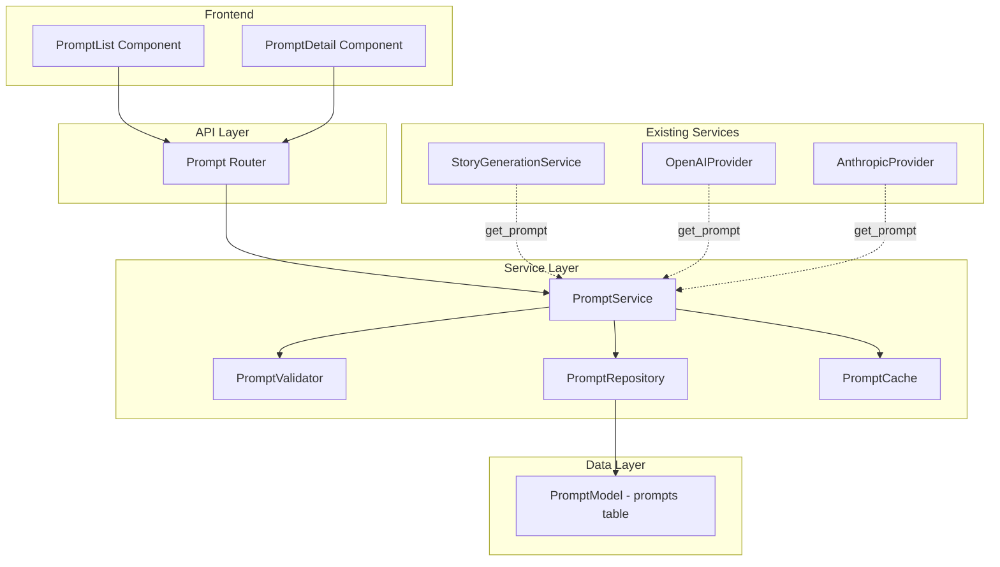
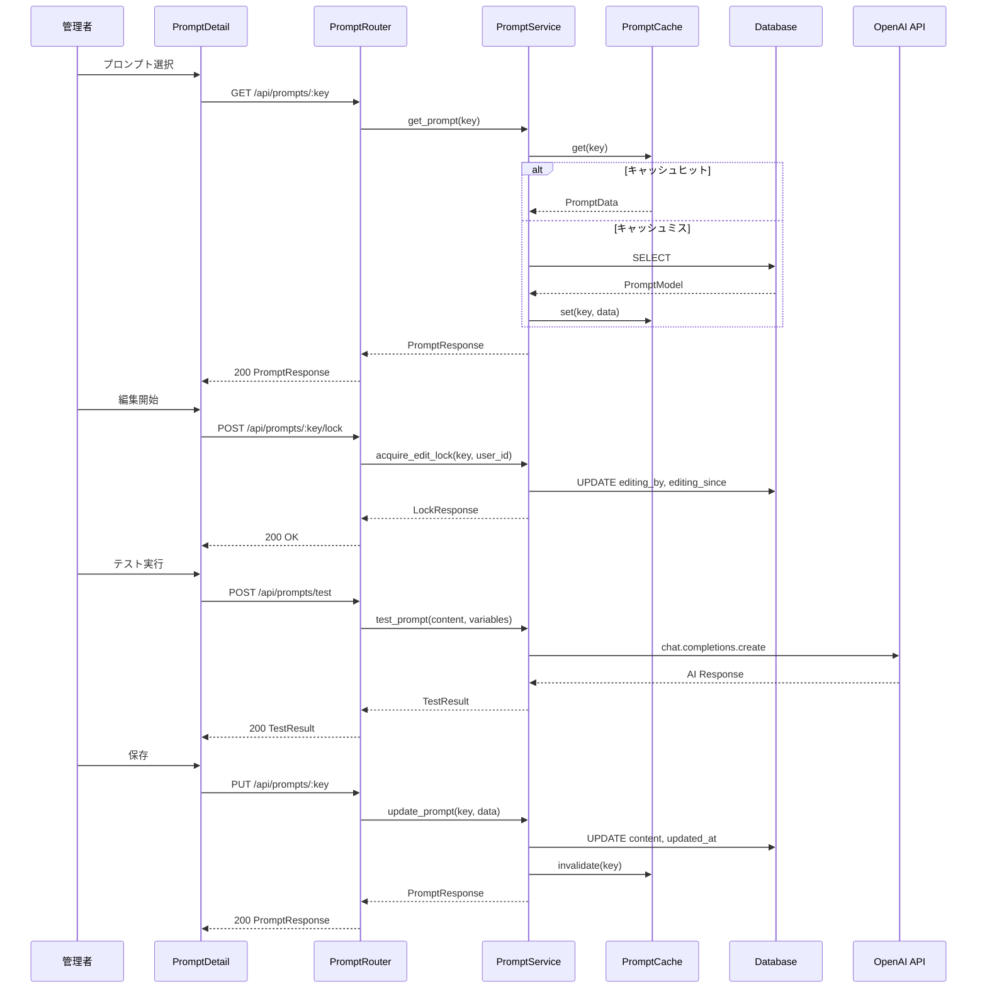
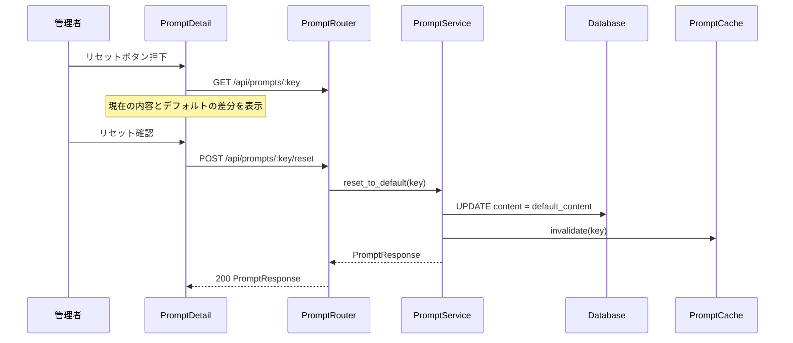
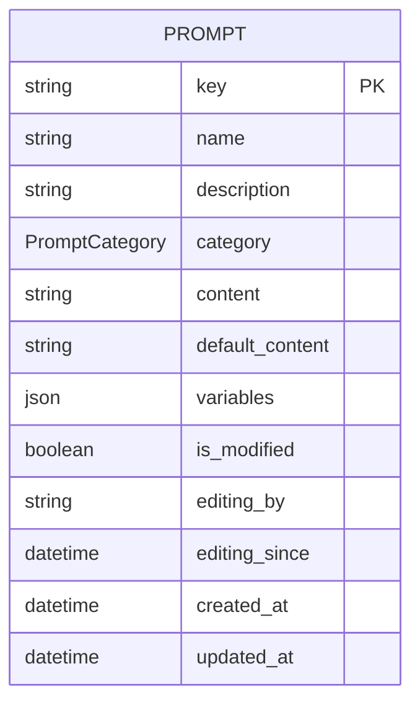

# Design Document: prompt-management

## Overview

**Purpose**: システム全体で使用されるAIプロンプトを一元管理し、WebUIから動的に編集・テスト・リセットできる管理基盤を提供する。
**Users**: 管理者がプロンプトの閲覧・編集・テスト・リセットを行い、開発者がサービス層からプロンプトを取得する。
**Impact**: 現在ハードコードされている3箇所・5つのプロンプト（StoryGenerationService、OpenAIProvider、AnthropicProvider）を、データベース管理のプロンプトに置換する。

### Goals
- プロンプトのCRUD管理とカテゴリフィルタリング
- プレースホルダー検証付きの編集機能
- AIテスト実行によるプロンプトプレビュー
- デフォルトプロンプトの自動シードとリセット機能
- 既存サービスとのシームレスな統合（キャッシュ・フォールバック付き）

### Non-Goals
- プロンプトのバージョン管理・変更履歴追跡
- ユーザー認証・権限管理（将来機能）
- 外部キャッシュ（Redis等）の導入
- プロンプトのA/Bテスト機能

## Architecture

### Existing Architecture Analysis

既存システムはレイヤードアーキテクチャ（Router → Service → Repository → Model）を採用。Inquiry、Story、Importerの3機能が同一パターンで実装されている。

- **統合ポイント**: StoryGenerationService（`_call_openai_api`内のプロンプト）、OpenAIProvider/AnthropicProvider（`ANALYSIS_SYSTEM_PROMPT`定数）
- **既存パターン**: BaseModel継承、Alembicマイグレーション、Pydanticスキーマ、TanStack React Query
- **制約**: OpenAI/Anthropicプロバイダーの`ANALYSIS_SYSTEM_PROMPT`が重複コピーされており、プロンプト管理で一元化する

### Architecture Pattern & Boundary Map



**Architecture Integration**:
- **Selected pattern**: レイヤードアーキテクチャ（既存パターンと完全一致）
- **Domain boundaries**: プロンプト管理は独立ドメインとして分離。既存サービスはPromptServiceを参照するのみ
- **Existing patterns preserved**: BaseModel継承、Repository/Service/Routerパターン、エラーコード体系（GS-4xx）
- **New components rationale**: 独立したドメインとして責務を明確化し、既存コンポーネントの肥大化を防止
- **Steering compliance**: `structure.md`のレイヤード構造、`tech.md`のコード品質基準に準拠

### Technology Stack

| Layer | Choice / Version | Role in Feature | Notes |
|-------|------------------|-----------------|-------|
| Frontend | React 18.2.0 + TypeScript 4.9.5 | PromptList/PromptDetailコンポーネント | 既存スタック |
| Frontend State | TanStack React Query 5.8.4 | サーバー状態管理、キャッシュ | 既存スタック |
| Backend | FastAPI 0.104.1 + Python 3.11+ | REST APIエンドポイント | 既存スタック |
| ORM | SQLAlchemy 2.0.23 | PromptModel定義 | 既存スタック |
| Migration | Alembic 1.12.1 | promptsテーブル作成 | 既存スタック |
| AI Integration | OpenAI API 1.3.7 | テスト実行機能 | 既存スタック |
| Database | PostgreSQL 15 | プロンプト永続化 | 既存スタック |

新規依存関係の追加なし。

## System Flows

### プロンプト編集・テスト実行フロー



### デフォルトリセットフロー



## Requirements Traceability

| Requirement | Summary | Components | Interfaces | Flows |
|-------------|---------|------------|------------|-------|
| 1.1 | プロンプト一覧表示 | PromptList, PromptRouter, PromptService | GET /api/prompts | - |
| 1.2 | プロンプト詳細表示 | PromptDetail, PromptRouter, PromptService | GET /api/prompts/:key | - |
| 1.3 | カテゴリフィルター | PromptList, PromptService | GET /api/prompts?category= | - |
| 1.4 | カテゴリ定義 | PromptCategory列挙型 | - | - |
| 2.1 | 編集モード切替 | PromptDetail | - | - |
| 2.2 | プロンプト保存 | PromptDetail, PromptRouter, PromptService, PromptRepository | PUT /api/prompts/:key | 編集フロー |
| 2.3 | プレースホルダー検証 | PromptValidator | PromptService.validate_placeholders | - |
| 2.4 | 空本文バリデーション | PromptValidator | PromptService.validate_content | - |
| 2.5 | 編集ロック表示 | PromptDetail, PromptService | POST /api/prompts/:key/lock, DELETE /api/prompts/:key/lock | - |
| 3.1 | テスト実行 | PromptDetail, PromptRouter, PromptService | POST /api/prompts/test | テスト実行フロー |
| 3.2 | カスタム入力データ | PromptDetail, PromptService | POST /api/prompts/test | テスト実行フロー |
| 3.3 | 実行中インジケーター | PromptDetail | - | - |
| 3.4 | タイムアウトエラー | PromptService | POST /api/prompts/test | - |
| 4.1 | デフォルト自動登録 | PromptSeeder, main.py lifespan | - | 起動時初期化 |
| 4.2 | デフォルト値保護 | PromptService, PromptRepository | - | - |
| 4.3 | デフォルト値参照 | PromptModel default_contentカラム | GET /api/prompts/:key | - |
| 4.4 | デフォルトリセット | PromptService | POST /api/prompts/:key/reset | リセットフロー |
| 4.5 | 変更有無表示 | PromptDetail, PromptResponse.is_modified | GET /api/prompts/:key | - |
| 4.6 | リセット確認ダイアログ | PromptDetail | - | リセットフロー |
| 5.1 | ストーリー生成プロンプトAPI | PromptService | PromptService.get_prompt | - |
| 5.2 | インポート解析プロンプトAPI | PromptService | PromptService.get_prompt | - |
| 5.3 | プロンプト本文+メタデータ返却 | PromptService | PromptService.get_prompt | - |
| 5.4 | デフォルトフォールバック | PromptService | PromptService.get_prompt | - |
| 5.5 | インメモリキャッシュ | PromptCache | PromptCache.get | - |

## Components and Interfaces

| Component | Domain/Layer | Intent | Req Coverage | Key Dependencies | Contracts |
|-----------|-------------|--------|--------------|-----------------|-----------|
| PromptModel | Data | プロンプトデータの永続化 | 1.1-1.4, 4.1-4.3 | BaseModel (P0) | - |
| PromptCategory | Data/Enum | プロンプトカテゴリ列挙型 | 1.4 | - | - |
| PromptRepository | Service | データアクセス層 | 1.1-1.3, 2.2, 4.4 | PromptModel (P0) | Service |
| PromptValidator | Service | 入力検証 | 2.3, 2.4 | - | Service |
| PromptCache | Service | インメモリキャッシュ | 5.5 | - | Service |
| PromptService | Service | ビジネスロジック統括 | 全要件 | PromptRepository (P0), PromptValidator (P0), PromptCache (P1) | Service |
| PromptSeeder | Service | デフォルトプロンプト初期投入 | 4.1, 4.2 | PromptRepository (P0) | - |
| PromptRouter | API | REST APIエンドポイント | 1.1-1.3, 2.2, 2.5, 3.1, 4.4 | PromptService (P0) | API |
| PromptList | Frontend | プロンプト一覧表示 | 1.1, 1.3, 1.4 | PromptRouter (P0) | State |
| PromptDetail | Frontend | 詳細・編集・テスト・リセット | 1.2, 2.1-2.5, 3.1-3.4, 4.4-4.6 | PromptRouter (P0) | State |

### Data Layer

#### PromptModel

| Field | Detail |
|-------|--------|
| Intent | プロンプトデータの永続化とデフォルト値の保持 |
| Requirements | 1.1, 1.2, 1.3, 1.4, 4.1, 4.2, 4.3 |

**Responsibilities & Constraints**
- promptsテーブルのORMマッピング
- `key`は一意識別子（`story_generation_system`等）で変更不可
- `default_content`はアプリレベルで更新を禁止

**Dependencies**
- Inbound: PromptRepository — CRUD操作 (P0)

#### PromptCategory

| Field | Detail |
|-------|--------|
| Intent | プロンプトのカテゴリ分類 |
| Requirements | 1.4 |

値: `story_generation`, `import_analysis`, `general`

### Service Layer

#### PromptRepository

| Field | Detail |
|-------|--------|
| Intent | プロンプトのデータアクセス操作 |
| Requirements | 1.1, 1.2, 1.3, 2.2, 4.4 |

**Responsibilities & Constraints**
- CRUD操作（find_by_key, find_all, update）
- カテゴリフィルタリング
- `default_content`カラムの更新は禁止（contentのみ更新可）

**Dependencies**
- Inbound: PromptService — データアクセス (P0)
- Outbound: PromptModel — ORM操作 (P0)

**Contracts**: Service [x]

##### Service Interface
```python
class PromptRepository:
    def find_by_key(self, key: str) -> Optional[PromptModel]:
        """キーでプロンプトを取得する."""
        ...

    def find_all(self, category: Optional[PromptCategory] = None) -> List[PromptModel]:
        """全プロンプトを取得する（カテゴリフィルタリング対応）."""
        ...

    def update(self, key: str, data: UpdatePromptData) -> Optional[PromptModel]:
        """プロンプトを更新する（default_contentは更新不可）."""
        ...

    def reset_to_default(self, key: str) -> Optional[PromptModel]:
        """プロンプトをデフォルト値にリセットする."""
        ...

    def update_edit_lock(
        self, key: str, editing_by: Optional[str], editing_since: Optional[datetime]
    ) -> Optional[PromptModel]:
        """編集ロック情報を更新する."""
        ...

    def create(self, data: CreatePromptData) -> PromptModel:
        """プロンプトを作成する（シード用）."""
        ...
```
- Preconditions: 有効なSQLAlchemyセッション
- Postconditions: DB操作完了、セッションコミット済み
- Invariants: `default_content`は`update`メソッドで変更されない

#### PromptValidator

| Field | Detail |
|-------|--------|
| Intent | プロンプト入力の検証 |
| Requirements | 2.3, 2.4 |

**Responsibilities & Constraints**
- プロンプト本文の空チェック
- プレースホルダー構文検証（`{variable_name}`形式）
- エラーコード体系: GS-401〜GS-409

**Dependencies**
- Inbound: PromptService — バリデーション呼び出し (P0)

**Contracts**: Service [x]

##### Service Interface
```python
class PromptValidator:
    def validate_content(self, content: str) -> ValidationResult:
        """プロンプト本文を検証する."""
        ...

    def validate_placeholders(self, content: str, allowed_variables: List[str]) -> ValidationResult:
        """プレースホルダーの構文と変数名を検証する."""
        ...
```
- Preconditions: なし
- Postconditions: ValidationResult（valid/errorsリスト）を返却
- Invariants: エラーコードはGS-4xx体系

#### PromptCache

| Field | Detail |
|-------|--------|
| Intent | プロンプトのインメモリキャッシュとDB障害時フォールバック |
| Requirements | 5.5 |

**Responsibilities & Constraints**
- キーベースのインメモリキャッシュ（Python辞書）
- Write-through: 更新時にキャッシュを無効化
- DB障害時にキャッシュからフォールバック提供

**Dependencies**
- Inbound: PromptService — キャッシュ読み取り/無効化 (P1)

**Contracts**: Service [x]

##### Service Interface
```python
class PromptCache:
    def get(self, key: str) -> Optional[PromptCacheEntry]:
        """キャッシュからプロンプトを取得する."""
        ...

    def set(self, key: str, entry: PromptCacheEntry) -> None:
        """キャッシュにプロンプトを設定する."""
        ...

    def invalidate(self, key: str) -> None:
        """指定キーのキャッシュを無効化する."""
        ...

    def invalidate_all(self) -> None:
        """全キャッシュを無効化する."""
        ...
```

#### PromptService

| Field | Detail |
|-------|--------|
| Intent | プロンプト管理のビジネスロジック統括 |
| Requirements | 全要件 |

**Responsibilities & Constraints**
- プロンプト取得（キャッシュ → DB → デフォルトフォールバック）
- プロンプト更新（バリデーション → DB更新 → キャッシュ無効化）
- テスト実行（プレースホルダー置換 → OpenAI API呼び出し）
- 編集ロック管理（取得 → 解放 → タイムアウト判定）
- デフォルトリセット

**Dependencies**
- Inbound: PromptRouter — API処理 (P0)
- Inbound: StoryGenerationService — プロンプト取得 (P0)
- Inbound: OpenAIProvider/AnthropicProvider — プロンプト取得 (P0)
- Outbound: PromptRepository — データアクセス (P0)
- Outbound: PromptValidator — 入力検証 (P0)
- Outbound: PromptCache — キャッシュ操作 (P1)
- External: OpenAI API — テスト実行 (P1)

**Contracts**: Service [x]

##### Service Interface
```python
class PromptService:
    def get_prompt(self, key: str) -> PromptData:
        """プロンプトを取得する（キャッシュ → DB → デフォルト）."""
        ...

    def list_prompts(self, category: Optional[PromptCategory] = None) -> List[PromptData]:
        """プロンプト一覧を取得する."""
        ...

    def update_prompt(self, key: str, data: UpdatePromptRequest) -> PromptData:
        """プロンプトを更新する."""
        ...

    def reset_to_default(self, key: str) -> PromptData:
        """デフォルトにリセットする."""
        ...

    def test_prompt(self, request: TestPromptRequest) -> TestPromptResult:
        """プロンプトをテスト実行する."""
        ...

    def acquire_edit_lock(self, key: str, user_id: str) -> EditLockResult:
        """編集ロックを取得する."""
        ...

    def release_edit_lock(self, key: str, user_id: str) -> None:
        """編集ロックを解放する."""
        ...
```
- Preconditions: 有効なSQLAlchemyセッション
- Postconditions: 操作結果を返却、キャッシュ整合性を維持
- Invariants: `default_content`は変更されない

#### PromptSeeder

| Field | Detail |
|-------|--------|
| Intent | デフォルトプロンプトの初期投入 |
| Requirements | 4.1, 4.2 |

**Responsibilities & Constraints**
- アプリ起動時にデフォルトプロンプトをDBに投入（冪等）
- 既存プロンプトは上書きしない（INSERT IF NOT EXISTS）
- Python定数としてデフォルト値を定義

**Dependencies**
- Outbound: PromptRepository — データ投入 (P0)

**Implementation Notes**
- `main.py`のlifespan処理で呼び出し（ImporterConfigLoaderと同様のパターン）
- デフォルトプロンプト定義は`services/prompt_defaults.py`に集約

### API Layer

#### PromptRouter

| Field | Detail |
|-------|--------|
| Intent | プロンプト管理REST APIエンドポイント |
| Requirements | 1.1-1.3, 2.2, 2.5, 3.1-3.2, 4.4 |

**Dependencies**
- Inbound: Frontend — HTTP リクエスト (P0)
- Outbound: PromptService — ビジネスロジック (P0)

**Contracts**: API [x]

##### API Contract

| Method | Endpoint | Request | Response | Errors |
|--------|----------|---------|----------|--------|
| GET | /api/prompts | ?category={category} | PromptListResponse | 400 |
| GET | /api/prompts/{key} | - | PromptResponse | 404 |
| PUT | /api/prompts/{key} | UpdatePromptRequest | PromptResponse | 400, 404, 409 |
| POST | /api/prompts/{key}/lock | AcquireLockRequest | LockResponse | 404, 409 |
| DELETE | /api/prompts/{key}/lock | - | 204 | 404 |
| POST | /api/prompts/{key}/reset | - | PromptResponse | 404 |
| POST | /api/prompts/test | TestPromptRequest | TestPromptResult | 400, 504 |

### Frontend Layer

#### PromptList

| Field | Detail |
|-------|--------|
| Intent | プロンプト一覧表示とカテゴリフィルタリング |
| Requirements | 1.1, 1.3, 1.4 |

**Implementation Notes**
- TanStack React Queryで`GET /api/prompts`を呼び出し
- カテゴリフィルタードロップダウン
- 既存InquiryListと同様のUIパターン（テーブル表示、行クリックで詳細遷移）

##### State Management
- Query Key: `['prompts', { category }]`
- フィルター状態: `useState<PromptCategory | undefined>`

#### PromptDetail

| Field | Detail |
|-------|--------|
| Intent | プロンプト詳細表示、編集、テスト実行、デフォルトリセット |
| Requirements | 1.2, 2.1-2.5, 3.1-3.4, 4.4-4.6 |

**Implementation Notes**
- 読み取り/編集モード切替（既存InquiryDetailパターン）
- テキストエリアによるプロンプト編集
- テスト実行パネル（カスタム入力データ入力 + 実行ボタン + 結果表示）
- デフォルトリセットボタン + 確認ダイアログ（差分表示付き）
- 編集ロック状態の表示（他ユーザー編集中の警告）
- `is_modified`フラグによるデフォルトからの変更有無表示

##### State Management
- Query Key: `['prompts', key]`
- 編集モード: `useState<boolean>`
- テスト実行状態: `useMutation`（ローディング・エラー・結果）

## Data Models

### Domain Model



**ビジネスルール**:
- `key`はシステム全体で一意な識別子（例: `story_generation_system`）
- `default_content`はシード時に設定され、アプリレベルで更新禁止
- `is_modified`は`content != default_content`で判定（DB更新時に自動計算）
- `editing_by`は30分経過で自動的に無効（アプリレベル判定）
- `variables`はプレースホルダー変数名のリスト（JSON配列）

### Physical Data Model

**promptsテーブル**:

| Column | Type | Constraints | Description |
|--------|------|------------|-------------|
| id | INTEGER | PK, AUTO_INCREMENT | 一意識別子 |
| key | VARCHAR(100) | UNIQUE, NOT NULL | プロンプトキー |
| name | VARCHAR(200) | NOT NULL | 表示名 |
| description | TEXT | | 説明 |
| category | VARCHAR(50) | NOT NULL | カテゴリ |
| content | TEXT | NOT NULL | 現在のプロンプト本文 |
| default_content | TEXT | NOT NULL | デフォルトプロンプト本文 |
| variables | JSON | DEFAULT '[]' | プレースホルダー変数リスト |
| is_modified | BOOLEAN | DEFAULT FALSE | デフォルトから変更されているか |
| editing_by | VARCHAR(100) | NULLABLE | 編集中ユーザーID |
| editing_since | TIMESTAMP(TZ) | NULLABLE | 編集開始日時 |
| created_at | TIMESTAMP(TZ) | NOT NULL, DEFAULT NOW() | 作成日時 |
| updated_at | TIMESTAMP(TZ) | NOT NULL, DEFAULT NOW() | 更新日時 |

**インデックス**:
- `ix_prompts_key` — UNIQUE INDEX on `key`
- `ix_prompts_category` — INDEX on `category`

### Data Contracts & Integration

**API Data Transfer**

```python
# レスポンススキーマ
class PromptResponse(BaseModel):
    id: int
    key: str
    name: str
    description: Optional[str]
    category: str
    content: str
    default_content: str
    variables: List[str]
    is_modified: bool
    editing_by: Optional[str]
    editing_since: Optional[datetime]
    created_at: datetime
    updated_at: datetime

# 更新リクエスト
class UpdatePromptRequest(BaseModel):
    content: str  # 必須、空文字不可
    description: Optional[str] = None

# テスト実行リクエスト
class TestPromptRequest(BaseModel):
    content: str  # テスト対象のプロンプト本文
    variables: Dict[str, str]  # プレースホルダー変数の値

# テスト実行結果
class TestPromptResult(BaseModel):
    output: str  # AI出力結果
    model: str  # 使用モデル
    elapsed_ms: int  # 実行時間（ミリ秒）

# 編集ロックリクエスト
class AcquireLockRequest(BaseModel):
    user_id: str  # 編集者ID

# 一覧レスポンス
class PromptListResponse(BaseModel):
    data: List[PromptResponse]
    total: int
```

**TypeScript型定義**:

```typescript
interface PromptResponse {
  id: number;
  key: string;
  name: string;
  description: string | null;
  category: PromptCategory;
  content: string;
  default_content: string;
  variables: string[];
  is_modified: boolean;
  editing_by: string | null;
  editing_since: string | null;
  created_at: string;
  updated_at: string;
}

type PromptCategory = 'story_generation' | 'import_analysis' | 'general';

interface UpdatePromptRequest {
  content: string;
  description?: string;
}

interface TestPromptRequest {
  content: string;
  variables: Record<string, string>;
}

interface TestPromptResult {
  output: string;
  model: string;
  elapsed_ms: number;
}
```

## Error Handling

### Error Categories and Responses

**エラーコード体系: GS-4xx**

| Code | Category | HTTP Status | Description |
|------|----------|-------------|-------------|
| GS-401 | 入力検証 | 400 | プロンプト本文が空 |
| GS-402 | 入力検証 | 400 | 無効なプレースホルダー構文 |
| GS-403 | 入力検証 | 400 | 無効なカテゴリ |
| GS-404 | データアクセス | 404 | プロンプトが見つからない |
| GS-405 | 編集ロック | 409 | 他のユーザーが編集中 |
| GS-406 | テスト実行 | 504 | テスト実行タイムアウト（30秒） |
| GS-407 | テスト実行 | 500 | AI API呼び出し失敗 |
| GS-408 | デフォルト管理 | 400 | デフォルト値の直接変更試行 |

### Monitoring
- テスト実行の応答時間・成功率をログ出力
- キャッシュヒット率をログ出力（DEBUG レベル）
- DB障害時のキャッシュフォールバック発動をWARNINGログ出力

## Testing Strategy

### Unit Tests
- **PromptValidator**: 空文字検証、プレースホルダー構文検証（正常系・異常系）、エラーコード検証
- **PromptRepository**: CRUD操作、カテゴリフィルタリング、リセット、編集ロック
- **PromptService**: プロンプト取得（キャッシュヒット/ミス/フォールバック）、更新、テスト実行、ロック管理
- **PromptCache**: get/set/invalidate、全クリア
- **PromptSeeder**: 初回投入、冪等性（既存データを上書きしない）

### Integration Tests
- API層テスト: 全エンドポイントのHTTPリクエスト/レスポンス検証
- 既存サービス統合: StoryGenerationServiceがPromptServiceからプロンプトを取得して動作
- テスト実行フロー: プロンプト → プレースホルダー置換 → OpenAI API（モック）→ 結果返却

### E2E/UI Tests
- プロンプト一覧表示・カテゴリフィルタリング
- プロンプト詳細表示・編集・保存
- テスト実行（ローディング・結果表示・タイムアウト）
- デフォルトリセット（確認ダイアログ・差分表示・リセット実行）

## Migration Strategy

1. **Alembicマイグレーション**: `prompts`テーブル作成
2. **デフォルトシード**: アプリ起動時lifespan処理でデフォルトプロンプトを投入
3. **既存サービス改修**: StoryGenerationService、OpenAI/AnthropicProviderのプロンプト取得元をPromptServiceに変更
4. **フォールバック**: PromptServiceが利用不可の場合、既存のハードコードプロンプトにフォールバック（移行期間中の安全策）
