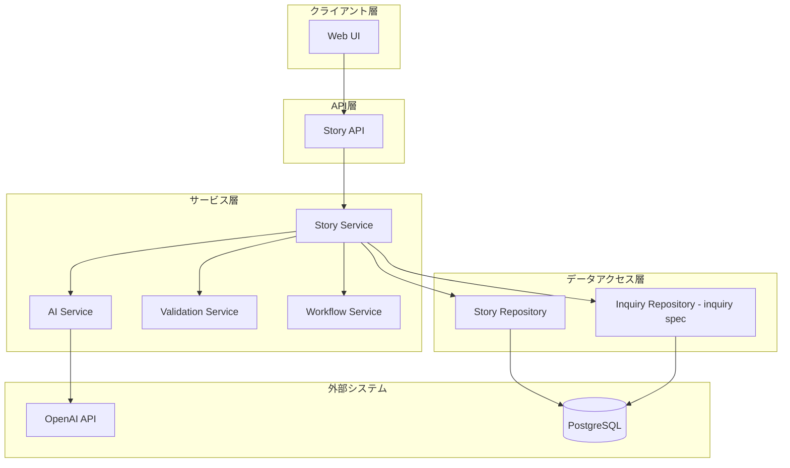
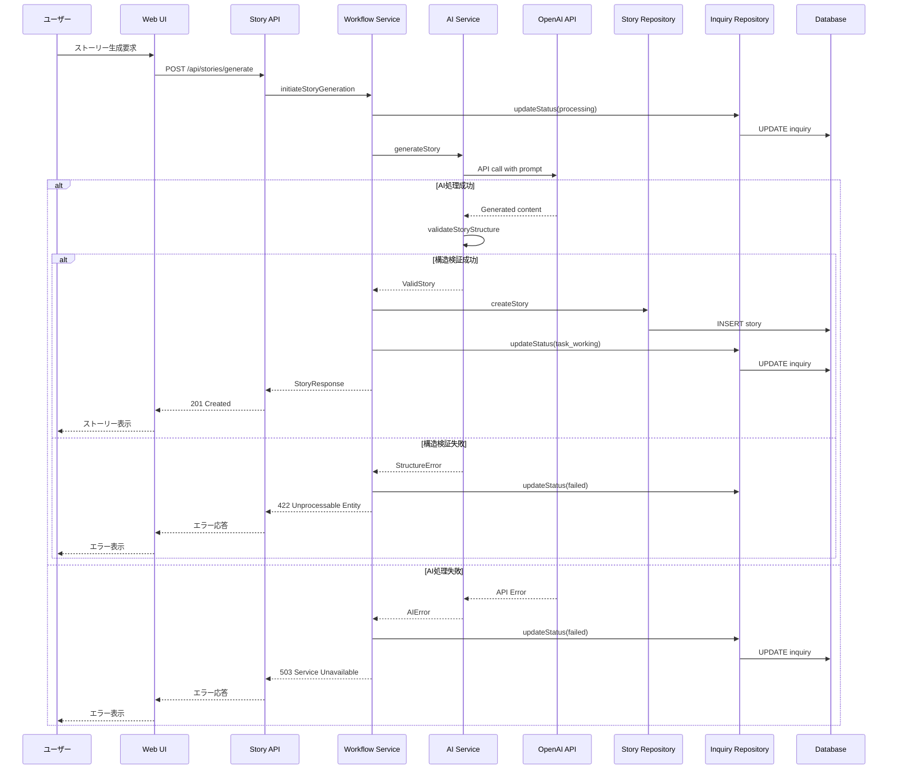
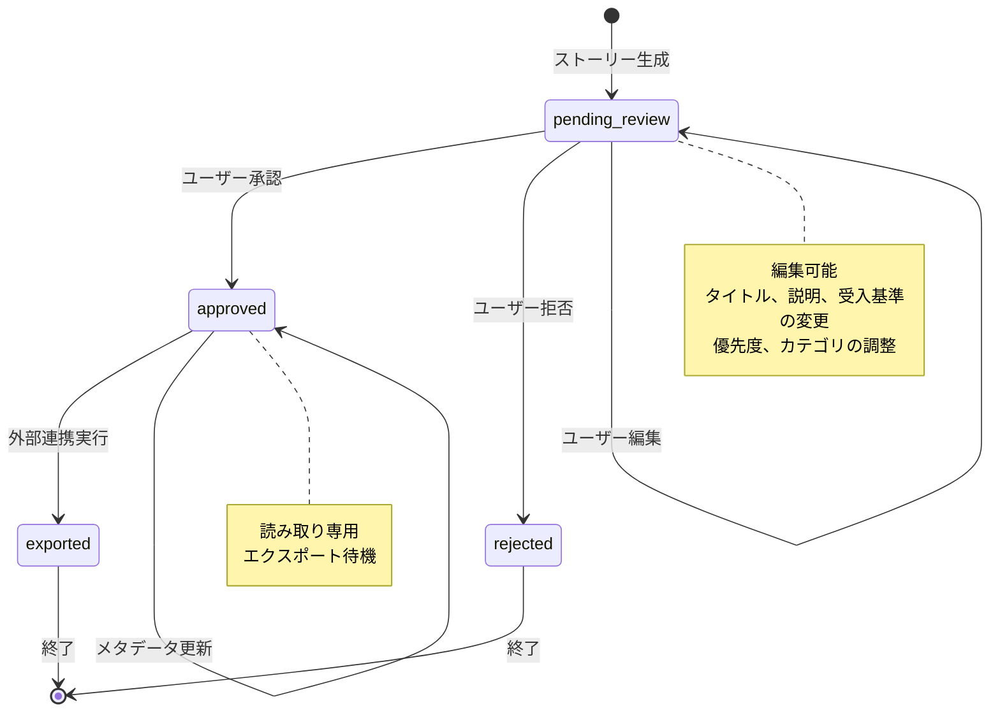
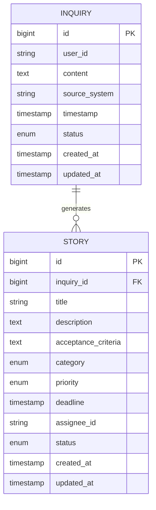

# ストーリー管理機能 技術設計書

## 概要

ストーリー管理機能は、問い合わせからAIを活用して構造化されたユーザーストーリーを生成し、それを管理するシステムである。本機能はAI駆動のストーリー生成と人間によるレビュー・承認という2つの主要フローを提供する。

### 設計目標

- **型安全性**: すべてのインターフェースで明示的な型定義を使用し、`any`型を排除する
- **疎結合**: コンポーネント間の依存関係を最小化し、明確な境界を設定する
- **拡張性**: 将来的な外部システム連携やAIモデル変更に対応できる設計
- **可観測性**: すべての重要な操作でログ記録とエラー追跡を実装する
- **言語対応**: 日本語を主言語として設計し、国際化を考慮する

### 非目標

- リアルタイムコラボレーション機能（将来検討）
- 複数AIプロバイダーの同時使用（Phase 1では単一プロバイダー）
- モバイルアプリケーション（WebUIのみ）

## 依存関係

### inquiry spec への依存

本機能は **inquiry spec（問い合わせ管理機能）** に依存します：

- **Inquiryエンティティ**: Storyは`inquiry_id`でInquiryを参照
- **InquiryStatus**: ストーリー生成時に問い合わせのステータスを更新
- **問い合わせ内容**: AI生成の入力として使用

**依存するインターフェース:**
```typescript
// inquiry specで定義されたエンティティ
interface InquiryEntity {
  id: number;
  user_id: string;
  content: string;
  source_system: string;
  timestamp: Date;
  status: InquiryStatus;
  created_at: Date;
  updated_at: Date;
}
```

## 要件トレーサビリティ

| 要件ID | 要件概要 | 主要コンポーネント | 主要インターフェース | フロー |
|--------|----------|-------------------|---------------------|--------|
| 1.1-1.8 | ストーリー生成 | AIStoryGenerator, StoryRepository | generateStory, validateStoryStructure | AI変換フロー |
| 2.1-2.6 | ストーリーの管理・レビュー | StoryRepository, StoryWorkflowService | listStories, updateStory, approveStory | ストーリーレビューフロー |
| 3.1-3.3 | ユーザーインターフェース | StoryBoard, StoryDetail | すべてのUI関連インターフェース | 全UIフロー |

## アーキテクチャ概要

### システムアーキテクチャ図



### レイヤー責務

- **クライアント層**: ユーザー入力の受付、データ表示、バリデーションフィードバック
- **API層**: HTTPリクエスト処理、認証・認可、リクエスト/レスポンスのシリアライゼーション
- **サービス層**: ビジネスロジック実装、ワークフロー制御、外部システム統合
- **データアクセス層**: データベースCRUD操作、クエリ最適化、トランザクション管理
- **外部システム**: AI処理、データ永続化

## 技術スタック

### バックエンド

| レイヤー | 技術 | バージョン | 役割 |
|---------|------|-----------|------|
| APIフレームワーク | FastAPI | 0.104.1 | RESTful API提供、OpenAPI自動生成 |
| ASGIサーバー | Uvicorn | 0.24.0 | 非同期リクエスト処理 |
| ORM | SQLAlchemy | 2.0.23 | データベース抽象化レイヤー |
| マイグレーション | Alembic | 1.12.1 | スキーマバージョン管理 |
| バリデーション | Pydantic | 2.5.0 | データ検証・シリアライゼーション |
| AI統合 | OpenAI | 1.3.7 | ストーリー生成エンジン |
| テスト | pytest | 7.4.3 | ユニット・統合テスト |

### フロントエンド

| レイヤー | 技術 | バージョン | 役割 |
|---------|------|-----------|------|
| UIフレームワーク | React | 18.2.0 | コンポーネントベースUI構築 |
| 型システム | TypeScript | 4.9.5 | 静的型チェック |
| 状態管理 | TanStack Query | 5.8.4 | サーバー状態管理・キャッシング |
| フォーム | React Hook Form | 7.43.0 | フォーム状態管理 |
| バリデーション | Zod | 3.22.4 | スキーマバリデーション |
| HTTP | Axios | 1.6.2 | API通信 |
| スタイリング | Tailwind CSS | 3.3.5 | ユーティリティファーストCSS |

### データ層

| レイヤー | 技術 | バージョン | 役割 |
|---------|------|-----------|------|
| データベース | PostgreSQL | 15 | リレーショナルデータ永続化 |
| コンテナ | Docker | latest | 開発環境統一 |

## システムフロー

### AI変換フロー



### ストーリーレビューフロー



## コンポーネント設計

### コンポーネント概要

| コンポーネント | ドメイン | 責務 | 要件カバレッジ | 依存関係 |
|--------------|---------|------|--------------|---------|
| StoryRepository | データアクセス | ストーリーCRUD | 1.1-1.8, 2.1-2.6 | Database |
| AIStoryGenerator | サービス | AI生成 | 1.1-1.8 | OpenAI API |
| StoryWorkflowService | サービス | ワークフロー制御 | 1.1-1.8, 2.1-2.6 | StoryRepo, InquiryRepo |
| StoryAPI | API | ストーリーエンドポイント | 1.1-2.6 | StoryService |
| StoryBoard | UI | ストーリー管理 | 3.1-3.3 | StoryAPI |
| StoryDetail | UI | ストーリー詳細 | 3.1-3.3 | StoryAPI |

## データモデル

### ドメインモデル



#### エンティティ定義

**Story（ストーリー）**

- **責務**: 構造化されたユーザーストーリーを表現する
- **集約ルート**: Story自身（Inquiryへの参照を持つ）
- **不変条件**:
  - `inquiry_id`は有効なInquiryを参照する（inquiry specのInquiryエンティティ）
  - `title`は500文字以内
  - `description`と`acceptance_criteria`は空文字列を許可しない

#### 列挙型定義

**StoryStatus**

```typescript
type StoryStatus =
  | 'pending_review'        // レビュー待ち
  | 'approved'              // 承認済み
  | 'rejected'              // 拒否
  | 'exported';             // エクスポート済み
```

**Priority**

```typescript
type Priority =
  | 'low'                   // 低
  | 'medium'                // 中
  | 'high'                  // 高
  | 'urgent';               // 緊急
```

**StoryCategory**

```typescript
type StoryCategory =
  | 'development'           // 開発
  | 'testing'               // テスト
  | 'documentation'         // ドキュメント
  | 'research'              // 調査
  | 'maintenance'           // メンテナンス
  | 'custom';               // カスタム
```

### 論理データモデル

#### インデックス戦略

```sql
-- ストーリーテーブル
CREATE INDEX ix_stories_inquiry_id ON stories(inquiry_id);
CREATE INDEX ix_stories_status ON stories(status);
CREATE INDEX ix_stories_priority ON stories(priority);
CREATE INDEX ix_stories_assignee_id ON stories(assignee_id);
CREATE INDEX ix_stories_deadline ON stories(deadline);
CREATE INDEX ix_stories_composite ON stories(status, priority, created_at DESC);

-- 全文検索用（将来）
CREATE INDEX ix_stories_title_gin ON stories USING gin(to_tsvector('japanese', title));
```

#### データ整合性制約

```sql
-- 外部キー制約
ALTER TABLE stories
  ADD CONSTRAINT fk_stories_inquiry
  FOREIGN KEY (inquiry_id)
  REFERENCES inquiries(id)
  ON DELETE CASCADE;

-- チェック制約
ALTER TABLE stories
  ADD CONSTRAINT chk_stories_title_length
  CHECK (length(title) <= 500);
```

### データ契約・統合

#### API レスポンス型

**StoryResponse**

```typescript
interface StoryResponse {
  id: number;
  inquiry_id: number;
  title: string;
  description: string;
  acceptance_criteria: string;
  category: StoryCategory;
  priority: Priority;
  deadline: string | null;  // ISO 8601形式
  assignee_id: string | null;
  status: StoryStatus;
  created_at: string;  // ISO 8601形式
  updated_at: string;  // ISO 8601形式
}
```

**PaginatedResponse**

```typescript
interface PaginatedResponse<T> {
  data: T[];
  meta: {
    page: number;
    limit: number;
    total: number;
    has_next: boolean;
  };
  timestamp: string;  // ISO 8601形式
}
```

#### API リクエスト型

**GenerateStoryRequest**

```typescript
interface GenerateStoryRequest {
  inquiry_id: number;
  template_id?: number;  // 将来使用
}
```

**UpdateStoryRequest**

```typescript
interface UpdateStoryRequest {
  title?: string;
  description?: string;
  acceptance_criteria?: string;
  category?: StoryCategory;
  priority?: Priority;
  deadline?: string | null;
  assignee_id?: string | null;
}
```

## コンポーネント・インターフェース詳細

### データアクセス層

#### StoryRepository

**責務**: ストーリーのCRUD操作とクエリ実行

**契約種別**: Service

**サービスインターフェース**

```typescript
interface StoryRepository {
  // 作成操作（要件1.2-1.5）
  create(data: CreateStoryData): Promise<StoryEntity>;

  // 読み取り操作（要件2.1-2.2）
  findById(id: number): Promise<StoryEntity | null>;
  findMany(options: FindManyOptions): Promise<StoryEntity[]>;
  findByInquiryId(inquiryId: number): Promise<StoryEntity[]>;
  count(filter: StoryFilter): Promise<number>;

  // 更新操作（要件2.3-2.5）
  update(id: number, data: UpdateStoryData): Promise<StoryEntity>;
  updateStatus(id: number, status: StoryStatus): Promise<StoryEntity>;

  // 削除操作（将来）
  delete(id: number): Promise<void>;
}

interface CreateStoryData {
  inquiry_id: number;
  title: string;
  description: string;
  acceptance_criteria: string;
  category: StoryCategory;
  priority: Priority;
  deadline?: Date | null;
  assignee_id?: string | null;
  status: StoryStatus;
}

interface UpdateStoryData {
  title?: string;
  description?: string;
  acceptance_criteria?: string;
  category?: StoryCategory;
  priority?: Priority;
  deadline?: Date | null;
  assignee_id?: string | null;
}

interface StoryFilter {
  status?: StoryStatus | StoryStatus[];
  priority?: Priority | Priority[];
  category?: StoryCategory | StoryCategory[];
  assignee_id?: string;
  deadline_before?: Date;
  deadline_after?: Date;
}

interface StoryEntity {
  id: number;
  inquiry_id: number;
  title: string;
  description: string;
  acceptance_criteria: string;
  category: StoryCategory;
  priority: Priority;
  deadline: Date | null;
  assignee_id: string | null;
  status: StoryStatus;
  created_at: Date;
  updated_at: Date;
}
```

**実装ノート**

- `findByInquiryId`は関連ストーリーの一括取得に使用する
- デフォルトソートは`priority DESC, created_at DESC`

**エラーハンドリング**

- `EntityNotFoundError`: 指定されたIDのエンティティが存在しない
- `DatabaseError`: データベース操作失敗
- `ValidationError`: データ検証失敗

### サービス層

#### AIStoryGenerator

**責務**: OpenAI APIを使用したストーリー生成

**契約種別**: Service, API

**サービスインターフェース**

```typescript
interface AIStoryGenerator {
  // ストーリー生成（要件1.1-1.3）
  generateStory(request: GenerationRequest): Promise<GeneratedStory>;

  // 生成結果検証（要件1.7）
  validateStructure(story: GeneratedStory): ValidationResult;
}

interface GenerationRequest {
  inquiry_content: string;
  template_content?: string;  // 将来使用
  generation_config?: GenerationConfig;
}

interface GenerationConfig {
  model: string;          // デフォルト: "gpt-4"
  temperature: number;    // デフォルト: 0.7
  max_tokens: number;     // デフォルト: 2000
}

interface GeneratedStory {
  title: string;
  description: string;
  acceptance_criteria: string;
  category: StoryCategory;
  priority: Priority;
}
```

**API契約（OpenAI）**

- **エンドポイント**: `https://api.openai.com/v1/chat/completions`
- **認証**: Bearer Token（環境変数`OPENAI_API_KEY`）
- **レート制限**: 3,500 RPM（tier dependent）
- **タイムアウト**: 30秒
- **リトライ戦略**: 指数バックオフ、最大3回

**プロンプト構造**

```
以下の問い合わせから、アジャイル開発で使用するユーザーストーリーを生成してください。

問い合わせ内容：
{inquiry_content}

出力形式（JSON）：
{
  "title": "簡潔なタイトル（最大100文字）",
  "description": "As a [ユーザー], I want [機能] so that [価値]",
  "acceptance_criteria": "- 具体的な基準1\n- 具体的な基準2\n- 具体的な基準3",
  "category": "development|testing|documentation|research|maintenance|custom",
  "priority": "low|medium|high|urgent"
}

制約：
- タイトルは100文字以内
- 説明はユーザーストーリー形式
- 受入基準は3-5項目
- カテゴリは6種類から選択
- 優先度は4段階から選択
```

**実装ノート**

- AI生成中は`inquiry.status = 'processing'`に設定する（要件1.8）
- 生成失敗時は`inquiry.status = 'failed'`に設定する（要件1.6）
- レスポンスのJSON構造を検証し、必須フィールドの存在を確認する
- タイムアウト、ネットワークエラー、APIエラーを適切にハンドリングする

**エラーハンドリング**

- `AIServiceUnavailableError`: OpenAI APIへの接続失敗
- `AIGenerationTimeoutError`: 生成処理タイムアウト
- `InvalidResponseFormatError`: レスポンス形式が不正
- `AIQuotaExceededError`: APIクォータ超過

#### StoryWorkflowService

**責務**: ストーリーのワークフロー制御

**契約種別**: Service

**サービスインターフェース**

```typescript
interface StoryWorkflowService {
  // ストーリーワークフロー（要件2.4-2.5）
  approveStory(storyId: number): Promise<StoryEntity>;
  rejectStory(storyId: number): Promise<StoryEntity>;

  // ストーリー生成ワークフロー（要件1.1-1.8）
  initiateStoryGeneration(inquiryId: number): Promise<StoryEntity>;
}
```

**ワークフロールール**

ストーリーステータス遷移:
- 初期状態: `pending_review`（要件1.4）
- `pending_review` → `approved`: ユーザー承認時
- `pending_review` → `rejected`: ユーザー拒否時
- `approved` → `exported`: 外部システムエクスポート時（将来）

**実装ノート**

- すべてのステータス変更で`updated_at`タイムスタンプを更新する
- 無効なステータス遷移は`InvalidStateTransitionError`を発生させる
- ワークフロー実行はトランザクション内で行う
- `initiateStoryGeneration`は問い合わせのステータスも更新する（inquiry spec依存）

**エラーハンドリング**

- `InvalidStateTransitionError`: 無効なステータス遷移
- `StoryNotFoundError`: ストーリーが存在しない
- `InquiryNotFoundError`: 問い合わせが存在しない（inquiry spec）

### API層

#### StoryAPI

**責務**: ストーリー関連のHTTPエンドポイント

**契約種別**: API

**APIエンドポイント**

```typescript
// ストーリー生成（要件1.1-1.8）
POST /api/stories/generate
Request: GenerateStoryRequest
Response: 201 Created, StoryResponse
Errors: 400 Bad Request, 404 Not Found, 422 Unprocessable Entity, 503 Service Unavailable

// ストーリー一覧（要件2.1）
GET /api/stories?page=1&limit=20&status=pending_review&priority=high
Response: 200 OK, PaginatedResponse<StoryResponse>
Errors: 400 Bad Request, 500 Internal Server Error

// ストーリー詳細（要件2.2）
GET /api/stories/{id}
Response: 200 OK, StoryResponse
Errors: 404 Not Found, 500 Internal Server Error

// ストーリー更新（要件2.3）
PUT /api/stories/{id}
Request: UpdateStoryRequest
Response: 200 OK, StoryResponse
Errors: 400 Bad Request, 404 Not Found, 500 Internal Server Error

// ストーリー承認（要件2.4）
POST /api/stories/{id}/approve
Response: 200 OK, StoryResponse
Errors: 404 Not Found, 409 Conflict, 500 Internal Server Error

// ストーリー拒否（要件2.5）
POST /api/stories/{id}/reject
Response: 200 OK, StoryResponse
Errors: 404 Not Found, 409 Conflict, 500 Internal Server Error
```

**実装ノート**

- `/generate`エンドポイントはAI処理のため最大30秒のタイムアウト
- AI処理失敗時は503 Service Unavailableを返す（要件1.6）
- 構造検証失敗時は422 Unprocessable Entityを返す（要件1.7）
- ストーリー生成中の問い合わせは`processing`ステータス（要件1.8）

**エラーレスポンス形式**

```typescript
interface ErrorResponse {
  errors: Array<{
    code: string;      // GS-xxx形式
    message: string;   // 日本語メッセージ
    field?: string;    // バリデーションエラー時のフィールド名
  }>;
  timestamp: string;   // ISO 8601形式
}
```

### UI層

#### StoryBoard

**責務**: ストーリー一覧・詳細表示

**契約種別**: UI

**プロパティ**

```typescript
interface StoryBoardProps {
  onStoryClick: (storyId: number) => void;
  statusFilter?: StoryStatus[];
  priorityFilter?: Priority[];
}
```

**実装ノート（要件3.2）**

- カンバンボード形式でストーリーをステータス別に表示
- 各カードにタイトル、優先度、担当者IDを表示（要件2.2）
- フィルタリング機能（ステータス、優先度、カテゴリ、担当者ID）
- ソート機能（優先度、期限、作成日時）

#### StoryDetail

**責務**: ストーリー詳細表示・編集

**契約種別**: UI

**プロパティ**

```typescript
interface StoryDetailProps {
  storyId: number;
  onUpdate: (data: UpdateStoryRequest) => Promise<void>;
  onApprove: () => Promise<void>;
  onReject: () => Promise<void>;
}
```

**実装ノート（要件3.3）**

- 全フィールドの詳細表示（タイトル、説明、受入基準、カテゴリ、優先度、期限）
- 編集モードでインライン編集をサポート
- 承認/拒否ボタンを提供
- 元の問い合わせへのリンクを表示（inquiry spec連携）
- 担当者ID・期限の設定UI（要件2.6）

## エラーハンドリング

### エラー分類

| エラータイプ | HTTPステータス | 説明 | ユーザーアクション |
|------------|--------------|------|------------------|
| ValidationError | 400 | 入力値検証失敗 | 入力値を修正して再送信 |
| EntityNotFoundError | 404 | リソースが存在しない | URLを確認 |
| InvalidStateTransitionError | 409 | 不正な状態遷移 | 現在の状態を確認 |
| InvalidResponseFormatError | 422 | AI生成結果が不正 | 再試行 |
| AIServiceUnavailableError | 503 | OpenAI API接続失敗 | しばらく待って再試行 |
| DatabaseError | 500 | データベースエラー | サポートに連絡 |

### エラーコード体系

```
GS-006: 指定されたストーリーが見つかりません
GS-007: 不正なステータス遷移です
GS-008: AI生成処理に失敗しました
GS-009: AI生成結果の構造が不正です
GS-010: データベース操作に失敗しました
GS-013: AI APIへの接続に失敗しました
GS-014: AI APIのクォータを超過しました
GS-015: 処理がタイムアウトしました
```

### エラーログ戦略

**構造化ログ形式**

```json
{
  "timestamp": "2025-12-27T00:00:00Z",
  "level": "ERROR",
  "message": "AI generation failed",
  "error_code": "GS-008",
  "context": {
    "inquiry_id": 123,
    "user_id": "user_001",
    "ai_model": "gpt-4",
    "error_details": "Connection timeout"
  },
  "stack_trace": "..."
}
```

**ログレベル**

- `DEBUG`: 開発環境のみ、詳細なデバッグ情報
- `INFO`: 通常の操作ログ（ストーリー生成開始など）
- `WARNING`: 警告（リトライ実行など）
- `ERROR`: エラー（AI生成失敗など）
- `CRITICAL`: 致命的エラー（データベース接続失敗など）

**監視対象メトリクス**

- AI生成成功率（目標: 95%以上）
- AI生成平均時間（目標: 10秒以内）
- API応答時間P95（目標: 500ms以内、生成API除く）
- エラー発生率（目標: 1%未満）

## テスト戦略

### テスト範囲

| レイヤー | テスト種別 | カバレッジ目標 | ツール |
|---------|----------|--------------|--------|
| データアクセス | ユニットテスト | 90% | pytest + SQLite |
| サービス層 | ユニットテスト | 85% | pytest + Mock |
| API層 | 統合テスト | 80% | pytest + TestClient |
| UI層 | コンポーネントテスト | 70% | Jest + RTL |

### テストケース優先度

**P0（必須）**
- AI生成フロー全体（要件1.1-1.8）
- ステータス遷移ロジック（要件2.4-2.5）

**P1（高優先度）**
- エラーハンドリング全般
- データ整合性制約

**P2（中優先度）**
- UI コンポーネント個別機能
- ソート・フィルタリング

### テスト例

**統合テスト例: Story Generation API**

```python
@pytest.mark.asyncio
async def test_generate_story_success(client, db_session, mock_openai):
    # Arrange
    inquiry = create_test_inquiry(db_session, content="ログイン機能が欲しい")
    mock_openai.return_value = {
        "title": "ログイン機能の実装",
        "description": "As a user, I want to log in...",
        "acceptance_criteria": "- ユーザー名とパスワードで認証できる",
        "category": "development",
        "priority": "high"
    }

    # Act
    response = await client.post(
        "/api/stories/generate",
        json={"inquiry_id": inquiry.id}
    )

    # Assert
    assert response.status_code == 201
    story = response.json()
    assert story["title"] == "ログイン機能の実装"
    assert story["status"] == "pending_review"

    # Verify inquiry status updated
    updated_inquiry = db_session.get(Inquiry, inquiry.id)
    assert updated_inquiry.status == "task_working"
```

## 未解決事項

### 技術的課題

1. **AI生成品質の評価**: 生成されたストーリーの品質をどのように評価するか（将来検討）
2. **長時間処理の対応**: AI生成が30秒を超える場合の非同期処理化（Phase 2で検討）

### ビジネス要件

1. **テンプレート機能の詳細**: テンプレートの作成・管理UI仕様
2. **通知機能**: ストーリー生成完了時の通知方法（メール、Slack、Webhook）

### オープンな設計判断

1. **バッチエクスポート**: 複数ストーリーの一括エクスポート機能の詳細仕様
2. **リアルタイム更新**: WebSocketによるリアルタイム状態同期の必要性

## 付録

### 参照ドキュメント

- [FastAPI公式ドキュメント](https://fastapi.tiangolo.com/)
- [SQLAlchemy 2.0ドキュメント](https://docs.sqlalchemy.org/en/20/)
- [OpenAI API Reference](https://platform.openai.com/docs/api-reference)
- [React公式ドキュメント](https://react.dev/)
- [TanStack Query](https://tanstack.com/query/latest)

### 用語集

- **ストーリー（Story）**: 構造化されたユーザーストーリー
- **AI生成（AI Generation）**: OpenAI APIを使用した自動ストーリー生成
- **ワークフロー（Workflow）**: ステータス遷移の制御ロジック
- **レビュー（Review）**: 人間によるストーリー確認・編集プロセス

### 変更履歴

| 日付 | バージョン | 変更内容 | 承認者 |
|------|----------|---------|-------|
| 2025-12-27 | 1.0 | storyboard specから分割して初版作成 | - |
