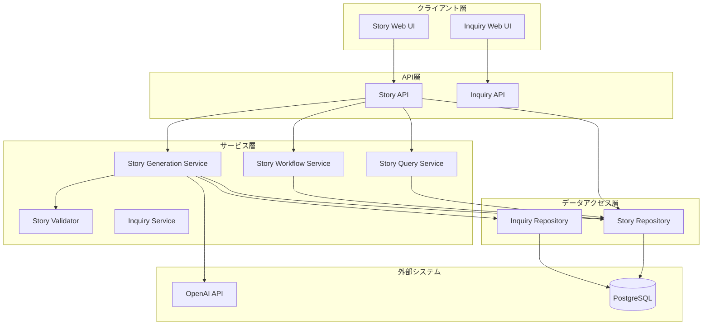
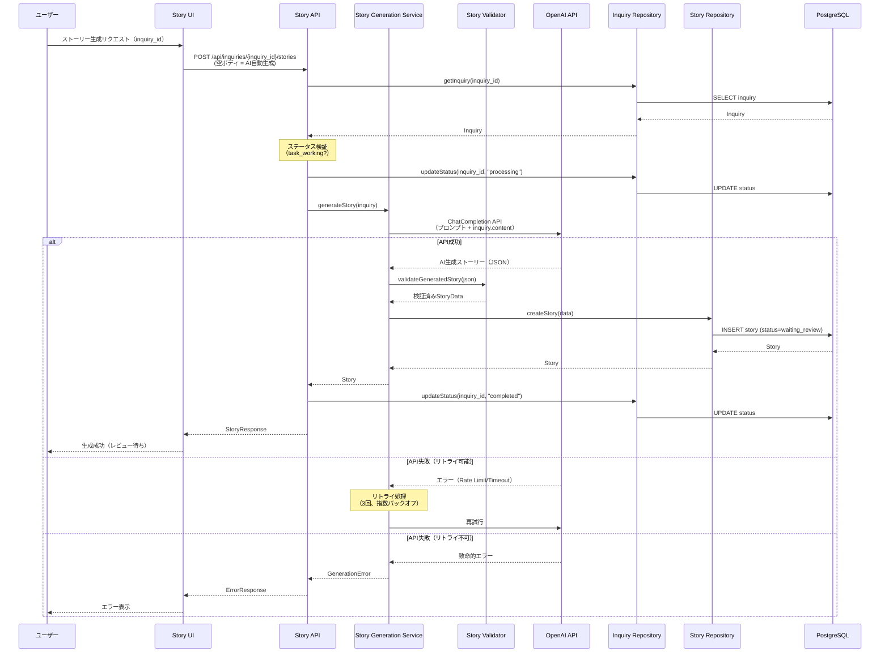
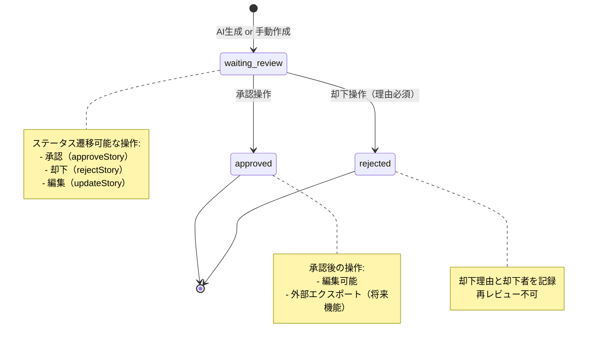
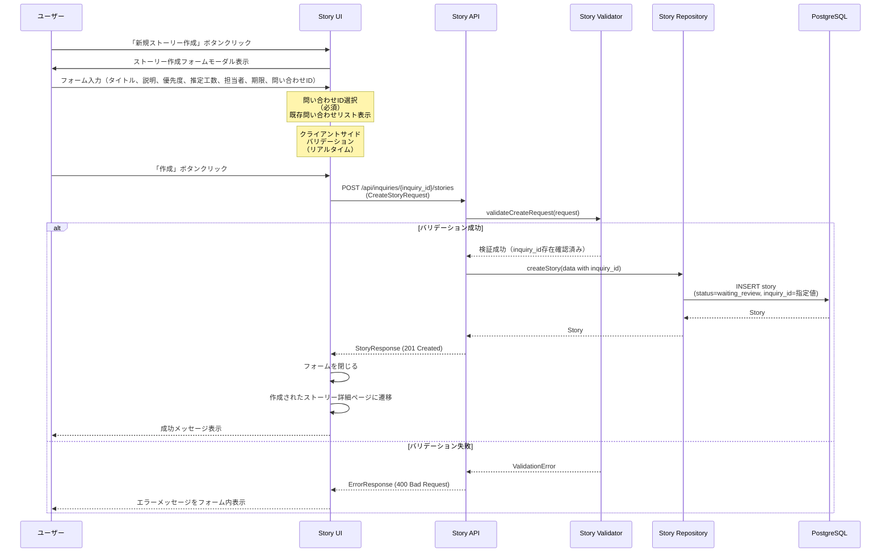

# ストーリー管理機能 技術設計書

## 概要

ストーリー管理機能は、問い合わせからAIを活用して構造化されたユーザーストーリーを生成し、それを管理するための機能である。本機能は開発者・プロジェクトマネージャーに対し、非構造化要件から実装可能な作業項目への高速変換、ストーリー変換コンテンツの品質保証、既存開発ワークフローへのシームレスな統合を提供する。

**目的**: この機能は、手動でのストーリー作成時間の削減と構造化作業項目の効率的管理という価値を開発者・プロジェクトマネージャーに提供する。

**ユーザー**: 開発者・プロジェクトマネージャーは、承認された問い合わせからストーリーを生成し、レビュー・編集・承認するワークフローに本機能を利用する。

**影響**: 現在のInquiry管理システムを拡張し、AI変換機能とストーリー承認ワークフローを追加する。

### 設計目標

- **型安全性**: すべてのインターフェースで明示的な型定義を使用し、`any`型を排除する
- **疎結合**: InquiryシステムとStoryシステムの結合度を最小化し、外部キー参照のみで関連付ける
- **拡張性**: 複数のAIプロバイダー対応、テンプレート機能の将来拡張に対応可能な設計
- **可観測性**: AI処理、ステータス遷移、エラー処理のすべてでログ記録と追跡を実装する
- **データ整合性**: ストーリーデータの一貫性と参照整合性を保証する

### 非目標

- テンプレート管理機能（将来実装）
- 高度なAI品質チューニング（初期バージョンでは基本的なプロンプト最適化のみ）
- ストーリーのバージョン管理（初期バージョンでは更新履歴のみ）
- 外部タスク管理ツールへのエクスポート（初期バージョンではストーリー承認まで）

## アーキテクチャ

### 既存アーキテクチャ分析

本機能は既存のInquiry管理システムを拡張する形で実装される。既存アーキテクチャの制約と統合点を以下に示す。

**既存パターンの尊重**:
- レイヤー構造: API層 → サービス層（Validator/Repository/Query/Workflow） → データアクセス層
- BaseModel継承によるID、created_at、updated_atの自動管理
- Pydantic 2.xを使用したCreateRequest、UpdateRequest、Responseの分離パターン
- Enum型によるステータス管理とJSON metadataフィールドでの拡張情報保持

**統合ポイント**:
- InquiryModelとStoryModelの外部キー関連（inquiry_id）
- 共通ベースモデル（BaseModel）の継承
- 共通エラーハンドリング（ErrorResponse、ValidationErrorDetail）
- 既存のデータベース接続・セッション管理の再利用

**技術的制約**:
- PostgreSQL 15の機能範囲内でのスキーマ設計
- SQLAlchemy 2.0.23のORM制約
- FastAPI 0.104.1のルーティング・依存性注入パターン

### アーキテクチャパターンと境界マップ



**アーキテクチャ統合**:
- **選択パターン**: Repository + Service層分離（Inquiryと同様）
- **ドメイン境界**: StoryドメインとInquiryドメインは疎結合（外部キー参照のみ）
- **既存パターン保持**: BaseModel継承、Pydanticスキーマ分離、Enum型ステータス管理
- **新規コンポーネント理由**: StoryGenerationServiceはAI統合の複雑性を隔離し、要件1.10（複数AIプロバイダー対応）を実現
- **ステアリング準拠**: 技術スタック（FastAPI、SQLAlchemy、React）、命名規則（snake_case）、レイヤー構造に準拠

### 技術スタック

| レイヤー | 選択技術/バージョン | 機能における役割 | 備考 |
|---------|------------------|----------------|------|
| **バックエンド** |
| APIフレームワーク | FastAPI 0.104.1 | RESTful API提供、ストーリーCRUD・AI変換エンドポイント | 既存Inquiry APIと同様 |
| ASGIサーバー | Uvicorn 0.24.0 | 非同期リクエスト処理 | 既存構成を継承 |
| ORM | SQLAlchemy 2.0.23 | StoryModel定義、Inquiryとの外部キー関連 | BaseModel継承 |
| マイグレーション | Alembic 1.12.1 | storiesテーブル作成、インデックス設定 | 既存マイグレーションに追加 |
| バリデーション | Pydantic 2.5.0 | StoryスキーマとAI生成結果の検証 | 型安全性保証 |
| AI統合 | OpenAI API 1.3.7 | ストーリー生成（GPT-4推奨） | 既存依存関係を活用 |
| **フロントエンド** |
| UIフレームワーク | React 18.2.0 | StoryForm、StoryList、StoryDetailコンポーネント | 既存Inquiryパターンを踏襲 |
| 型システム | TypeScript 4.9.5 | StoryResponse、CreateStoryRequest型定義 | strict mode |
| 状態管理 | TanStack Query 5.8.4 | サーバー状態管理、キャッシング、mutations | 既存構成を継承 |
| フォーム | React Hook Form 7.43.0 | ストーリー入力・編集フォーム管理 | Zod 3.22.4バリデーション |
| **データ** |
| データベース | PostgreSQL 15 | storiesテーブル、外部キー制約、JSON列 | 既存inquiriesテーブルと同一DB |
| **インフラ** |
| コンテナ | Docker Compose | 開発環境統合 | 既存構成を継承 |

詳細な技術選定理由と代替案の評価は`research.md`を参照。

## システムフロー

### ストーリー生成フロー（AI変換）



**フローレベル決定**:
- Inquiryステータス検証をAPI層で実施（`task_working`のみ許可）
- AI処理中はInquiryステータスを`processing`に変更
- リトライ戦略: 3回、指数バックオフ（1秒、2秒、4秒）、タイムアウト30秒
- 生成成功後、Storyステータスは`waiting_review`（人間レビュー必須）

### ストーリー承認ワークフロー



**フローレベル決定**:
- ステータス遷移は一方向（waiting_review → approved/rejected）
- 承認・却下時にメタデータ記録（承認者、承認日時、却下理由）
- `approved`後も編集可能（更新日時のみ記録）

### ストーリー手動作成フロー



**フローレベル決定**:
- 手動作成時、`inquiry_id`は必須（すべてのストーリーは問い合わせと関連付けられる）
- inquiry_id指定時は既存問い合わせの存在確認が必須（バリデーション層で検証）
- 作成時のステータスは`waiting_review`（AI生成と同じ初期ステータス）
- クライアントサイドとサーバーサイドの2段階バリデーション
- 作成成功後、詳細ページに自動遷移してすぐに内容確認・編集可能

## 要件トレーサビリティ

| 要件ID | 要件概要 | コンポーネント | インターフェース | フロー |
|-------|---------|--------------|----------------|--------|
| 1.1-1.10 | AI変換（Inquiry → Story） | StoryGenerationService, StoryValidator, StoryRepository | generateStory, validateGeneratedStory, createStory | ストーリー生成フロー |
| 2.1-2.17 | ストーリーレビュー・編集・手動作成（inquiry_id必須） | StoryQueryService, StoryRepository, StoryValidator | listStories, getStory, updateStory, deleteStory, createStory | ストーリー管理フロー、手動作成フロー |
| 3.1-3.11 | 承認ワークフロー | StoryWorkflowService | approveStory, rejectStory, batchApprove | ステータス変更フロー |
| 4.1-4.13 | データモデル・バリデーション | StoryModel, StoryValidator, Pydanticスキーマ | CreateStoryRequest, UpdateStoryRequest, StoryResponse | 全フロー |
| 5.1-5.22 | Web UI（一覧・詳細・新規作成・inquiry_id選択） | StoryForm, StoryList, StoryDetail | すべてのUI関連インターフェース | 全UIフロー |

## コンポーネントとインターフェース

### コンポーネント概要

| コンポーネント | ドメイン/レイヤー | 意図 | 要件カバレッジ | 主要依存関係（優先度） | 契約 |
|--------------|----------------|------|--------------|---------------------|------|
| StoryModel | データ/ORM | ストーリーエンティティ定義 | 4.1-4.13 | BaseModel (P0), InquiryModel (P1) | State |
| StoryRepository | データアクセス | ストーリーCRUD操作 | 2.1-2.4, 4.1-4.13 | StoryModel (P0), Database (P0) | Service |
| StoryValidator | サービス/バリデーション | 入力検証・ビジネスルール検証 | 2.7, 2.12, 4.5-4.13 | Pydanticスキーマ (P0) | Service |
| StoryGenerationService | サービス/AI統合 | AI変換ロジック | 1.1-1.10 | OpenAI API (P0), StoryValidator (P0), InquiryRepository (P1) | Service |
| StoryWorkflowService | サービス/ワークフロー | ステータス遷移管理 | 3.1-3.11 | StoryRepository (P0) | Service |
| StoryQueryService | サービス/クエリ | 一覧・検索・フィルタリング | 2.1-2.4 | StoryRepository (P0) | Service |
| StoryAPI | API/ルーター | HTTPエンドポイント | 全要件 | 全Serviceコンポーネント (P0) | API |
| StoryForm | UI/コンポーネント | ストーリー入力フォーム | 5.1-5.14 | storyApi (P0), React Hook Form (P0) | - |
| StoryList | UI/コンポーネント | ストーリー一覧表示 | 5.1-5.14 | storyApi (P0), TanStack Query (P0) | - |
| StoryDetail | UI/コンポーネント | ストーリー詳細・編集 | 5.1-5.14 | storyApi (P0), TanStack Query (P0) | - |

### データアクセス層

#### StoryModel

| フィールド | 詳細 |
|---------|------|
| 意図 | ストーリーエンティティのORM定義と参照整合性の保証 |
| 要件 | 4.1-4.13 |

**責任と制約**:
- ストーリーデータの永続化スキーマ定義
- Inquiryとの外部キー関連（inquiry_id nullable）
- タイトル500文字制限、必須フィールド検証のCheckConstraint
- JSON列（story_metadata）による拡張情報管理

**依存関係**:
- Inbound: StoryRepository - CRUD操作 (P0)
- Outbound: BaseModel - 共通フィールド継承 (P0)
- Outbound: InquiryModel - 外部キー参照 (P1)

**契約**: State [x]

##### State Management
```python
# StoryModel ORM定義（SQLAlchemy 2.0）
class StoryModel(BaseModel):
    __tablename__ = "stories"

    # 外部キー（必須、すべてのストーリーは問い合わせと関連付けられる）
    inquiry_id: Mapped[int] = mapped_column(
        BigInteger, ForeignKey("inquiries.id"), nullable=False, index=True
    )

    # 必須フィールド
    title: Mapped[str] = mapped_column(String(500), nullable=False)
    description: Mapped[str] = mapped_column(Text, nullable=False)
    priority: Mapped[Priority] = mapped_column(
        Enum(Priority), nullable=False, default=Priority.MEDIUM
    )
    status: Mapped[StoryStatus] = mapped_column(
        Enum(StoryStatus), nullable=False,
        default=StoryStatus.WAITING_REVIEW, index=True
    )

    # オプショナルフィールド
    estimated_effort: Mapped[Optional[float]] = mapped_column(Float, nullable=True)
    deadline: Mapped[Optional[datetime]] = mapped_column(DateTime(timezone=True), nullable=True)
    assignee: Mapped[Optional[str]] = mapped_column(String(50), nullable=True)

    # JSON拡張フィールド
    story_metadata: Mapped[Dict[str, Any]] = mapped_column(
        JSON, nullable=False, default=lambda: {}
    )

    __table_args__ = (
        CheckConstraint("length(trim(title)) > 0 AND length(title) <= 500",
                       name="chk_stories_title"),
        CheckConstraint("length(trim(description)) > 0",
                       name="chk_stories_description"),
    )
```

- **永続化**: PostgreSQL storiesテーブル、トランザクション境界はRepository層で管理
- **一貫性**: 外部キー制約（FOREIGN KEY inquiry_id REFERENCES inquiries(id)）
- **並行性**: SQLAlchemy Session管理、楽観的ロック（updated_at比較）

**実装ノート**:
- **統合**: BaseModel継承によりid、created_at、updated_atを自動管理
- **検証**: CheckConstraintでDB層検証、Pydanticでアプリ層検証の2段階
- **リスク**: inquiry_id NULLの扱いに注意（クエリ時のOUTER JOIN）

#### StoryRepository

| フィールド | 詳細 |
|---------|------|
| 意図 | ストーリーのCRUD操作とクエリ実行を提供 |
| 要件 | 2.1-2.4, 2.8-2.9, 2.15-2.17, 4.1-4.13 |

**責任と制約**:
- ストーリーの作成・取得・更新・削除
- フィルタリング（status、priority、inquiry_id）
- ソート（created_at、updated_at、priority、estimated_effort）
- ページネーション（limit/offset）
- トランザクション境界の管理

**依存関係**:
- Inbound: StoryGenerationService、StoryQueryService、StoryWorkflowService、StoryAPI - データアクセス (P0)
- Outbound: StoryModel - ORM操作 (P0)
- Outbound: Database Session - トランザクション管理 (P0)

**契約**: Service [x]

##### Service Interface
```python
class StoryRepository:
    def create_story(
        self,
        session: Session,
        data: CreateStoryData
    ) -> StoryModel:
        """ストーリーを作成する.

        Preconditions:
        - data.titleは1-500文字
        - data.descriptionは空でない
        - data.inquiry_idが指定された場合、Inquiryが存在する

        Postconditions:
        - storiesテーブルに新規レコード挿入
        - status=waiting_review
        - created_at、updated_at自動設定

        Returns:
            作成されたStoryModel

        Raises:
            IntegrityError: 外部キー制約違反
        """
        pass

    def get_story(
        self,
        session: Session,
        story_id: int
    ) -> Optional[StoryModel]:
        """ストーリーをIDで取得する.

        Returns:
            StoryModel or None（存在しない場合）
        """
        pass

    def list_stories(
        self,
        session: Session,
        status: Optional[StoryStatus] = None,
        priority: Optional[Priority] = None,
        inquiry_id: Optional[int] = None,
        sort_by: str = "created_at",
        sort_order: str = "desc",
        limit: int = 20,
        offset: int = 0
    ) -> tuple[list[StoryModel], int]:
        """ストーリー一覧を取得する（フィルタリング・ソート・ページネーション）.

        Returns:
            (stories, total_count)のタプル
        """
        pass

    def update_story(
        self,
        session: Session,
        story_id: int,
        data: UpdateStoryData
    ) -> Optional[StoryModel]:
        """ストーリーを更新する.

        Preconditions:
        - ストーリーが存在する

        Postconditions:
        - updated_at自動更新

        Returns:
            更新されたStoryModel or None
        """
        pass

    def delete_story(
        self,
        session: Session,
        story_id: int
    ) -> bool:
        """ストーリーを削除する.

        Returns:
            削除成功時True、存在しない場合False
        """
        pass
```

**実装ノート**:
- **統合**: SQLAlchemy 2.0 Session管理、InquiryRepositoryと同様のパターン
- **検証**: 外部キー制約はDB層で自動検証
- **リスク**: inquiry_id NULLのストーリーをフィルタリングするクエリに注意

### サービス層

#### StoryValidator

| フィールド | 詳細 |
|---------|------|
| 意図 | ストーリー入力の検証とビジネスルール適用 |
| 要件 | 2.7, 2.12, 4.5-4.13 |

**責任と制約**:
- 入力値のフォーマット検証（タイトル500文字、必須フィールド）
- ビジネスルール検証（ステータス遷移の妥当性）
- AI生成ストーリーの構造検証
- エラーメッセージの日本語化

**依存関係**:
- Inbound: StoryGenerationService、StoryAPI - バリデーション実行 (P0)
- Outbound: Pydanticスキーマ（CreateStoryRequest、UpdateStoryRequest） - 型検証 (P0)

**契約**: Service [x]

##### Service Interface
```python
class StoryValidator:
    def validate_create_request(
        self,
        request: CreateStoryRequest
    ) -> list[ValidationErrorDetail]:
        """作成リクエストを検証する.

        Returns:
            エラーリスト（空=検証成功）
        """
        pass

    def validate_update_request(
        self,
        request: UpdateStoryRequest
    ) -> list[ValidationErrorDetail]:
        """更新リクエストを検証する.

        Returns:
            エラーリスト（空=検証成功）
        """
        pass

    def validate_generated_story(
        self,
        data: dict[str, Any]
    ) -> GeneratedStoryData:
        """AI生成ストーリーの構造を検証する.

        Preconditions:
        - dataは辞書形式

        Postconditions:
        - 必須フィールド（title、description、priority）存在確認
        - titleは500文字以内
        - priorityはEnum値

        Returns:
            検証済みGeneratedStoryData

        Raises:
            ValidationError: 構造検証失敗
        """
        pass

    def validate_inquiry_exists(
        self,
        session: Session,
        inquiry_id: int
    ) -> bool:
        """問い合わせIDの存在を検証する.

        Preconditions:
        - inquiry_idが指定されている

        Postconditions:
        - Inquiryが存在する場合True、存在しない場合ValidationErrorを発生

        Returns:
            True（検証成功）

        Raises:
            ValidationError: Inquiry不存在（エラーコード: GS-204）
        """
        pass
```

**実装ノート**:
- **統合**: Pydantic 2.xバリデーションを活用、InquiryValidatorパターンを踏襲
- **検証**: エラーコード（GS-xxx）体系を使用
- **リスク**: AI生成結果の多様性に対応するため、柔軟なスキーマ設計が必要
- **inquiry_id検証**: `validate_inquiry_exists`はRepository層を呼び出す前にAPI層またはService層で実行し、参照整合性エラーを事前に防ぐ。InquiryRepositoryへの依存が必要（循環依存に注意）

#### StoryGenerationService

| フィールド | 詳細 |
|---------|------|
| 意図 | OpenAI APIを使用したストーリー生成ロジックの実装 |
| 要件 | 1.1-1.10 |

**責任と制約**:
- OpenAI API呼び出しとプロンプト管理
- リトライ戦略（3回、指数バックオフ）
- AI生成結果の構造検証（StoryValidatorを使用）
- タイムアウト処理（30秒）
- 使用量追跡とログ記録

**依存関係**:
- Inbound: StoryAPI - AI変換実行 (P0)
- Outbound: OpenAI API - ストーリー生成 (P0、外部サービス)
- Outbound: StoryValidator - 生成結果検証 (P0)
- Outbound: InquiryRepository - Inquiry内容取得 (P1)
- Outbound: StoryRepository - Story保存 (P0)

**契約**: Service [x]

##### Service Interface
```python
class StoryGenerationService:
    def generate_story(
        self,
        session: Session,
        inquiry_id: int
    ) -> StoryModel:
        """問い合わせからストーリーを生成する.

        Preconditions:
        - inquiry_idのInquiryが存在し、status=task_working

        Postconditions:
        - Inquiryステータスをprocessingに変更
        - AI生成成功時、Storyをwaiting_reviewで作成
        - Inquiryステータスをcompletedに変更

        Returns:
            生成されたStoryModel

        Raises:
            InquiryNotFoundError: Inquiry不存在
            InvalidInquiryStatusError: ステータス不正
            AIGenerationError: AI生成失敗（リトライ後も失敗）
            ValidationError: 生成結果の構造検証失敗
        """
        pass

    def _call_openai_api(
        self,
        inquiry_content: str,
        retry_count: int = 3
    ) -> dict[str, Any]:
        """OpenAI APIを呼び出す（内部メソッド）.

        リトライ戦略: 3回、指数バックオフ（1秒、2秒、4秒）
        タイムアウト: 30秒

        Returns:
            AI生成結果（JSON辞書）

        Raises:
            AIGenerationError: リトライ後も失敗
        """
        pass

    def _rollback_inquiry_status(
        self,
        session: Session,
        inquiry_id: int,
        original_status: InquiryStatus = InquiryStatus.TASK_WORKING
    ) -> None:
        """AI生成失敗時にInquiryステータスをロールバックする（内部メソッド）.

        Preconditions:
        - inquiry_idのInquiryが存在する
        - AI生成処理が失敗した

        Postconditions:
        - Inquiryステータスをoriginal_status（デフォルト: task_working）に戻す
        - ロールバック処理をログ記録（WARNING）

        Args:
            session: データベースセッション
            inquiry_id: 問い合わせID
            original_status: ロールバック先のステータス

        Raises:
            InquiryNotFoundError: Inquiry不存在
        """
        pass
```

**実装ノート**:
- **統合**: OpenAI Python SDK 1.3.7を使用、環境変数OPENAI_API_KEYから認証情報取得
- **検証**: プロンプトテンプレートは設定ファイルまたはコード内定数で管理
- **リスク**: APIレート制限、コスト管理、生成品質のばらつき → `research.md`参照
- **トランザクション境界**: `generate_story`メソッドは以下のトランザクション戦略を採用
  - `session.begin()`でトランザクション開始
  - Inquiryステータス更新（task_working → processing）
  - AI生成実行
  - AI生成成功時: Story作成 + Inquiryステータス更新（processing → completed）
  - AI生成失敗時: `_rollback_inquiry_status`でInquiryステータスを元に戻す（processing → task_working）
  - トランザクションコミット（成功時）またはロールバック（例外時）
- **エラーリカバリー**: リトライ失敗後も`_rollback_inquiry_status`を実行し、ユーザーが問い合わせを再利用可能にする

OpenAI API統合の詳細調査（レート制限、プロンプト最適化、コスト見積もり）は`research.md`を参照。

#### StoryWorkflowService

| フィールド | 詳細 |
|---------|------|
| 意図 | ストーリーのステータス遷移とワークフロー管理 |
| 要件 | 3.1-3.11 |

**責任と制約**:
- ステータス遷移検証（waiting_review → approved/rejected）
- 承認・却下時のメタデータ記録（承認者、日時、理由）
- 一括承認処理
- ステータス履歴の記録

**依存関係**:
- Inbound: StoryAPI - ワークフロー操作 (P0)
- Outbound: StoryRepository - ステータス更新 (P0)

**契約**: Service [x]

##### Service Interface
```python
class StoryWorkflowService:
    def approve_story(
        self,
        session: Session,
        story_id: int,
        approver: str
    ) -> StoryModel:
        """ストーリーを承認する.

        Preconditions:
        - ストーリーが存在し、status=waiting_review

        Postconditions:
        - status=approved
        - story_metadata.approval: {approved_at, approver}
        - story_metadata.status_history: ステータス変更履歴追加

        Returns:
            更新されたStoryModel

        Raises:
            StoryNotFoundError: Story不存在
            InvalidStatusTransitionError: waiting_review以外
        """
        pass

    def reject_story(
        self,
        session: Session,
        story_id: int,
        rejector: str,
        reason: str
    ) -> StoryModel:
        """ストーリーを却下する.

        Preconditions:
        - ストーリーが存在し、status=waiting_review
        - reasonが空でない

        Postconditions:
        - status=rejected
        - story_metadata.rejection: {rejected_at, rejector, reason}
        - story_metadata.status_history: ステータス変更履歴追加

        Returns:
            更新されたStoryModel

        Raises:
            StoryNotFoundError: Story不存在
            InvalidStatusTransitionError: waiting_review以外
            ValueError: reason空
        """
        pass

    def batch_approve(
        self,
        session: Session,
        story_ids: list[int],
        approver: str
    ) -> list[tuple[int, bool, Optional[str]]]:
        """複数ストーリーを一括承認する.

        各ストーリーのステータスを個別に検証。

        Returns:
            (story_id, success, error_message)のリスト
        """
        pass
```

**実装ノート**:
- **統合**: InquiryWorkflowServiceと同様のパターン
- **検証**: ステータス遷移の妥当性はサービス層で検証
- **リスク**: 一括操作時のトランザクション管理（部分成功の扱い）

#### StoryQueryService

| フィールド | 詳細 |
|---------|------|
| 意図 | ストーリー一覧・検索・フィルタリングのクエリロジック |
| 要件 | 2.1-2.4 |

**責任と制約**:
- フィルタリング条件の構築（status、priority、inquiry_id）
- ソート順の適用（created_at、updated_at、priority、estimated_effort）
- ページネーション処理

**依存関係**:
- Inbound: StoryAPI - クエリ実行 (P0)
- Outbound: StoryRepository - データ取得 (P0)

**契約**: Service [x]

##### Service Interface
```python
class StoryQueryService:
    def list_stories_with_filters(
        self,
        session: Session,
        status: Optional[StoryStatus] = None,
        priority: Optional[Priority] = None,
        inquiry_id: Optional[int] = None,
        sort_by: str = "created_at",
        sort_order: str = "desc",
        limit: int = 20,
        offset: int = 0
    ) -> tuple[list[StoryModel], int]:
        """フィルタリング・ソート・ページネーション適用済みストーリー一覧を取得.

        Returns:
            (stories, total_count)のタプル
        """
        pass
```

**実装ノート**:
- **統合**: InquiryQueryServiceと同様のパターン
- **検証**: パラメータ検証はAPI層で実施
- **リスク**: 複雑なフィルタ条件のパフォーマンス最適化

### API層

#### StoryAPI

| フィールド | 詳細 |
|---------|------|
| 意図 | ストーリー管理のHTTPエンドポイント提供 |
| 要件 | 全要件 |

**責任と制約**:
- HTTPリクエスト/レスポンス処理
- 認証・認可（将来実装）
- エラーハンドリングとレスポンス標準化
- 依存性注入（Database Session、Serviceコンポーネント）

**依存関係**:
- Inbound: StoryUI - API呼び出し (P0)
- Outbound: StoryGenerationService、StoryWorkflowService、StoryQueryService、StoryRepository - ビジネスロジック (P0)

**契約**: API [x]

##### API Contract

| Method | Endpoint | Request | Response | Errors |
|--------|----------|---------|----------|--------|
| POST | /api/inquiries/{inquiry_id}/stories | `{}` (空 = AI自動生成) or CreateStoryRequest (手動作成) | StoryResponse | 400 (Inquiry不正), 404 (Inquiry不存在), 422 (ステータス不正), 500 (AI生成失敗/バリデーション失敗) |
| GET | /api/inquiries/{inquiry_id}/stories | Query: status, priority, sort_by, sort_order, limit, offset | `{"stories": [StoryResponse], "total": int}` | 404 (Inquiry不存在), 400 (パラメータ不正), 500 |
| GET | /api/stories | Query: status, priority, inquiry_id, sort_by, sort_order, limit, offset | `{"stories": [StoryResponse], "total": int}` | 400 (パラメータ不正), 500 |
| GET | /api/stories/{id} | - | StoryResponse | 404 (Story不存在), 500 |
| PUT | /api/stories/{id} | UpdateStoryRequest | StoryResponse | 400 (バリデーション失敗), 404 (Story不存在), 500 |
| DELETE | /api/stories/{id} | - | `{"success": true}` | 404 (Story不存在), 500 |
| POST | /api/stories/{id}/approve | `{"approver": str}` | StoryResponse | 400 (バリデーション失敗), 404 (Story不存在), 422 (ステータス遷移不正), 500 |
| POST | /api/stories/{id}/reject | `{"rejector": str, "reason": str}` | StoryResponse | 400 (理由空), 404 (Story不存在), 422 (ステータス遷移不正), 500 |
| POST | /api/stories/batch-approve | `{"story_ids": [int], "approver": str}` | `{"results": [{"id": int, "success": bool, "error": str}]}` | 400 (パラメータ不正), 500 |

**実装ノート**:
- **ハイブリッドアプローチ**: ネストされたURLとトップレベルURLの両方をサポート
  - **ネストされたURL**: 作成と問い合わせ配下の一覧取得 (`/api/inquiries/{inquiry_id}/stories`)
  - **トップレベルURL**: 個別操作と全体一覧 (`/api/stories`, `/api/stories/{id}`)
  - **理由**: ストーリーは問い合わせに依存するが、独自のIDで直接アクセス可能。両方のアクセスパターンで柔軟性を提供
- **統合**: FastAPI Routerパターン、InquiryAPIと同様の構造
- **検証**: Pydanticスキーマによる自動バリデーション
- **リスク**: 認証・認可の実装は将来フェーズ

### フロントエンド層

フロントエンドコンポーネント（StoryForm、StoryList、StoryDetail）は既存のInquiryコンポーネントパターンを踏襲する。詳細な実装ノートのみ記載。

#### 共通UI設計原則

- **Base Interface**: 共通Props（`BaseStoryPanelProps`）を定義し、各コンポーネントで拡張
- **State Management**: TanStack React Query 5.8.4で全サーバー状態を管理
- **Form Handling**: React Hook Form 7.43.0 + Zod 3.22.4バリデーション
- **Error Handling**: react-hot-toast 2.4.1でトースト通知
- **Accessibility**: キーボードナビゲーション、ARIA属性、スクリーンリーダー対応

#### StoryForm（ストーリー入力コンポーネント）

**実装ノート**:
- **モード対応**: 新規作成モードと編集モードの両対応
  - 新規作成モード: モーダルダイアログで表示、`POST /api/inquiries/{inquiry_id}/stories`を使用
  - 編集モード: StoryDetail内でインライン表示、`PUT /api/stories/{id}`を使用
- **統合**: InquiryFormパターンを踏襲、React Hook Form + Zodバリデーション
- **検証**: タイトル500文字制限、必須フィールド検証、inquiry_id存在確認、リアルタイムエラー表示
- **フィールド**:
  - inquiry_id（必須、フォーム外で選択）: ドロップダウンまたは検索可能セレクトで既存問い合わせを選択、選択後にストーリー作成フォームを表示
  - title（必須）
  - description（必須）
  - priority（必須、デフォルト=MEDIUM）
  - estimated_effort（オプショナル）
  - deadline（オプショナル）
  - assignee（オプショナル）
- **ボタン配置**:
  - 新規作成モード: ストーリー一覧ページのヘッダーに「新規ストーリー作成」ボタン
  - 編集モード: StoryDetail内の「編集」ボタンでフォーム表示
- **リスク**: 受入基準入力UI（配列形式）の使いやすさ、inquiry_id選択UIのユーザビリティ

#### StoryList（ストーリー一覧コンポーネント）

**実装ノート**:
- **統合**: InquiryListパターンを踏襲、TanStack Query + ページネーション + フィルタリング
- **検証**: ステータス・優先度フィルタ、ソート機能（作成日時、更新日時、優先度、推定工数）
- **UI要素**: ページヘッダーに「新規ストーリー作成」ボタンを配置（クリックでStoryFormモーダル表示）
- **リスク**: 大量ストーリー表示時のパフォーマンス最適化

#### StoryDetail（ストーリー詳細・編集コンポーネント）

**実装ノート**:
- **統合**: InquiryDetailパターンを踏襲、読み取り/編集モード切り替え、承認・却下モーダル
- **検証**: インライン編集、ステータス遷移の妥当性検証
- **リスク**: 受入基準の表示・編集UI（リスト形式）

## データモデル

### ドメインモデル

**Aggregate（集約）**:
- **Story Aggregate**: Storyエンティティが集約ルート
  - トランザクション境界: Story単位での作成・更新・削除
  - ビジネスルール: ステータス遷移の妥当性、タイトル500文字制限、必須フィールド検証

**Entities（エンティティ）**:
- **Story**: id、title、description、priority、status、estimated_effort、deadline、assignee、inquiry_id、story_metadata、created_at、updated_at

**Value Objects（値オブジェクト）**:
- **Priority**: Enum（LOW、MEDIUM、HIGH、URGENT）
- **StoryStatus**: Enum（WAITING_REVIEW、APPROVED、REJECTED）

**Domain Events（ドメインイベント）**:
- StoryGenerated: AI変換完了時
- StoryApproved: 承認時
- StoryRejected: 却下時
- StoryUpdated: 更新時

**ビジネスルール・不変条件**:
- タイトルは1-500文字
- 説明は必須
- ステータス遷移はwaiting_review → approved/rejected（一方向）
- 却下時は理由必須
- inquiry_idが設定されている場合、Inquiryが存在する（参照整合性）

### 論理データモデル

**構造定義**:

```
Story (1) --* (1) Inquiry
  - カーディナリティ: Story 0..N : Inquiry 1（すべてのストーリーは1つの問い合わせに関連付けられる）
  - 参照整合性: FOREIGN KEY (inquiry_id) REFERENCES inquiries(id)
```

**属性と型**:
- id: BigInteger（主キー、自動インクリメント）
- inquiry_id: BigInteger（外部キー、NOT NULL）
- title: String(500)（必須）
- description: Text（必須）
- priority: Enum（LOW/MEDIUM/HIGH/URGENT、デフォルト=MEDIUM）
- status: Enum（WAITING_REVIEW/APPROVED/REJECTED、デフォルト=WAITING_REVIEW）
- estimated_effort: Float（オプショナル）
- deadline: DateTime with timezone（オプショナル）
- assignee: String(50)（オプショナル）
- story_metadata: JSON（デフォルト={}）
- created_at: DateTime with timezone（自動設定）
- updated_at: DateTime with timezone（自動更新）

**一貫性と整合性**:
- トランザクション境界: Story単位（Repository層で管理）
- カスケードルール: Inquiry削除時、関連Storyも削除（ON DELETE CASCADE）
- 時間的側面: updated_at自動更新、status_historyをmetadataに記録

### 物理データモデル

**テーブル定義**:

```sql
CREATE TABLE stories (
    id BIGSERIAL PRIMARY KEY,
    inquiry_id BIGINT NOT NULL REFERENCES inquiries(id) ON DELETE CASCADE,
    title VARCHAR(500) NOT NULL,
    description TEXT NOT NULL,
    priority VARCHAR(20) NOT NULL DEFAULT 'medium',
    status VARCHAR(50) NOT NULL DEFAULT 'waiting_review',
    estimated_effort DOUBLE PRECISION,
    deadline TIMESTAMP WITH TIME ZONE,
    assignee VARCHAR(50),
    story_metadata JSONB NOT NULL DEFAULT '{}',
    created_at TIMESTAMP WITH TIME ZONE NOT NULL DEFAULT NOW(),
    updated_at TIMESTAMP WITH TIME ZONE NOT NULL DEFAULT NOW(),

    CONSTRAINT chk_stories_title CHECK (length(trim(title)) > 0 AND length(title) <= 500),
    CONSTRAINT chk_stories_description CHECK (length(trim(description)) > 0)
);
```

**インデックス定義**:

```sql
CREATE INDEX ix_stories_inquiry_id ON stories(inquiry_id);
CREATE INDEX ix_stories_status ON stories(status);
CREATE INDEX ix_stories_priority ON stories(priority);
CREATE INDEX ix_stories_created_at ON stories(created_at DESC);
CREATE INDEX ix_stories_updated_at ON stories(updated_at DESC);
```

**パフォーマンス最適化**:
- inquiry_idインデックス: Inquiryから関連Storyを高速取得
- statusインデックス: ステータスフィルタリングの高速化
- created_at/updated_atインデックス: ソート処理の高速化
- JSONB型使用: story_metadataのクエリ性能向上

### マイグレーション戦略

**Alembicマイグレーション手順**:

1. **マイグレーションファイル生成**:
   ```bash
   make db-revision m="Add stories table"
   ```

2. **マイグレーションスクリプト内容**（`alembic/versions/xxxx_add_stories_table.py`）:
   ```python
   def upgrade() -> None:
       # 1. storiesテーブル作成（inquiry_id NOT NULL制約付き）
       op.create_table(
           'stories',
           sa.Column('id', sa.BigInteger(), nullable=False),
           sa.Column('inquiry_id', sa.BigInteger(), nullable=False),
           sa.Column('title', sa.String(500), nullable=False),
           sa.Column('description', sa.Text(), nullable=False),
           sa.Column('priority', sa.String(20), nullable=False, server_default='medium'),
           sa.Column('status', sa.String(50), nullable=False, server_default='waiting_review'),
           sa.Column('estimated_effort', sa.Float(), nullable=True),
           sa.Column('deadline', sa.DateTime(timezone=True), nullable=True),
           sa.Column('assignee', sa.String(50), nullable=True),
           sa.Column('story_metadata', postgresql.JSONB(), nullable=False, server_default='{}'),
           sa.Column('created_at', sa.DateTime(timezone=True), nullable=False, server_default=sa.text('NOW()')),
           sa.Column('updated_at', sa.DateTime(timezone=True), nullable=False, server_default=sa.text('NOW()')),
           sa.PrimaryKeyConstraint('id'),
           sa.ForeignKeyConstraint(['inquiry_id'], ['inquiries.id'], ondelete='CASCADE'),
           sa.CheckConstraint("length(trim(title)) > 0 AND length(title) <= 500", name='chk_stories_title'),
           sa.CheckConstraint("length(trim(description)) > 0", name='chk_stories_description')
       )

       # 2. インデックス作成
       op.create_index('ix_stories_inquiry_id', 'stories', ['inquiry_id'])
       op.create_index('ix_stories_status', 'stories', ['status'])
       op.create_index('ix_stories_priority', 'stories', ['priority'])
       op.create_index('ix_stories_created_at', 'stories', ['created_at'], postgresql_ops={'created_at': 'DESC'})
       op.create_index('ix_stories_updated_at', 'stories', ['updated_at'], postgresql_ops={'updated_at': 'DESC'})

   def downgrade() -> None:
       # インデックス削除
       op.drop_index('ix_stories_updated_at', 'stories')
       op.drop_index('ix_stories_created_at', 'stories')
       op.drop_index('ix_stories_priority', 'stories')
       op.drop_index('ix_stories_status', 'stories')
       op.drop_index('ix_stories_inquiry_id', 'stories')

       # テーブル削除
       op.drop_table('stories')
   ```

3. **マイグレーション実行**:
   ```bash
   make db-migrate  # Alembic upgrade head
   ```

4. **マイグレーション検証**:
   ```bash
   make db-status  # マイグレーション状態確認
   docker-compose exec db psql -U gs_user -d gs_db -c "\d stories"  # テーブル構造確認
   ```

**inquiry_id NOT NULL制約の考慮事項**:
- **初期実装**: storiesテーブル作成時から`inquiry_id NOT NULL`制約を設定（既存データなし）
- **将来的な制約緩和が必要な場合**: 以下の手順でマイグレーション
  1. `inquiry_id`をNULLABLEに変更するマイグレーション作成
  2. 既存データのinquiry_id=NULLレコードを処理（削除またはデフォルト値設定）
  3. NOT NULL制約を追加するマイグレーション作成
  4. 段階的にマイグレーション実行

**参照整合性の保証**:
- `FOREIGN KEY (inquiry_id) REFERENCES inquiries(id) ON DELETE CASCADE`により、Inquiry削除時に関連Storyも自動削除
- StoryValidator.validate_inquiry_existsでアプリケーション層でも事前検証（DB制約エラーの回避）

**ロールバック戦略**:
- `make db-downgrade`でマイグレーションのロールバックが可能
- ダウングレード時はstoriesテーブルとインデックスがすべて削除される（データ消失に注意）
- 本番環境ではロールバック前にバックアップ必須

### データ契約と統合

**APIデータ転送**:

```typescript
// CreateStoryRequest（手動作成）
// inquiry_idはパスパラメータ (/api/inquiries/{inquiry_id}/stories) で指定
interface CreateStoryRequest {
  title: string;              // 1-500文字
  description: string;        // 必須
  priority: Priority;         // Enum
  estimated_effort?: number;  // オプショナル
  deadline?: string;          // ISO 8601
  assignee?: string;          // オプショナル
}

// UpdateStoryRequest
interface UpdateStoryRequest {
  title?: string;
  description?: string;
  priority?: Priority;
  estimated_effort?: number;
  deadline?: string;
  assignee?: string;
}

// StoryResponse
interface StoryResponse {
  id: number;
  inquiry_id: number;
  title: string;
  description: string;
  priority: Priority;
  status: StoryStatus;
  estimated_effort: number | null;
  deadline: string | null;   // ISO 8601
  assignee: string | null;
  story_metadata: Record<string, any>;
  created_at: string;        // ISO 8601
  updated_at: string;        // ISO 8601
}
```

**バリデーションルール**:
- titleは1-500文字、空白のみ不可
- descriptionは必須、空白のみ不可
- priorityはEnum値（LOW/MEDIUM/HIGH/URGENT）
- statusはEnum値（WAITING_REVIEW/APPROVED/REJECTED）
- inquiry_id（パスパラメータ）は既存問い合わせの存在確認が必須
- シリアライゼーション: JSON、日時はISO 8601形式

**イベントスキーマ**（将来実装）:
- StoryGeneratedEvent: `{story_id, inquiry_id, generated_at}`
- StoryApprovedEvent: `{story_id, approver, approved_at}`
- StoryRejectedEvent: `{story_id, rejector, reason, rejected_at}`

**スキーマバージョニング戦略**:
- 後方互換性維持（新フィールドはオプショナル追加のみ）
- Alembicマイグレーションでバージョン管理
- APIバージョニングは現時点では不要（初期実装）

## エラーハンドリング

### エラー戦略

**エラーカテゴリと対応**:

**ユーザーエラー（4xx）**:
- 400 Bad Request: 入力バリデーション失敗 → フィールドレベルエラーメッセージ表示
- 404 Not Found: Story/Inquiry不存在 → 一覧画面への誘導
- 422 Unprocessable Entity: ビジネスルール違反（ステータス遷移不正） → 現在ステータスの説明

**システムエラー（5xx）**:
- 500 Internal Server Error: AI生成失敗、DB接続エラー → エラーログ記録、ユーザーには一般メッセージ
- 503 Service Unavailable: OpenAI APIダウン → リトライ促進メッセージ

**ビジネスロジックエラー（422）**:
- InvalidStatusTransitionError: ステータス遷移不正 → 「waiting_review状態のみ承認・却下可能」
- InvalidInquiryStatusError: Inquiryステータス不正 → 「task_working状態の問い合わせのみ変換可能」

### AI生成失敗時のリカバリー戦略

**リカバリーフロー**:
1. **AI生成開始時**: Inquiryステータスを`task_working` → `processing`に変更
2. **AI API呼び出し**: OpenAI APIを呼び出し（リトライ戦略: 3回、指数バックオフ）
3. **AI生成成功時**:
   - Story作成（status=`waiting_review`）
   - Inquiryステータスを`processing` → `completed`に変更
   - トランザクションコミット
4. **AI生成失敗時（リトライ後も失敗）**:
   - `_rollback_inquiry_status`を実行してInquiryステータスを`processing` → `task_working`に戻す
   - エラーログ記録（ERROR、エラーコード: GS-206）
   - ユーザーに「AI生成に失敗しました。しばらく経ってから再度お試しください」メッセージ表示
   - トランザクションロールバック（Storyは作成されない）
5. **リカバリー完了**: ユーザーは問い合わせを再利用してストーリー生成を再試行可能

**トランザクション境界**:
- `generate_story`メソッド全体を1つのトランザクションで囲む（`session.begin()`）
- AI生成失敗時はロールバックでInquiryステータス変更も取り消す
- ただし、ロールバック前に`_rollback_inquiry_status`でステータスを明示的に戻す（監査ログ記録のため）

**エラーハンドリング詳細**:
- **AIGenerationError**: OpenAI API呼び出し失敗（レート制限、タイムアウト、認証エラー）
  - HTTPステータス: 500
  - ユーザーメッセージ: 「AI生成に失敗しました。しばらく経ってから再度お試しください」
  - リカバリー: Inquiryステータスを`task_working`に戻す
- **ValidationError（AI生成結果検証失敗）**:
  - HTTPステータス: 500
  - ユーザーメッセージ: 「生成されたストーリーの形式が不正です。管理者に連絡してください」
  - リカバリー: Inquiryステータスを`task_working`に戻す
- **InquiryNotFoundError**:
  - HTTPステータス: 404
  - ユーザーメッセージ: 「指定された問い合わせが見つかりません」
  - リカバリー: 不要（Inquiryが存在しない）
- **InvalidInquiryStatusError**:
  - HTTPステータス: 422
  - ユーザーメッセージ: 「この問い合わせはストーリー生成できません（ステータス: {current_status}）」
  - リカバリー: 不要（ステータス不正）

### エラーレスポンス標準化

```json
{
  "errors": [
    {
      "code": "GS-201",
      "message": "タイトルは500文字以内で入力してください",
      "field": "title"
    }
  ],
  "timestamp": "2025-12-27T00:00:00Z"
}
```

**エラーコード体系**（GS-2xx: Story関連）:
- GS-201: タイトル長さ制限違反
- GS-202: 必須フィールド欠如
- GS-203: ステータス遷移不正
- GS-204: Inquiry不存在
- GS-205: Inquiryステータス不正
- GS-206: AI生成失敗
- GS-207: 却下理由未入力

### 監視

- **エラー追跡**: 全エラーをstructlogで記録、エラーコード・ユーザーID・リクエストIDを含む
- **ログ記録**: INFO（正常系）、WARNING（リトライ）、ERROR（失敗）
- **ヘルスモニタリング**: `/health`エンドポイントでDB接続・OpenAI API疎通確認

## テスト戦略

### ユニットテスト

**対象**:
- StoryValidator: バリデーションロジック（タイトル制限、必須フィールド、AI生成結果検証）
- StoryRepository: CRUD操作、フィルタリング、ソート、ページネーション
- StoryWorkflowService: ステータス遷移ロジック（承認・却下・一括承認）
- StoryQueryService: クエリ構築ロジック

**カバレッジ目標**: 80%以上

### 統合テスト

**対象**:
- StoryAPI → StoryRepository: エンドツーエンドAPI動作
- StoryGenerationService → OpenAI API: AI生成フロー（モック使用）
- StoryWorkflowService → StoryRepository: ステータス遷移の永続化
- Inquiry → Story関連: 外部キー制約、カスケード動作

**カバレッジ目標**: 主要フロー100%

### E2E/UIテスト

**対象**:
- ストーリー生成フロー: 問い合わせ選択 → AI生成 → レビュー待ち表示
- ストーリー一覧・フィルタリング: ステータス・優先度フィルタ、ソート、ページネーション
- ストーリー承認・却下: モーダルダイアログ、確認メッセージ
- ストーリー編集: インライン編集、バリデーションエラー表示

**カバレッジ目標**: クリティカルパス100%

### パフォーマンス/負荷テスト

**対象**:
- AI生成処理: 30秒以内のレスポンスタイム
- ストーリー一覧取得: 1秒以内のレスポンスタイム（1000件データ）
- 一括承認: 10件同時承認、5秒以内
- 同時ユーザー: 100ユーザー同時アクセス時の安定性

## セキュリティ考慮事項

**脅威モデリング**:
- プロンプトインジェクション攻撃: AI生成時のユーザー入力サニタイゼーション
- 機密情報漏洩: OpenAI APIへの送信データの監査
- 不正なステータス変更: ステータス遷移の厳格な検証

**データ保護**:
- OpenAI APIへの送信データ: 個人情報の最小化（ユーザーIDは送信しない）
- ストーリーメタデータ: 承認者・却下者情報の適切な管理
- ログ記録: 機密情報のマスキング

**AI倫理**:
- 生成コンテンツの偏見チェック: 将来実装（初期バージョンでは人間レビュー必須で対応）
- 人間による最終承認: waiting_reviewステータスで強制
- AI判断の透明性: 生成プロンプトとレスポンスのログ記録

## パフォーマンス・スケーラビリティ

**ターゲットメトリクス**:
- ストーリー生成: 通常10秒以内、最大30秒
- ストーリー一覧表示: 1秒以内
- ストーリー詳細表示: 500ms以内
- 承認・却下操作: 500ms以内

**スケーリングアプローチ**:
- 水平スケーリング: FastAPIアプリケーションの複数インスタンス起動
- データベースインデックス最適化: status、priority、created_atインデックス
- OpenAI APIレート制限対応: リトライ戦略、タイムアウト設定

**キャッシング戦略**:
- React Query: サーバー状態のクライアントサイドキャッシング（5分間有効）
- データベース: 頻繁にアクセスされるストーリー一覧のクエリ最適化

---

**設計書バージョン**: 1.0
**最終更新**: 2026-01-02
**承認ステータス**: レビュー待ち
