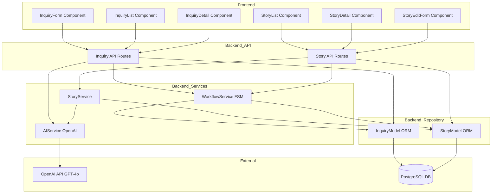
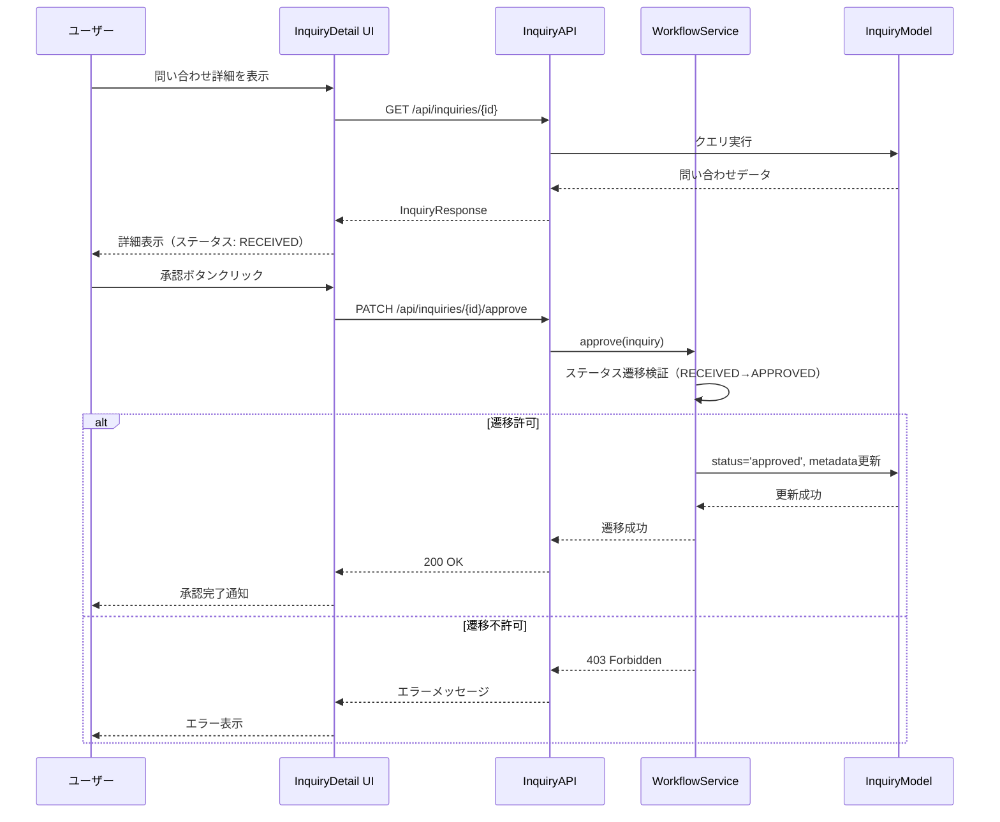
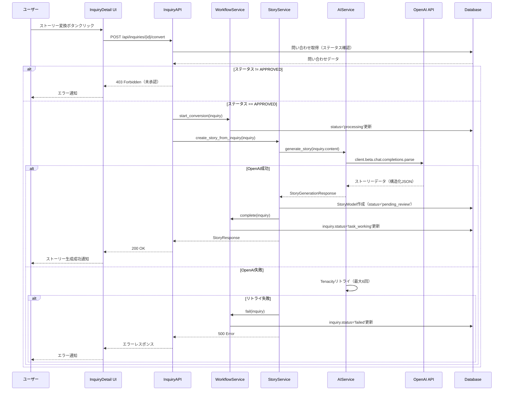

# ストーリーボード機能 技術設計ドキュメント

## Overview

**Purpose**: ストーリーボード機能は、報告者からの自然言語による問い合わせを受け付け、AI駆動でそれを構造化されたユーザーストーリーに変換し、ユーザー（開発者・プロジェクトマネージャー）が承認・管理できるエンドツーエンドのワークフローを提供する。本機能により、非構造化要件を効率的に処理可能な作業項目へと変換し、開発プロセスの初期段階を大幅に効率化する。

**Users**:
- **報告者**: 自然言語で問い合わせを入力し、システムに要求を投げる利用者（社内ユーザー、クライアント、プロダクトオーナー等）
- **ユーザー（開発者・プロジェクトマネージャー）**: 問い合わせを承認・却下し、AI生成されたストーリーをレビュー・編集・承認し、開発バックログとして管理する利用者

**Impact**:
既存のGhostSquadプラットフォームに以下の変更を加える：
- **問い合わせ管理の拡張**: 既存の問い合わせCRUD機能に編集、承認・却下ワークフロー、検索機能を追加
- **新規AI統合層の導入**: OpenAI APIを利用したストーリー生成機能を新規実装
- **新規ストーリー管理層の導入**: AI生成されたストーリーのCRUD、レビュー、承認機能を新規実装
- **フロントエンドUI拡張**: 問い合わせとストーリーの一覧表示、詳細表示、編集、管理UIを新規実装

### Goals

- 報告者が自然言語で問い合わせを作成・編集でき、ユーザーが問い合わせを一覧表示・検索・承認・却下できるワークフローの完成
- AI（OpenAI GPT-4o）を使用して、承認された問い合わせから構造化されたユーザーストーリーを自動生成する機能の実装
- ユーザーがAI生成ストーリーを確認・編集・承認し、品質を保証できる管理機能の提供
- 型安全性を維持し、既存の設計パターン（FastAPI、React、SQLAlchemy）に整合する拡張性の高いアーキテクチャの確立
- エンドツーエンドのテストカバレッジ80%以上を達成し、高品質なコードベースを維持

### Non-Goals

- ユーザー認証・認可機能（現在は`user_id`ハードコード、将来フェーズで実装）
- 複数ストーリー生成（1問い合わせから複数ストーリー生成）（初期実装は1対1、将来拡張検討）
- ストーリーテンプレートのUI管理機能（初期実装はコード内ハードコード、将来DB管理へ移行）

## Architecture

### Existing Architecture Analysis

GhostSquadは既存のレイヤードアーキテクチャを採用しており、以下の層で構成されている：

**既存の層構成**:
- **API層（FastAPI）**: `backend/api/inquiries.py`に問い合わせCRUD操作が実装済み（POST、GET一覧、GET詳細）
- **モデル層（SQLAlchemy ORM）**: `backend/models/database/`に`InquiryModel`、`StoryModel`、`StoryTemplateModel`が完全実装済み、Alembicマイグレーション適用済み
- **Pydanticスキーマ層**: `backend/models/api/`にRequest/Responseモデルが実装済み、型安全性を確保
- **Enum層**: `backend/models/enums/`に`InquiryStatus`、`StoryStatus`、`Priority`、`StoryCategory`が実装済み
- **フロントエンド**: React 18.2 + TypeScript 4.9.5、`InquiryForm`コンポーネント（React Hook Form + Zod）が実装済み、TanStack Query 5.8.4が設定済み

**既存の制約とパターン**:
- **データモデル**: BigInteger ID使用、`inquiry_metadata`と`story_metadata`にJSON形式でメタデータを格納
- **エラーハンドリング**: 日本語エラーメッセージ、詳細なロギング（`exc_info=True`）、適切なHTTPステータスコード（201、200、404、422、500）
- **依存性注入**: `Depends(get_db)`でDBセッション管理
- **バリデーション**: PydanticとZodによる二重バリデーション（フロントエンド・バックエンド両方）
- **CORS設定**: `localhost:3000`、`127.0.0.1:3000`、`frontend:3000`が許可済み

**不足している層**:
- **サービス層**: `backend/services/`ディレクトリ自体が存在せず、ビジネスロジックを集約する層が未実装

### Architecture Pattern & Boundary Map

**選択したパターン**: **レイヤードアーキテクチャ（サービス層追加）**

**根拠**:
既存システムとの一貫性を保ちつつ、ビジネスロジック（AI統合、ワークフロー管理、ストーリー生成）を明確に分離するため、サービス層を新規追加する。ヘキサゴナルアーキテクチャは実装コストが高く、既存との整合性に課題があるため不採用。イベント駆動アーキテクチャは複雑性が高く、初期実装には適さないため将来拡張として保留。




**Architecture Integration**:
- **選択パターン**: レイヤードアーキテクチャ + サービス層追加。既存のAPI層とモデル層の間にサービス層を挿入し、ビジネスロジックを集約する。
- **ドメイン境界**:
  - **問い合わせドメイン**: 問い合わせCRUD、承認・却下ワークフロー（InquiryAPI、WorkflowService、InquiryModel）
  - **ストーリードメイン**: ストーリーCRUD、AI生成、レビュー・承認（StoryAPI、StoryService、AIService、StoryModel）
  - **AI統合ドメイン**: OpenAI API呼び出し、プロンプト管理、リトライロジック（AIService）
  - **ワークフロードメイン**: ステータス遷移管理、FSM実装（WorkflowService）
- **既存パターン保持**: FastAPI Router、Pydantic、依存性注入、詳細なエラーハンドリング、ロギング
- **新規コンポーネント根拠**:
  - **サービス層**: ビジネスロジックをAPI層から分離し、テスト容易性と再利用性を向上
  - **AIService**: OpenAI API統合を専用サービスに隔離し、プロンプト管理とリトライロジックを集約
  - **WorkflowService**: ステータス遷移ルールをFSMで管理し、不正遷移を防止
  - **StoryService**: ストーリー生成とバリデーションのビジネスロジックを集約
- **Steering準拠**: product.md、structure.md、tech.mdに整合

### Technology Stack

| Layer | Choice / Version | Role in Feature | Notes |
|-------|------------------|-----------------|-------|
| **Frontend** | React 18.2.0 + TypeScript 4.9.5 | フロントエンドフレームワーク、型安全性確保 | 既存設定を踏襲、strict mode有効化済み |
| Frontend | TanStack React Query 5.8.4 | サーバー状態管理、無限スクロール実装 | 既存依存関係、useInfiniteQuery使用 |
| Frontend | React Hook Form 7.43.0 + Zod 3.22.4 | フォーム管理・バリデーション | 既存パターン（InquiryForm）を踏襲 |
| Frontend | Tailwind CSS 3.3.5 + Lucide React 0.294.0 | スタイリング・アイコン | 既存UI設計との一貫性維持 |
| **Backend** | FastAPI 0.104.1 + Uvicorn 0.24.0 | APIフレームワーク、非同期処理 | 既存API層を拡張 |
| Backend | SQLAlchemy 2.0.23 + Alembic 1.12.1 | ORM、マイグレーション管理 | 既存モデル（InquiryModel、StoryModel）活用 |
| Backend | Pydantic 2.5.0 | リクエスト・レスポンスバリデーション | 既存パターン踏襲、構造化出力に使用 |
| Backend | OpenAI API 1.3.7（GPT-4o gpt-4o-2024-08-06） | AI駆動ストーリー生成 | 構造化出力ネイティブサポート、コストパフォーマンス良好 |
| Backend | python-statemachine 2.5.0+ | FSM実装、ステータス遷移管理 | asyncサポート、FastAPI統合実績あり |
| Backend | tenacity 8.x | リトライロジック | OpenAI公式推奨、Exponential backoff with jitter |
| **Data** | PostgreSQL 15 Alpine | データ永続化 | 既存DB接続設定活用、BigInteger ID使用 |
| **Infrastructure** | Docker Compose | 開発環境オーケストレーション | 既存環境を維持、新規サービス不要 |

**新規依存関係**: `python-statemachine`（v2.5.0+）、`tenacity`（v8.x）をrequirements.txtに追加

## System Flows

### 問い合わせ承認・却下フロー



### AI駆動ストーリー生成フロー



## Requirements Traceability

| Requirement | Summary | Components | Interfaces | Flows |
|-------------|---------|------------|------------|-------|
| 1.1 | 問い合わせ作成機能 | InquiryForm、InquiryAPI（POST）、InquiryModel | POST /api/inquiries | - |
| 2.1 | 問い合わせ一覧表示（ページネーション） | InquiryList、InquiryAPI（GET一覧）、useInfiniteInquiries | GET /api/inquiries | - |
| 2.2 | 問い合わせ検索機能 | InquiryList、InquiryAPI（GET一覧拡張） | GET /api/inquiries | - |
| 2.3 | 問い合わせ編集機能 | InquiryDetail、InquiryAPI（PUT） | PUT /api/inquiries/{id} | - |
| 3.1 | 問い合わせ承認機能 | InquiryDetail、InquiryAPI（PATCH approve）、WorkflowService | PATCH /api/inquiries/{id}/approve | 問い合わせ承認・却下フロー |
| 3.2 | 問い合わせ却下機能 | InquiryDetail、InquiryAPI（PATCH reject）、WorkflowService | PATCH /api/inquiries/{id}/reject | 問い合わせ承認・却下フロー |
| 4.1 | AI駆動ストーリー生成 | InquiryDetail、InquiryAPI（POST convert）、StoryService、AIService | POST /api/inquiries/{id}/convert | AI駆動ストーリー生成フロー |
| 4.2 | ストーリー構造化 | AIService、StoryService | StoryGenerationResponse Pydantic Model | AI駆動ストーリー生成フロー |
| 5.1 | ストーリー一覧表示 | StoryList、StoryAPI（GET一覧） | GET /api/stories | - |
| 5.2 | ストーリー詳細表示 | StoryDetail、StoryAPI（GET詳細） | GET /api/stories/{id} | - |
| 5.3 | ストーリー編集機能 | StoryEditForm、StoryAPI（PUT） | PUT /api/stories/{id} | - |
| 5.4 | ストーリー承認・拒否 | StoryDetail、StoryAPI（PATCH）、WorkflowService | PATCH /api/stories/{id}/approve | - |
| 6.1 | Web UI（問い合わせ） | InquiryForm、InquiryList、InquiryDetail | - | - |
| 6.2 | Web UI（ストーリー） | StoryList、StoryDetail、StoryEditForm | - | - |

## Components and Interfaces

詳細なコンポーネント設計は以下の通り：

### Backend / API Layer

#### InquiryAPI
- **Intent**: 問い合わせのCRUD操作、検索、承認・却下、ストーリー変換のAPIエンドポイントを提供
- **Requirements**: 1.1, 2.1, 2.2, 2.3, 3.1, 3.2, 4.1
- **Contracts**: API、Service

**API Contract**:
- POST /api/inquiries - 問い合わせ作成
- GET /api/inquiries - 一覧取得（limit、offset、status、search等）
- GET /api/inquiries/{id} - 個別取得
- PUT /api/inquiries/{id} - 更新
- PATCH /api/inquiries/{id}/approve - 承認
- PATCH /api/inquiries/{id}/reject - 却下
- POST /api/inquiries/{id}/convert - ストーリー変換

#### StoryAPI
- **Intent**: ストーリーのCRUD操作、承認・拒否のAPIエンドポイントを提供
- **Requirements**: 5.1, 5.2, 5.3, 5.4
- **Contracts**: API、Service

**API Contract**:
- GET /api/stories - 一覧取得（limit、offset、status、priority等）
- GET /api/stories/{id} - 個別取得
- PUT /api/stories/{id} - 更新
- PATCH /api/stories/{id}/approve - 承認
- PATCH /api/stories/{id}/reject - 拒否

### Backend / Service Layer

#### AIService
- **Intent**: OpenAI APIとの統合、プロンプト管理、リトライロジック、構造化出力の生成を担当
- **Requirements**: 4.1, 4.2
- **Contracts**: Service

**主要メソッド**:
```python
@retry(wait=wait_random_exponential(min=1, max=60), stop=stop_after_attempt(6))
async def generate_story(inquiry_content: str) -> StoryGenerationResponse:
    # Pydantic Response Modelで構造化出力
    response = await self.client.beta.chat.completions.parse(
        model="gpt-4o-2024-08-06",
        messages=[{"role": "user", "content": prompt}],
        response_format=StoryGenerationResponse,
        timeout=60
    )
    return response.choices[0].message.parsed
```

#### StoryService
- **Intent**: ストーリー生成ビジネスロジック、バリデーション、AIServiceとの統合を担当
- **Requirements**: 4.1, 4.2, 5.3
- **Contracts**: Service

**主要メソッド**:
```python
async def create_story_from_inquiry(inquiry: InquiryModel, db: Session) -> StoryModel:
    generation_response = await self.ai_service.generate_story(inquiry.content)
    self._validate_story_generation(generation_response)
    story = StoryModel(
        inquiry_id=inquiry.id,
        title=generation_response.title,
        description=generation_response.description,
        status=StoryStatus.PENDING_REVIEW.value,
        # ... その他のフィールド
    )
    db.add(story)
    db.commit()
    return story
```

#### WorkflowService
- **Intent**: ステータス遷移管理をFSMで実装し、不正遷移を防止
- **Requirements**: 3.1, 3.2, 5.4
- **Contracts**: Service、State

**ステートマシン定義**:
```python
class InquiryStateMachine(StateMachine):
    received = State('RECEIVED', initial=True)
    approved = State('APPROVED')
    rejected = State('REJECTED')
    processing = State('PROCESSING')
    task_working = State('TASK_WORKING')
    completed = State('COMPLETED')
    failed = State('FAILED')

    approve = received.to(approved)
    reject = received.to(rejected)
    start_conversion = approved.to(processing)
    complete = processing.to(task_working)
    fail = processing.to(failed)
```

### Frontend / UI Components

#### InquiryList
- **Intent**: 問い合わせ一覧を表示し、検索・フィルタリング機能を提供
- **Requirements**: 2.1, 2.2, 6.1
- **実装**: TanStack Query useInfiniteQuery、Intersection Observer、ステータスバッジ

#### InquiryDetail
- **Intent**: 問い合わせ詳細を表示し、編集・承認・却下・ストーリー変換機能を提供
- **Requirements**: 2.3, 3.1, 3.2, 4.1, 6.1
- **実装**: React Hook Form + Zod、楽観的更新、確認ダイアログ

#### StoryList
- **Intent**: ストーリー一覧を表示し、フィルタリング機能を提供
- **Requirements**: 5.1, 6.2
- **実装**: TanStack Query、カード型レイアウト

#### StoryDetail
- **Intent**: ストーリー詳細を表示し、承認・拒否機能を提供
- **Requirements**: 5.2, 5.4, 6.2
- **実装**: 受入基準の箇条書き表示、確認ダイアログ

#### StoryEditForm
- **Intent**: ストーリーを編集するフォームを提供
- **Requirements**: 5.3, 6.2
- **実装**: React Hook Form + Zod、クロスフィールドバリデーション

## Data Models

### Domain Model
- **Inquiry Entity**: 問い合わせの主要エンティティ（BigInteger ID、user_id、content、language、timestamp、status、inquiry_metadata）
- **Story Entity**: ストーリーの主要エンティティ（BigInteger ID、inquiry_id、title、description、category、priority、estimated_effort、status等）
- **Business Rules**: 承認済み問い合わせのみストーリー変換可能、ストーリーは生成時にpending_review、問い合わせ削除時ストーリーもカスケード削除

### Logical Data Model
既存の`InquiryModel`と`StoryModel`を活用し、新規フィールドやリレーションシップの追加は不要。

**Inquiry Model**:
- id: BigInteger、主キー、自動インクリメント
- user_id: String(255)
- content: Text（必須）
- language: String(2)（デフォルト: 'ja'）
- timestamp: DateTime（UTC）
- status: String(50)（RECEIVED、APPROVED、REJECTED等）
- inquiry_metadata: JSON
- **Relationship**: stories（1対多、カスケード削除）

**Story Model**:
- id: BigInteger、主キー、自動インクリメント
- inquiry_id: BigInteger、外部キー（inquiries.id、NOT NULL）
- title: String(500)（必須）
- description: Text（必須）
- category、priority、estimated_effort、deadline、status、assignee、tags、dependencies、story_metadata
- created_at、updated_at: DateTime（UTC）
- **Relationship**: inquiry（多対1）

## Error Handling

### Error Strategy
- **User Errors（4xx）**: バリデーションエラー、認証エラー、リソース未検出
- **System Errors（5xx）**: データベースエラー、外部APIエラー、予期しないエラー
- **Business Logic Errors（422）**: ステータス遷移エラー、AI生成失敗

### Error Categories and Responses
- **400 Bad Request**: 不正なリクエストフォーマット → フィールドレベルのエラーメッセージ（日本語）
- **403 Forbidden**: 不正なステータス遷移 → 「現在のステータスからは実行できません」
- **404 Not Found**: リソース未検出 → 「指定されたIDの問い合わせ/ストーリーが見つかりません」
- **422 Unprocessable Entity**: バリデーションエラー → フィールドごとの詳細エラーメッセージ
- **500 Internal Server Error**: データベースエラー、OpenAI APIエラー → 「データベースエラーが発生しました」、「AI生成処理に失敗しました」

### Monitoring
- Pythonロギング（`logging`モジュール、`exc_info=True`）
- OpenAI API使用量追跡（AIServiceでメトリクス記録）
- データベース接続プール監視（`pool_pre_ping=True`）

## Testing Strategy

### Unit Tests
**Backend**:
- test_workflow_service.py: FSMテスト（正常遷移、不正遷移、コールバック、15テストケース）
- test_ai_service.py: OpenAI API統合テスト（モック使用、リトライロジック、12テストケース）
- test_story_service.py: ストーリー生成ビジネスロジックテスト（10テストケース）
- test_inquiry_api.py: 問い合わせAPI拡張テスト（更新、承認・却下、検索、変換、20テストケース）
- test_story_api.py: ストーリーAPIテスト（CRUD、承認・拒否、15テストケース）

**Frontend**:
- InquiryList.test.tsx、InquiryDetail.test.tsx、StoryList.test.tsx、StoryDetail.test.tsx、StoryEditForm.test.tsx
- 合計40-50テストケース

**Target Coverage**: 80%以上（新規コード）

### Integration Tests
- 問い合わせ作成 → 承認 → ストーリー変換 → ストーリー承認のエンドツーエンドフロー（5テストケース）
- ストーリー変換失敗 → エラーハンドリング → ステータス更新フロー（3テストケース）
- WorkflowService + InquiryModel統合テスト（4テストケース）
- フロントエンド統合テスト（6テストケース）

**Target Tests**: 20テストケース

### E2E / UI Tests
- 問い合わせ作成 → 承認 → ストーリー変換 → 承認（クリティカルパス）
- 問い合わせ編集 → 保存
- ストーリー編集 → 承認
- 問い合わせ検索・フィルタリング
- ストーリーフィルタリング

**Target Tests**: 5テストケース

### Performance / Load
- 問い合わせ作成: < 500ms
- AI生成処理: < 30秒（通常 < 10秒、タイムアウト60秒）
- 同時ユーザー数: 100人（初期）
- AI生成処理: 5リクエスト/秒（OpenAI APIレート制限考慮）

**Target Tests**: 4テストケース

## Security Considerations

- OpenAI APIキーの環境変数管理（`.env`、`.gitignore`登録）
- 入力値サニタイゼーション（PydanticとZodによる二重バリデーション）
- SQLインジェクション対策（SQLAlchemy ORM使用）
- XSS対策（React標準機能）
- 将来: JWTトークンベース認証、RBAC、シークレット管理サービス統合

## Performance & Scalability

**Performance Targets**:
- 問い合わせ作成: < 500ms
- 問い合わせ一覧取得: < 1秒（100件）
- AI生成処理: < 30秒（通常 < 10秒）
- ストーリー一覧取得: < 1秒（100件）

**Scalability Strategy**:
- 同時ユーザー数: 100人（初期）→ 1000人（目標）
- ストーリー数: 10,000件（初期）→ 100,000件（目標）
- AI API呼び出し: 1,000回/日（初期）→ 10,000回/日（目標）

**Caching**:
- TanStack Queryキャッシュ戦略: `staleTime: 5分`、`cacheTime: 30分`
- 将来: RedisキャッシュでAPI応答を高速化検討

**Database Optimization**:
- インデックス追加（inquiries.status、stories.status、stories.priority、stories.created_at）
- クエリパフォーマンス分析（EXPLAIN ANALYZE）
- 接続プール設定（`pool_pre_ping=True`、`pool_recycle=300`）
