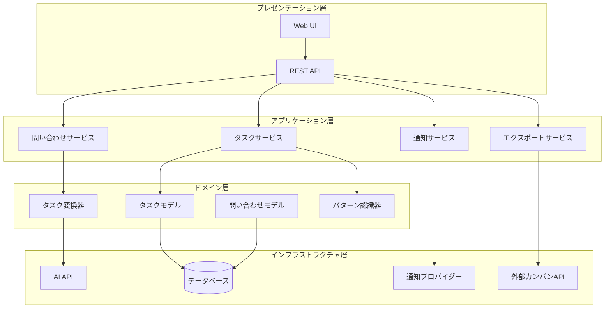

# 設計ドキュメント

## 概要

ストーリーボードシステムは、自然言語の問い合わせを構造化されたタスクに変換し、既存のカンバンシステムに統合するためのWebアプリケーションです。システムは問い合わせの受付、AI駆動のタスク生成、ユーザーレビュー、外部システム統合の4つの主要フェーズで構成されます。

## アーキテクチャ

システムは以下のレイヤーで構成されるクリーンアーキテクチャを採用します：



## コンポーネントとインターフェース

### 1. 問い合わせサービス (InquiryService)

**責任**: 問い合わせの受付、検証、保存

```typescript
interface InquiryService {
  submitInquiry(inquiry: string, userId: string): Promise<InquiryResult>
  getInquiryHistory(userId: string): Promise<Inquiry[]>
  requestClarification(inquiryId: string, questions: string[]): Promise<void>
  updateInquiryStatus(inquiryId: string): Promise<void>
  checkTaskCompletion(inquiryId: string): Promise<boolean>
}

interface InquiryResult {
  inquiryId: string
  status: 'processing' | 'needs_clarification' | 'task_working' | 'completed'
  generatedTasks?: Task[]
  clarificationQuestions?: string[]
}
```

### 2. タスク変換器 (TaskConverter)

**責任**: AI APIを使用した問い合わせのタスク変換

```typescript
interface TaskConverter {
  convertToTasks(inquiry: Inquiry): Promise<Task[]>
  extractDeadlines(inquiry: string): Promise<Date | null>
  categorizeTask(taskDescription: string): Promise<TaskCategory>
  estimateEffort(taskDescription: string): Promise<number>
}

interface Task {
  id: string
  title: string
  description: string
  category: TaskCategory
  priority: Priority
  estimatedEffort: number
  deadline?: Date
  status: TaskStatus
  metadata: TaskMetadata
}
```

### 3. パターン認識器 (PatternRecognizer)

**責任**: タスクパターンの識別とテンプレート適用

```typescript
interface PatternRecognizer {
  identifyPattern(taskDescription: string): Promise<TaskPattern>
  applyTemplate(pattern: TaskPattern, task: Task): Promise<Task>
  learnFromHistory(tasks: Task[]): Promise<void>
}

enum TaskPattern {
  BUG_FIX = 'bug_fix',
  FEATURE_ADDITION = 'feature_addition',
  INVESTIGATION = 'investigation',
  REVIEW = 'review',
  MAINTENANCE = 'maintenance'
}
```

### 4. タスクサービス (TaskService)

**責任**: タスクのCRUD操作、レビュー管理

```typescript
interface TaskService {
  getPendingTasks(userId: string): Promise<Task[]>
  updateTask(taskId: string, updates: Partial<Task>): Promise<Task>
  approveTask(taskId: string): Promise<void>
  rejectTask(taskId: string, reason?: string): Promise<void>
  batchApprove(taskIds: string[]): Promise<void>
  getTaskHistory(taskId: string): Promise<TaskVersion[]>
}
```

### 5. エクスポートサービス (ExportService)

**責任**: 外部カンバンシステムへのタスク出力

```typescript
interface ExportService {
  exportToKanban(tasks: Task[], targetSystem: KanbanSystem): Promise<ExportResult>
  getSupportedSystems(): KanbanSystem[]
  trackSyncStatus(taskId: string): Promise<SyncStatus>
}

interface KanbanSystem {
  name: string
  apiEndpoint: string
  authConfig: AuthConfig
  fieldMapping: FieldMapping
}
```

### 6. 通知サービス (NotificationService)

**責任**: ユーザー通知の管理

```typescript
interface NotificationService {
  sendTaskCompletionNotification(userId: string, tasks: Task[]): Promise<void>
  sendErrorAlert(userId: string, error: Error): Promise<void>
  sendDeadlineReminder(userId: string, tasks: Task[]): Promise<void>
  configureNotificationSettings(userId: string, settings: NotificationSettings): Promise<void>
}
```

## データモデル

### 問い合わせモデル

```typescript
interface Inquiry {
  id: string
  userId: string
  content: string
  language: 'ja' | 'en'
  timestamp: Date
  status: InquiryStatus
  metadata: {
    source: string
    processingTime?: number
    aiModel?: string
  }
}

enum InquiryStatus {
  RECEIVED = 'received',
  PROCESSING = 'processing',
  NEEDS_CLARIFICATION = 'needs_clarification',
  TASK_WORKING = 'task_working',
  COMPLETED = 'completed',
  FAILED = 'failed'
}
```

### タスクモデル

```typescript
interface Task {
  id: string
  inquiryId: string
  title: string
  description: string
  category: TaskCategory
  priority: Priority
  estimatedEffort: number // 時間単位
  deadline?: Date
  status: TaskStatus
  assignee?: string
  tags: string[]
  dependencies: string[] // 他のタスクID
  metadata: TaskMetadata
  createdAt: Date
  updatedAt: Date
}

enum TaskCategory {
  DEVELOPMENT = 'development',
  TESTING = 'testing',
  DOCUMENTATION = 'documentation',
  RESEARCH = 'research',
  MAINTENANCE = 'maintenance',
  CUSTOM = 'custom'
}

enum Priority {
  LOW = 'low',
  MEDIUM = 'medium',
  HIGH = 'high',
  URGENT = 'urgent'
}

enum TaskStatus {
  PENDING_REVIEW = 'pending_review',
  APPROVED = 'approved',
  EXPORTED = 'exported',
  REJECTED = 'rejected'
}

interface TaskMetadata {
  originalInquiry: string
  generationLog: string[]
  appliedTemplate?: string
  confidence: number // 0-1
  reviewNotes?: string[]
}
```

### テンプレートモデル

```typescript
interface TaskTemplate {
  id: string
  name: string
  pattern: TaskPattern
  fields: TemplateField[]
  checklist: string[]
  defaultEstimate: number
  isCustom: boolean
  userId?: string // カスタムテンプレートの場合
}

interface TemplateField {
  name: string
  type: 'text' | 'number' | 'date' | 'select'
  required: boolean
  defaultValue?: any
  options?: string[] // select型の場合
}
```

## 正確性プロパティ

*プロパティとは、システムのすべての有効な実行において真であるべき特性や動作のことです。これらは人間が読める仕様と機械で検証可能な正確性保証の橋渡しとなります。*

### プロパティ1: 問い合わせ受付と保存
*任意の*有効な問い合わせに対して、システムが受け付けた場合、その問い合わせはデータベースに永続化され、一意のIDが割り当てられる
**検証: 要件 1.1, 6.1, 9.1**

### プロパティ2: タスク変換の完全性
*任意の*受け付けられた問い合わせに対して、タスク変換器は少なくとも1つの実行可能なタスクを抽出するか、明確化要求を生成する
**検証: 要件 1.2, 1.4**

### プロパティ3: 複数タスク分離
*任意の*複数のタスクを含む問い合わせに対して、システムは各タスクに対して個別のタスク項目を作成し、それぞれに一意のIDを割り当てる
**検証: 要件 1.3**

### プロパティ4: 日本語サポート
*任意の*日本語の問い合わせに対して、システムは適切に処理し、日本語のUIで結果を表示する
**検証: 要件 1.5, 8.6**

### プロパティ5: 自動分類の一貫性
*任意の*作成されたタスクに対して、システムは有効なカテゴリ、優先度レベル、推定工数を割り当てる
**検証: 要件 2.1, 2.2**

### プロパティ6: 緊急キーワード検出
*任意の*緊急キーワード（緊急、至急、ASAP）を含むタスクに対して、システムは高優先度を割り当てる
**検証: 要件 2.3**

### プロパティ7: カスタムカテゴリサポート
*任意の*ユーザー定義カスタムカテゴリに対して、システムはそれを有効なカテゴリとして認識し、タスクに割り当て可能にする
**検証: 要件 2.4**

### プロパティ8: 依存関係自動識別
*任意の*関連するタスクセットに対して、システムは適切な依存関係を識別し、循環依存を作成しない
**検証: 要件 2.5**

### プロパティ9: タスク初期状態
*任意の*生成されたタスクに対して、システムは初期状態を「レビュー待ち」に設定し、必要なメタデータを含める
**検証: 要件 3.1, 6.1**

### プロパティ10: レビューデータ完全性
*任意の*レビュー対象タスクに対して、システムはタイトル、説明、カテゴリ、優先度、推定工数、期限のすべてのフィールドを編集可能な形式で表示する
**検証: 要件 3.2**

### プロパティ11: 変更履歴保持
*任意の*タスク修正に対して、システムは変更前後の状態を記録し、変更履歴を維持する
**検証: 要件 3.3, 6.5**

### プロパティ12: 状態遷移の正確性
*任意の*タスクに対して、承認時は「送信待ち」状態に、拒否時は「拒否」状態または削除状態に遷移する
**検証: 要件 3.4, 3.5**

### プロパティ13: 一括処理の原子性
*任意の*一括操作に対して、すべてのタスクが成功するか、すべてが失敗するかのいずれかになる（部分的成功はない）
**検証: 要件 3.6**

### プロパティ14: 出力データ完全性
*任意の*出力されるタスクに対して、タイトル、説明、カテゴリ、優先度、推定工数、期限（設定されている場合）のすべての情報が含まれる
**検証: 要件 4.2, 10.3**

### プロパティ15: 外部システム統合
*任意の*サポートされるカンバンシステムに対して、タスクが正常に出力され、追跡IDが生成される
**検証: 要件 4.3, 4.4, 4.5**

### プロパティ16: パターン認識とテンプレート適用
*任意の*認識されたタスクパターンに対して、システムは対応するテンプレートを適用し、テンプレートの必須フィールドを設定する
**検証: 要件 5.1, 5.2, 5.4**

### プロパティ17: カスタムテンプレート管理
*任意の*ユーザー定義テンプレートに対して、システムはそれを保存し、適切なパターンに対して適用可能にする
**検証: 要件 5.3**

### プロパティ18: 生成ログ記録
*任意の*タスク生成プロセスに対して、システムは分析ステップ、適用されたルール、使用されたテンプレートをログとして記録する
**検証: 要件 6.2, 6.3**

### プロパティ19: コメント機能
*任意の*タスクに対して、ユーザーが追加したコメントやメモは適切に保存され、タスクと関連付けられる
**検証: 要件 6.4**

### プロパティ20: 通知配信
*任意の*通知イベント（完了、エラー、確認要求）に対して、システムは設定された通知チャネルを通じて適切な通知を送信する
**検証: 要件 7.1, 7.2, 7.3, 7.4**

### プロパティ21: 通知設定適用
*任意の*ユーザー通知設定に対して、システムはその設定に従って通知の送信/非送信を決定する
**検証: 要件 7.5**

### プロパティ22: 検索機能
*任意の*検索クエリに対して、システムは関連する問い合わせとタスクを適切にフィルタリングして返す
**検証: 要件 8.4**

### プロパティ23: 進捗状況更新
*任意の*タスク生成またはレビュープロセスに対して、システムはリアルタイムで進捗状況を更新し、UIに反映する
**検証: 要件 8.5**

### プロパティ24: データ復元
*任意の*システム再起動に対して、永続ストレージからすべてのデータが適切に復元され、データ損失が発生しない
**検証: 要件 9.3**

### プロパティ25: バックアップ実行
*任意の*データ変更に対して、システムは定期的な自動バックアップを実行し、バックアップの成功/失敗を記録する
**検証: 要件 9.4**

### プロパティ26: 同期状態追跡
*任意の*外部システムへのタスク出力に対して、システムは同期状態を追跡し、同期の成功/失敗を記録する
**検証: 要件 9.5**

### プロパティ27: 期限自動設定
*任意の*期限情報を含む問い合わせに対して、システムは自然言語から適切な日付を抽出し、タスクの期限として設定する
**検証: 要件 10.2**

### プロパティ28: 期限通知
*任意の*期限が設定されたタスクに対して、期限が近づいた時（設定可能な日数前）にユーザーに通知を送信する
**検証: 要件 10.4**

### プロパティ29: 期限による優先度調整
*任意の*期限が設定されたタスクに対して、期限までの残り時間に基づいて優先度を自動的に調整する
**検証: 要件 10.5**

### プロパティ30: 問い合わせステータス管理
*任意の*問い合わせに対して、関連するすべてのタスクが完了状態（exported）になった場合はステータスを「completed」に、未完了のタスクがある場合は「task_working」に設定する
**検証: 要件 1.1, 3.4**
## エラーハンドリング

### エラー分類

1. **入力エラー**
   - 無効な問い合わせ形式
   - サポートされていない言語
   - 空の問い合わせ

2. **処理エラー**
   - AI API接続失敗
   - タスク変換失敗
   - パターン認識失敗

3. **システムエラー**
   - データベース接続失敗
   - 外部API接続失敗
   - 認証エラー

4. **ビジネスロジックエラー**
   - 循環依存の検出
   - 無効なテンプレート
   - 権限不足

### エラー処理戦略

```typescript
interface ErrorHandler {
  handleInputError(error: InputError): ErrorResponse
  handleProcessingError(error: ProcessingError): ErrorResponse
  handleSystemError(error: SystemError): ErrorResponse
  handleBusinessLogicError(error: BusinessLogicError): ErrorResponse
}

interface ErrorResponse {
  errorCode: string
  message: string
  userMessage: string
  retryable: boolean
  suggestedActions: string[]
}
```

### 回復戦略

- **自動リトライ**: 一時的なネットワークエラーやAPI制限
- **フォールバック**: AI APIが利用できない場合のルールベース処理
- **グレースフルデグラデーション**: 一部機能が利用できない場合の代替処理
- **ユーザー通知**: 回復不可能なエラーの場合の適切な通知

## テスト戦略

### 二重テストアプローチ

システムは**ユニットテスト**と**プロパティベーステスト**の両方を使用して包括的なカバレッジを実現します：

- **ユニットテスト**: 特定の例、エッジケース、エラー条件を検証
- **プロパティテスト**: すべての入力にわたる普遍的なプロパティを検証
- 両方のテストは相補的であり、包括的なカバレッジに必要です

### プロパティベーステスト設定

- **テストライブラリ**: fast-check (TypeScript/JavaScript)
- **最小実行回数**: 各プロパティテストあたり100回の反復
- **タグ形式**: **Feature: storyboard, Property {number}: {property_text}**
- 各正確性プロパティは単一のプロパティベーステストで実装される

### テストカテゴリ

1. **統合テスト**
   - エンドツーエンドのワークフロー
   - 外部システム統合
   - UI操作フロー

2. **ユニットテスト**
   - 個別コンポーネントの動作
   - エラーケースの処理
   - 境界値テスト

3. **プロパティテスト**
   - 普遍的な正確性プロパティ
   - ランダム入力での動作検証
   - 不変条件の維持

### テスト環境

- **開発環境**: 高速フィードバックのための軽量テスト
- **ステージング環境**: 本番類似環境での統合テスト
- **本番環境**: 監視とアラートによる継続的検証